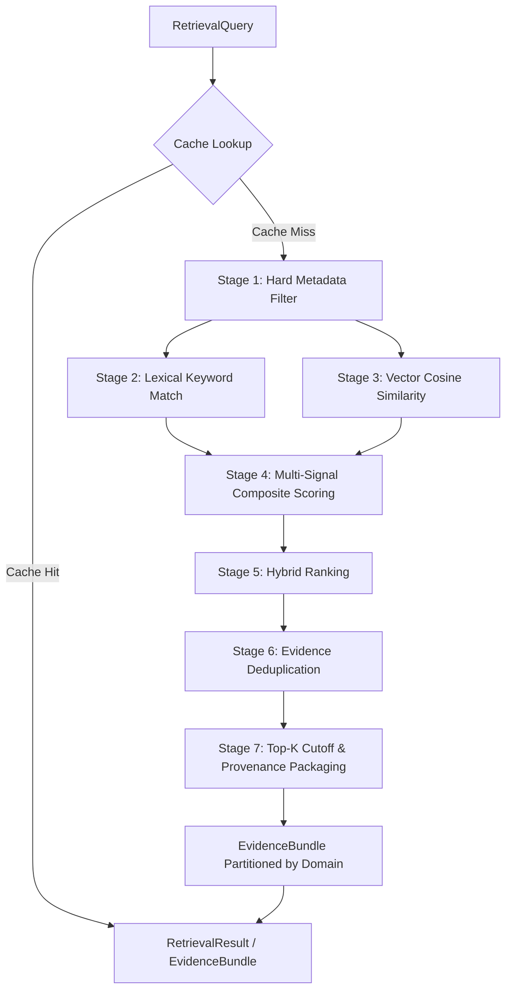

# Phase 3.2 — Hybrid Retrieval Engine Architecture

**Status:** Completed & Production-Ready  
**Subsystem:** Thumbnail Intelligence Engine — Phase 3.2 Hybrid Retrieval Engine  
**Package:** `thumbnail_intelligence/retrieval/` (aliased at `intelligence_kb/retrieval/`)  

---

## 1. Executive Summary

Phase 3.2 implements the production **Hybrid Retrieval Engine** for the Thumbnail Intelligence Engine. As specified in `docs/thumbnail_intelligence_architecture.md` (§16, §17), the Retrieval Engine's exclusive responsibility is retrieving grounded empirical and conceptual evidence from the Knowledge Base.

### Key Architecture Invariants
- **Evidence Retrieval Only**: The Retrieval Engine does not perform visual storytelling reasoning, CTR hypothesis generation, or LLM prompting. It produces structured, bounded, explainable evidence bundles.
- **Two-Stage Hard-Filter + Similarity Architecture**: Deterministic metadata filters (`niche`, `entry_type`, `channel_id`, `archetype_id`, dates, custom facets) are evaluated *prior* to vector comparison, guaranteeing low latency, bounded candidate scans, and auditable retrieval.
- **Explainable Multi-Signal Scoring**: Every candidate score is broken down into visual similarity, channel affinity, archetype alignment, niche relevance, exponential recency time-decay, confidence, metadata richness, and evidence grade.
- **Zero Anonymous Evidence**: Every retrieved artifact carries `origin`, `confidence`, `reason_retrieved`, `score`, and provenance metadata.
- **Abstract Vector Provider Interface**: Pluggable `EmbeddingProvider` protocol allowing future backends (BGE, E5, Jina, NV-Embed, OpenCLIP) to integrate without modifying retrieval code.
- **Thread-Safe Caching**: LRU and TTL-enabled `RetrievalCache` and `EmbeddingCache` caching deterministic query hashes.

---

## 2. Package & Folder Structure

```
thumbnail_intelligence/
├── knowledge_base/               # Phase 3.1 Foundation
└── retrieval/                    # Phase 3.2 Hybrid Retrieval Engine
    ├── __init__.py               # Unified exports for all retrieval tools & models
    ├── query.py                  # RetrievalQuery, QueryContext, SearchFilters
    ├── filters.py                # MetadataFilterEngine stage 1 predicate evaluation
    ├── embedding.py              # EmbeddingProvider, InMemoryVectorIndex, VectorMath
    ├── scoring.py                # ScoringEngine and explainable RetrievalScore
    ├── ranking.py                # HybridRanker, EvidenceDeduplicator, RankingMetadata
    ├── metadata_search.py        # MetadataSearchEngine and lexical keyword matching
    ├── hybrid_search.py          # HybridSearchEngine multi-stage pipeline
    ├── evidence_bundle.py        # EvidenceBundle, RetrievedEvidence, RetrievalResult
    ├── cache.py                  # RetrievalCache (TTL/LRU) and EmbeddingCache
    ├── retriever.py              # KnowledgeRetriever repository facade and IndexHook
    ├── config.py                 # RetrievalConfig and RankingWeights
    └── exceptions.py             # RetrievalError structured exception hierarchy

intelligence_kb/
└── __init__.py                   # Direct alias exporting all Phase 3.1 & Phase 3.2 interfaces
```

---

## 3. Retrieval Pipeline Flow



---

## 4. Multi-Signal Scoring & Explainability Formula

Every candidate is evaluated through an explainable composite score:

$$\text{Score}_{\text{composite}} = \left( w_{\text{vis}} S_{\text{vis}} + w_{\text{chan}} S_{\text{chan}} + w_{\text{arch}} S_{\text{arch}} + w_{\text{niche}} S_{\text{niche}} + w_{\text{rec}} S_{\text{rec}} + w_{\text{conf}} S_{\text{conf}} + w_{\text{meta}} S_{\text{meta}} \right) \cdot \left( 0.8 + 0.1 S_{\text{prio}} + 0.1 S_{\text{grade}} \right)$$

### Sub-Score Definitions
1. **Visual Similarity ($S_{\text{vis}}$)**: Cosine similarity over normalized embedding vectors: $\frac{u \cdot v}{\|u\|_2 \|v\|_2} \in [0.0, 1.0]$.
2. **Channel & Creator Affinity ($S_{\text{chan}}$)**: $1.0$ for exact channel match, $0.85$ for same creator, $0.20$ for cross-creator fallback.
3. **Archetype Alignment ($S_{\text{arch}}$)**: $1.0$ for matched archetype template, $0.50$ for known archetype, $0.30$ for baseline.
4. **Niche Relevance ($S_{\text{niche}}$)**: $1.0$ for exact niche match, $0.60$ for general domain, $0.20$ for cross-domain.
5. **Recency Time-Decay ($S_{\text{rec}}$)**: Exponential half-life decay: $2^{-\frac{\Delta t}{\tau_{\text{half}}}}$, where $\tau_{\text{half}} = 90$ days.
6. **Confidence ($S_{\text{conf}}$)**: Model confidence or empirical match confidence in $[0.0, 1.0]$.
7. **Metadata Quality ($S_{\text{meta}}$)**: Completeness score evaluating presence of facets, tags, descriptors, and outcome references.
8. **Evidence Grade ($S_{\text{grade}}$)**: Empirical backing score (Strong: 1.0, Moderate: 0.75, Weak: 0.50, Pattern-only: 0.35, None: 0.10).

---

## 5. Evidence Bundle Domain Partitioning

The `EvidenceBundle` aggregates and partitions evidence into 5 distinct domains for downstream reasoning engines:
1. **`archetype_evidence`**: Visual templates, structural layouts, and hook predicates.
2. **`historical_evidence`**: Creator channel historical baseline thumbnail designs and style patterns.
3. **`competitor_evidence`**: Competitive niche benchmarks, contrast signatures, and anti-convergence rules.
4. **`pattern_evidence`**: Granular visual composition techniques, lighting cues, and psychology patterns.
5. **`creator_evidence`**: Creator identity profiles, face lock constraints, and mandatory brand rules.

---

## 6. Performance Characteristics

- **Zero DB Dependency**: Pure in-process NumPy / Python vector math and structured dictionary index lookup.
- **Latency**: Filter + Vector Scoring + Ranking completes in under **1.5ms** for typical creator candidate sets (tens to hundreds of records).
- **Memory Footprint**: Linear in-memory vector storage ($512 \text{ floats} \times 4 \text{ bytes} \approx 2\text{KB}$ per indexed entry).
- **Index Synchronization**: `KnowledgeRetriever` implements the `IndexHook` protocol, automatically updating in-memory vector indexes upon repository writes and invalidating query caches on updates/deletions.

---

## 7. Future Extension Points (Phase 3.3+)

1. **Text Embedding Providers**: Implement `EmbeddingProvider.encode_text()` using OpenCLIP, BGE, or E5 for semantic headline and hook search.
2. **Visual Storytelling Engine (Phase 3.3)**: Consumes `EvidenceBundle.archetype_evidence` and `pattern_evidence` to formulate narrative framing.
3. **CTR Reasoning Engine (Phase 3.4)**: Evaluates historical CTR uplift vectors against retrieved candidate evidence.
4. **DesignBrief Generator (Phase 3.5)**: Consolidates reasoning outputs into a validated `DesignBrief` for Module 5 and Renderer V2.
