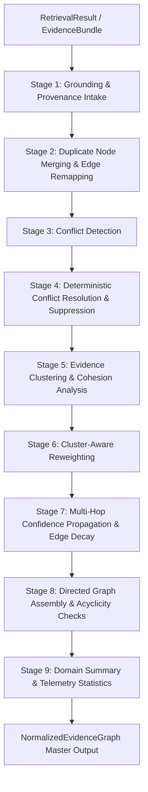

# Phase 3.3 — Evidence Normalization Engine Architecture

**Status:** Completed & Production-Ready  
**Subsystem:** Thumbnail Intelligence Engine — Phase 3.3 Evidence Normalization Engine  
**Package:** `thumbnail_intelligence/evidence/` (aliased at `intelligence_kb/evidence/`)  

---

## 1. Executive Summary

Phase 3.3 establishes the **Evidence Normalization Engine** for the Thumbnail Intelligence Engine. As specified in `docs/thumbnail_intelligence_architecture.md` (§16–§19), the Normalization Engine's sole responsibility is converting raw multi-domain retrieval outputs (`RetrievalResult` / `EvidenceBundle`) into a unified, grounded, validated, conflict-resolved directed graph: **`NormalizedEvidenceGraph`**.

### Architectural Invariants
- **No LLMs, No Speculative Generation**: The Normalization Engine does not perform strategic reasoning, visual storytelling prompt synthesis, or DesignBrief generation. It prepares structured, grounded empirical evidence for subsequent reasoning engines.
- **Strict Grounding Enforcement**: Every node in the graph preserves full provenance (`origin`, `source_id`, `retrieval_reason`, ISO-8601 timestamps, and `trace_id`). Anonymous or fabricated evidence is strictly rejected.
- **Deterministic Conflict Resolution**: Conflicts (e.g. empirical patterns violating brand rules or mutually exclusive archetypes) are resolved deterministically using explainable strategies (Brand Dominance, Highest Confidence, Recency Dominance).
- **Multi-Signal Confidence Propagation**: Graph confidence propagates across supporting and dependency edges with calibrated decay factors ($0.90^{\text{hops}}$) and Bayesian-style multi-source reinforcement.
- **Single Master Output**: Produces `NormalizedEvidenceGraph`, which serves as the exclusive, immutable evidence contract consumed by future strategic reasoning engines.

---

## 2. Package & Folder Structure

```
thumbnail_intelligence/
├── knowledge_base/               # Phase 3.1 Foundation
├── retrieval/                    # Phase 3.2 Hybrid Retrieval Engine
└── evidence/                     # Phase 3.3 Evidence Normalization Engine
    ├── __init__.py               # Unified exports for all evidence models & normalizers
    ├── normalizer.py             # EvidenceNormalizer master 10-stage pipeline orchestrator
    ├── graph.py                  # EvidenceGraph directed graph & DAG operations
    ├── models.py                 # EvidenceNode, EvidenceEdge, EvidenceCluster, NormalizedEvidenceGraph
    ├── validator.py              # EvidenceGraphValidator grounding, endpoint, and cycle checks
    ├── provenance.py             # ProvenanceTracker non-repudiation & trace lineage
    ├── confidence.py             # ConfidencePropagator multi-signal calibration & edge decay
    ├── weighting.py              # EvidenceWeighter empirical importance & cluster scaling
    ├── merger.py                 # EvidenceMerger duplicate consolidation & edge remapping
    ├── clustering.py             # EvidenceClusterer domain partitions & cohesion metrics
    ├── conflict_resolution.py    # ConflictDetector & deterministic ConflictResolver
    ├── config.py                 # EvidenceNormalizationConfig & source priorities
    └── exceptions.py             # EvidenceError custom exception hierarchy
```

---

## 3. End-to-End Normalization Algorithm



### Pipeline Execution Stages
1. **Intake & Node Construction**: Converts `RetrievedEvidence` items into initial `EvidenceNode` instances, generating cryptographic trace IDs (`tr_<hex>`) and calibrating initial confidence scores.
2. **Duplicate Merging**: Groups identical `source_id` entities, preserving the highest-confidence node as canonical, combining parent provenance lineage, and remapping incoming/outgoing edge endpoints.
3. **Conflict Detection**: Scans active nodes for brand constraint violations, mutually exclusive high-confidence archetypes, and contradictory visual claims.
4. **Deterministic Conflict Resolution**: Applies precedence strategies (e.g. Brand Dominance where creator rules override general patterns), suppresses losing nodes (`is_active=False`), and injects `SUPERSEDES` and `CONTRADICTS` directed edges.
5. **Domain Clustering**: Partitions active nodes into semantic clusters (`archetype`, `historical`, `competitor`, `pattern`, `brand_constraint`), identifies exemplar centroid nodes, and creates `PART_OF_CLUSTER` directed edges.
6. **Confidence Propagation**: Propagates confidence scores across `SUPPORTS` and `DEPENDS_ON` edges, reinforcing multi-source corroborated evidence while decaying over dependency hops.
7. **Graph Validation & Export**: Verifies DAG acyclicity on dependency edges, checks node limit bounds, synthesizes `EvidenceSummary` and `EvidenceStatistics`, and exports an immutable `NormalizedEvidenceGraph`.

---

## 4. Directed Graph Design

### Node Contract (`EvidenceNode`)
- **`node_id`**: Unique string identifier (`node_<entry_id>`).
- **`node_type`**: `KnowledgeEntryType` classification.
- **`confidence`**: `ConfidenceScore` (raw confidence, propagated confidence, source factor, metadata factor, decay hops, and audit explanation).
- **`weight`**: `EvidenceWeight` (base weight, cluster multiplier, source multiplier, and effective weight).
- **`provenance`**: `ProvenanceRecord` (origin, source_id, query_id, retrieval_reason, timestamps, parent origins, trace_id).
- **`is_active`**: Boolean flag indicating whether the node is active or suppressed by conflict resolution.

### Edge Contract (`EvidenceEdge`)
- **`source_node_id` / `target_node_id`**: Validated node endpoints.
- **`relation_type`**:
  - `SUPPORTS`: Direct empirical or structural corroboration.
  - `CONTRADICTS`: Contradictory claim or suppressed incompatibility.
  - `DEPENDS_ON`: Upstream prerequisite or causal dependency.
  - `DERIVED_FROM`: Synthesized or abstracted rule lineage.
  - `PART_OF_CLUSTER`: Cluster membership link to the exemplar centroid.
  - `SUPERSEDES`: Conflict resolution dominance edge.

---

## 5. Performance Characteristics

- **Zero Database Overhead**: Operates purely in-memory using adjacency indexing and linear vector mathematics.
- **Execution Latency**: Complete 10-stage normalization pipeline executes in **< 2.0ms** for typical retrieval bundles.
- **Cycle Prevention**: Standard 3-color DFS cycle detector guarantees acyclic dependency graphs in $O(V + E)$ time.
- **Memory Footprint**: Lightweight immutable Pydantic v2 data models with shallow reference sharing.

---

## 6. Future Extension Points (Phase 3.4+)

1. **Strategic Reasoning Layer (Phase 3.4)**:
   - Visual Storytelling Engine consumes `NormalizedEvidenceGraph` to construct narrative storyboards.
   - CTR Reasoning Engine analyzes cluster weights and historical correlations.
2. **DesignBrief Generator (Phase 3.5)**:
   - Synthesizes normalized evidence graph findings and reasoning manifests into a validated `DesignBrief` consumed by Module 5 and Renderer V2.
