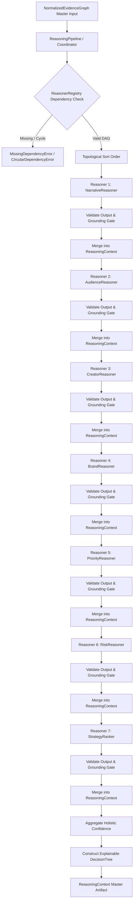

# Phase 3.4A — Strategic Reasoning Coordinator Foundation Architecture

**Status:** Completed & Production-Ready  
**Subsystem:** Thumbnail Intelligence Engine — Phase 3.4A Strategic Reasoning Coordinator Foundation  
**Package:** `thumbnail_intelligence/reasoning/` (aliased at `intelligence_kb/reasoning/`)  

---

## 1. Executive Summary

Phase 3.4A establishes the **Strategic Reasoning Coordinator Foundation** for the Thumbnail Intelligence Engine. As specified in `docs/thumbnail_intelligence_architecture.md` (§11–§15, §19), this subsystem establishes the orchestration architecture for strategic reasoning without embedding heuristic domain generation logic or black-box LLM prompts into the coordinator.

### Architectural Invariants
1. **Separation of Orchestration and Reasoning**: The `ReasoningCoordinator` has zero hardcoded reasoning rules. It operates solely as a deterministic orchestrator over registered reasoning modules.
2. **Pluggable & Extensible Registry**: Strategic reasoners (Narrative, Audience, Creator, Brand, Priority, Risk, StrategyRanker, and custom third-party modules) register via `ReasonerRegistry` with explicit dependency graphs and SemVer contracts.
3. **Topological Execution Ordering**: Multi-step reasoning pipelines are automatically ordered via deterministic topological sort (Kahn's algorithm), detecting missing dependencies and circular dependency cycles before execution.
4. **Strongly Typed Reasoning Context**: The `ReasoningContext` container provides immutable, validated placeholders for all strategic reasoning facets, full evidence references, an explainable decision tree, and an execution trace log.
5. **Grounding Gate & Validation Gate**: Every intermediate and final reasoner output is validated against its contract, and the grounding gate strictly rejects any claim carrying confidence $> 0.0$ with zero evidence references.
6. **Zero Anonymous Claims & Full Auditability**: Every decision node in the `DecisionTree` and step in the `ReasoningTrace` records elapsed execution time, source evidence identifiers, confidence levels, and provenance attribution.

---

## 2. Package & Folder Structure

```
thumbnail_intelligence/
├── knowledge_base/                  # Phase 3.1 Foundation
├── retrieval/                       # Phase 3.2 Hybrid Retrieval Engine
├── evidence/                        # Phase 3.3 Evidence Normalization Engine
└── reasoning/                       # Phase 3.4A Strategic Reasoning Coordinator Foundation
    ├── __init__.py                  # Unified exports for models, interfaces, coordinator, and errors
    ├── coordinator.py               # ReasoningCoordinator orchestrator and output merger
    ├── interfaces.py                # Abstract BaseReasoner and domain reasoner interfaces
    ├── registry.py                  # ReasonerRegistry with topological sort and validation
    ├── models.py                    # ReasonerContract, ReasonerType, output contracts, decision tree
    ├── context.py                   # ReasoningContext unified container and slot query API
    ├── pipeline.py                  # ReasoningPipeline high-level execution facade
    ├── config.py                    # ReasoningConfig execution and grounding settings
    └── exceptions.py                # Structured ReasoningError hierarchy
```

---

## 3. Reasoning Lifecycle & Pipeline Flow

The strategic reasoning lifecycle executes as a strictly sequential, grounded pipeline:



### Lifecycle Stages
1. **Intake & Graph Validation**: Verifies that the input `NormalizedEvidenceGraph` is valid, non-null, and grounded.
2. **Topological Order Resolution**: Queries `ReasonerRegistry.get_execution_order()`, verifying that all declared dependencies are present and acyclic.
3. **Reasoning Execution Loop**: Sequentially invokes each registered reasoner, passing the evidence graph and accumulated intermediate `ReasoningContext`.
4. **Intermediate Validation Gate**: Evaluates `reasoner.validate_output(output)`, ensuring model conformance and confidence bounds in $[0.0, 1.0]$.
5. **Grounding Gate**: Rejects ungrounded claims where confidence $> 0$ with zero evidence references (`GroundingEnforcementError`).
6. **Slot Merging & Evidence Harvesting**: Merges the typed output into its dedicated slot, extracts and deduplicates evidence references into the global pool, and records audit trace steps.
7. **Decision Tree Assembly**: Links strategic choices into an explainable hierarchical `DecisionTree`.
8. **Holistic Confidence Aggregation**: Computes overall confidence using the configured strategy (`weighted_mean`, `minimum`, or `harmonic_mean`).

---

## 4. Reasoner Interfaces Specification

| Reasoner Interface | Classification | Primary Output Model | Key Responsibilities |
|---|---|---|---|
| `NarrativeReasoner` | `ReasonerType.NARRATIVE` | `NarrativeReasoningOutput` | Story hooks, visual narrative framing, emotional tone, metaphors. |
| `AudienceReasoner` | `ReasonerType.AUDIENCE` | `AudienceReasoningOutput` | Target audience segments, curiosity triggers, cognitive load expectations. |
| `CreatorReasoner` | `ReasonerType.CREATOR` | `CreatorReasoningOutput` | Creator persona, visual signature consistency, channel style equity anchors. |
| `BrandReasoner` | `ReasonerType.BRAND` | `BrandReasoningOutput` | Mandatory palette rules, typography constraints, logo placement, prohibitions. |
| `PriorityReasoner` | `ReasonerType.PRIORITY` | `PriorityReasoningOutput` | Visual hierarchy, focal element weight allocations, composition style. |
| `RiskReasoner` | `ReasonerType.RISK` | `RiskReasoningOutput` | Visual fatigue scores, competitor convergence risk, policy flags, mitigations. |
| `StrategyRanker` | `ReasonerType.STRATEGY_RANKER` | `StrategyRankingOutput` | Candidate strategy ranking, expected CTR uplift, tradeoff analysis. |
| `BaseReasoner` (Custom) | `ReasonerType.CUSTOM` | Arbitrary Dict / Model | Extensible third-party reasoners recorded in `context.custom_outputs`. |

---

## 5. Extension Guide: Adding Future Reasoners

Future engineers can plug new domain reasoning modules into the pipeline without modifying the `ReasoningCoordinator`.

### Step 1: Implement the Abstract Interface
```python
from thumbnail_intelligence.evidence.models import NormalizedEvidenceGraph
from thumbnail_intelligence.reasoning.context import ReasoningContext
from thumbnail_intelligence.reasoning.interfaces import NarrativeReasoner
from thumbnail_intelligence.reasoning.models import (
    NarrativeReasoningOutput,
    ReasonerContract,
    ReasonerType,
)

class ProductionNarrativeReasoner(NarrativeReasoner):
    def __init__(self) -> None:
        self._contract = ReasonerContract(
            name="production_narrative_engine",
            reasoner_type=ReasonerType.NARRATIVE,
            dependencies=[],
            version="1.0.0",
            description="Production visual storytelling reasoning engine",
            is_mandatory=True,
        )

    @property
    def contract(self) -> ReasonerContract:
        return self._contract

    def reason(
        self,
        graph: NormalizedEvidenceGraph,
        context: ReasoningContext,
    ) -> NarrativeReasoningOutput:
        # Access grounded nodes from the graph
        active_nodes = graph.get_active_nodes()
        evidence_refs = [
            node.evidence_item.to_reference()
            for node in active_nodes if hasattr(node.evidence_item, "to_reference")
        ]

        return NarrativeReasoningOutput(
            story_hook="Unexpected discovery contrast",
            narrative_angle="Revealing counter-intuitive results",
            emotional_tone="Intrigue and suspense",
            evidence_refs=evidence_refs,
            confidence=0.92,
        )
```

### Step 2: Register in the Pipeline
```python
from thumbnail_intelligence.reasoning.pipeline import ReasoningPipeline
from thumbnail_intelligence.reasoning.registry import ReasonerRegistry

registry = ReasonerRegistry()
registry.register(ProductionNarrativeReasoner())

pipeline = ReasoningPipeline.from_registry(registry)
context = pipeline.run(normalized_graph)
```

---

## 6. Developer Guide & Operational Invariants

1. **No Direct Mutation of Inputs**: The input `NormalizedEvidenceGraph` is immutable. Reasoners must never modify graph nodes or edges.
2. **Always Cite Grounding References**: Every reasoning output that asserts a recommendation must cite at least one `EvidenceReference` from the graph or prior context.
3. **Handle Empty Context Slots Gracefully**: Upstream reasoners may be optional or skipped; downstream reasoners should check `context.has_slot("name")` before reading optional slots.
4. **SemVer Versioning**: Every reasoner contract must declare a valid semantic version (`major.minor.patch`) to allow audit reproducibility.
5. **Deterministic Ordering**: Independent reasoners without cross-dependencies are ordered deterministically by name, ensuring bitwise identical execution sequences across runs.
