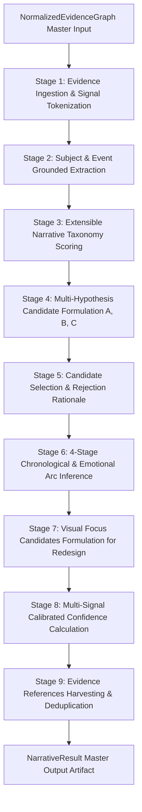

# Phase 3.4B — Narrative Reasoner Architecture

**Status:** Completed & Production-Ready  
**Subsystem:** Thumbnail Intelligence Engine — Phase 3.4B Narrative Reasoner  
**Package:** `thumbnail_intelligence/reasoning/` (aliased at `intelligence_kb/reasoning/`)  

---

## 1. Executive Summary

Phase 3.4B establishes the production **Narrative Reasoner** for the Thumbnail Intelligence Engine. As specified in `docs/thumbnail_intelligence_architecture.md` (§11, §19) and `docs/thumbnail-renderer-v2-architecture-v2.md`, the Narrative Reasoner's sole purpose is answering:
1. *What story is this video telling?*
2. *What is the primary narrative format and premise?*
3. *What supporting narrative hypotheses exist?*
4. *What emotional progression arc is present?*
5. *What visual focal elements must remain central in the thumbnail redesign?*

### Key Architecture Invariants
- **Strict Grounding Gate**: Every narrative claim, premise, hook, and arc step cites empirical `EvidenceReference` records and source evidence node IDs (`EvidenceNode`).
- **Zero Hallucinations & Zero Invention**: Claims are inferred strictly from normalized evidence nodes (title, transcript, OCR text, scene graph objects, detected faces, archetype matches, historical patterns).
- **Multi-Hypothesis Exploration & Rejection**: Evaluates multiple candidate narrative hypotheses (Candidate A, B, C) with individual fit scores and explicit rejection rationales for non-primary options.
- **Multi-Signal Calibrated Confidence Model**: Propagates confidence by evaluating evidence quality, multi-source agreement, metadata completeness, transcript density, OCR token confidence, scene graph clarity, and graph conflict penalties.
- **Pluggable Coordinator Integration**: Implements the abstract `NarrativeReasoner` interface from Phase 3.4A and integrates automatically into `ReasonerRegistry` and `ReasoningCoordinator`.

---

## 2. Package & File Structure

```
thumbnail_intelligence/
├── knowledge_base/                  # Phase 3.1 Foundation
├── retrieval/                       # Phase 3.2 Hybrid Retrieval Engine
├── evidence/                        # Phase 3.3 Evidence Normalization Engine
└── reasoning/                       # Phase 3.4 Strategic Reasoning Layer
    ├── __init__.py                  # Unified exports including narrative models & reasoner
    ├── coordinator.py               # ReasoningCoordinator orchestrator
    ├── interfaces.py                # BaseReasoner & abstract NarrativeReasoner
    ├── registry.py                  # ReasonerRegistry with topological DAG ordering
    ├── models.py                    # Generic reasoning contracts & trace steps
    ├── context.py                   # ReasoningContext container
    ├── pipeline.py                  # ReasoningPipeline facade
    ├── config.py                    # ReasoningConfig configuration
    ├── exceptions.py                # ReasoningError structured exceptions
    ├── narrative_models.py          # Phase 3.4B: NarrativeType, NarrativeArc, NarrativeResult
    └── narrative_reasoner.py        # Phase 3.4B: Production NarrativeReasoner implementation
```

---

## 3. End-to-End Narrative Reasoning Flow



### Pipeline Stages
1. **Evidence Ingestion**: Scans active, non-suppressed `EvidenceNode` instances from `NormalizedEvidenceGraph`. Tokenizes title words, transcript text, OCR banners, scene graph objects, detected faces, and archetype matches.
2. **Subject & Event Extraction**: Extracts grounded primary subjects (characters, vehicles, objects) and plot events, linking each to source evidence IDs.
3. **Taxonomy Scoring**: Evaluates keyword indicators and archetype synergies against the extensible `NarrativeType` taxonomy.
4. **Multi-Hypothesis Candidate Formulation**: Generates 2–3 competing `CandidateNarrative` hypotheses with individual fit scores, premises, hooks, pros, and cons.
5. **Candidate Selection & Rejection**: Selects the highest-scoring candidate as `primary_narrative` and records remaining candidates with explainable `rejection_rationale`.
6. **Narrative Arc Inference**: Constructs a 4-stage `NarrativeArc` (`Beginning`, `Conflict`, `Peak`, `Resolution`), calculates emotional intensity curves, and identifies the `dominant_stage` (default `ArcStage.PEAK`).
7. **Visual Focus Candidates Formulation**: Formulates `PRIMARY`, `SECONDARY`, and `TERTIARY` visual focus candidates with concrete lighting, framing, and contrast treatment directives for the thumbnail redesign.
8. **Confidence Calibration**: Computes component confidence scores (`evidence_quality`, `evidence_agreement`, `metadata_quality`, `transcript_quality`, `ocr_quality`, `scene_quality`, `conflict_penalty`).
9. **Result Assembly**: Packages outputs into `NarrativeResult`, inheriting from `NarrativeReasoningOutput` to ensure backward compatibility with `ReasoningContext.narrative`.

---

## 4. Extensible Narrative Taxonomy

| `NarrativeType` | Primary Driver | Indicative Keywords | Synergistic Archetypes |
|---|---|---|---|
| `DISCOVERY` | Curiosity & astonishment | secret, hidden, discovered, truth, mystery, lost, ancient | `curiosity_gap`, `mystery_reveal` |
| `CHALLENGE` | Tension & high stakes | challenge, survive, 24 hours, 100 days, impossible, trapped | `extreme_challenge`, `survival_test` |
| `TRANSFORMATION` | Visual contrast & progression | transformation, makeover, restoration, before and after, glow up | `before_after_split`, `makeover` |
| `COMPARISON` | Curiosity & competitive judgment | vs, versus, cheap vs expensive, battle, $1 vs $10,000 | `versus_battle`, `split_comparison` |
| `TUTORIAL` | Learning & utility | how to, tutorial, guide, step by step, master, complete guide | `step_by_step`, `how_to` |
| `REACTION` | Empathy & vicarious shock | reaction, shocked, mind blown, wasn't expecting, jaw dropping | `big_face_reaction`, `shock_face` |
| `REVIEW` | Critical evaluation & verdict | review, honest review, worth it, tested, after 30 days | `product_critique`, `verdict_review` |
| `DOCUMENTARY` | Storytelling depth & immersion | documentary, investigation, rise and fall, history of, exposed | `deep_dive`, `case_study` |
| `COMPETITION` | Rivalry & excitement | tournament, championship, won, winner, prize, game show | `tournament_bracket`, `winner_takes_all` |
| `COMEDY` | Humor & entertainment | funny, hilarious, prank, laugh, parody, satire, trolling | `humor_parody`, `prank_reveal` |
| `STORYTELLING` | Personal empathy | storytime, my story, what happened, confession, journey | `narrative_drama`, `personal_vlog` |
| `EDUCATIONAL` | Intellectual curiosity | science, physics, math, explained, why, what if | `explainer_concept`, `science_visual` |
| `VLOG` | Lifestyle immersion | vlog, day in the life, travel, road trip, diary | `lifestyle_vlog`, `travel_adventure` |
| `INTERVIEW` | Insider insights | interview, podcast, talking with, exclusive, q&a | `two_shot_dialogue`, `podcast_highlights` |
| `NEWS` | Timeliness & urgency | news, breaking, update, alert, official announcement | `breaking_headline`, `news_bulletin` |
| `CUSTOM` | Domain-specific extensions | Dynamically configurable | Dynamically configurable |

---

## 5. Multi-Signal Calibrated Confidence Model

The composite narrative confidence is calculated via:

$$\text{Conf}_{\text{narrative}} = \left( 0.25 Q_{\text{ev}} + 0.20 Q_{\text{agr}} + 0.15 Q_{\text{meta}} + 0.15 Q_{\text{trans}} + 0.10 Q_{\text{ocr}} + 0.15 Q_{\text{scene}} \right) \cdot (1.0 - 0.50 P_{\text{conflict}})$$

### Sub-Score Definitions
1. **Evidence Quality ($Q_{\text{ev}}$)**: Mean propagated confidence of active nodes: $\frac{1}{N} \sum_{i=1}^N c_i$.
2. **Evidence Agreement ($Q_{\text{agr}}$)**: Multi-source reinforcement score based on how many distinct token channels (title, transcript, OCR, scene graph) corroborate the narrative.
3. **Metadata Quality ($Q_{\text{meta}}$)**: Completeness score for video title, description, and tags ($1.0$ if title is present, $0.50$ baseline).
4. **Transcript Quality ($Q_{\text{trans}}$)**: Text density score scaling with transcript word count.
5. **OCR Quality ($Q_{\text{ocr}}$)**: Visual text quality scaling with extracted OCR token count and bounding box confidence.
6. **Scene Understanding Quality ($Q_{\text{scene}}$)**: Visual object clarity scaling with detected scene objects and faces.
7. **Conflict Penalty ($P_{\text{conflict}}$)**: Proportional penalty for unresolved graph contradictions: $\min(0.40, 0.10 \times N_{\text{conflicts}})$.

---

## 6. Grounding Strategy & Invariants

1. **Every Claim Grounded**: Every narrative hypothesis, arc step, and visual focus candidate carries a non-empty `evidence_refs: List[EvidenceReference]` list.
2. **No Hallucinated Detail**: If metadata or transcripts are sparse, the reasoner produces bounded, honest generic hypotheses with calibrated confidence, never fabricating specific plot points.
3. **Traceability**: Every deduction step is appended to `reasoning_trace` with timestamps and diagnostic messages.

---

## 7. Future Extension Points (Phase 3.4C+)

1. **Audience Reasoner (Phase 3.4C)**: Consumes `NarrativeResult.primary_narrative` and `NarrativeResult.narrative_arc` to determine target audience segments, curiosity triggers, and cognitive load levels.
2. **Creator Reasoner (Phase 3.4D)**: Compares `NarrativeResult` against creator channel historical style signatures.
3. **Priority Reasoner (Phase 3.4E)**: Consumes `NarrativeResult.visual_focus_candidates` to generate visual hierarchy allocations.
4. **DesignBrief Generator (Phase 3.5)**: Consolidates narrative findings into a grounded `DesignBrief` consumed by Module 5 and Renderer V2.
