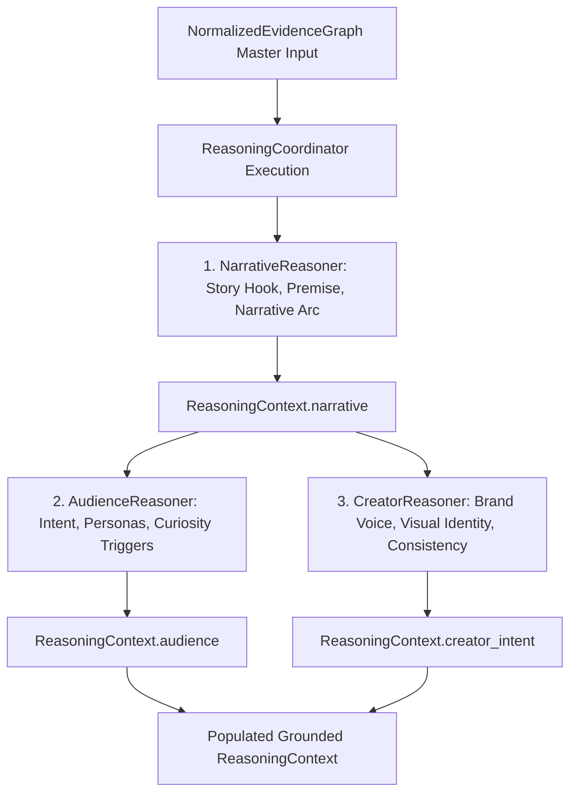

# Phase 3.4C — Audience & Creator Reasoners Architecture

**Status:** Completed & Production-Ready  
**Subsystem:** Thumbnail Intelligence Engine — Strategic Reasoning Layer (Phase 3.4C)  
**Package:** `thumbnail_intelligence/reasoning/` (aliased at `intelligence_kb/reasoning/`)  

---

## 1. Executive Summary

Phase 3.4C implements the production **Audience Reasoner** and **Creator Reasoner** within the Thumbnail AI Strategic Reasoning Layer. These reasoners build upon the foundational contracts established in Phase 3.4A and the narrative understanding produced in Phase 3.4B.

### Core Strategic Purpose
1. **Audience Reasoner (`AudienceReasoner`)**:
   - *Who is the viewer for this video?*
   - *What is their primary and secondary intent (`Entertainment`, `Learning`, `Problem Solving`, `Curiosity Seeking`, `Purchase Decision`)?*
   - *What is their domain knowledge level (`Beginner`, `Intermediate`, `Advanced`, `General`) and optimal cognitive load?*
   - *What psychological curiosity triggers, emotional drivers, pain points, and reward expectations motivate a click?*
   - *What archetypal viewer personas represent the core audience?*
2. **Creator Reasoner (`CreatorReasoner`)**:
   - *Who is the creator and what is their channel archetype (`Entertainer`, `Educator`, `Challenger`, `Storyteller`, `Expert Reviewer`, `Lifestyle Vlogger`, `Investigator`)?*
   - *What is their historical thumbnail style and visual identity signature (color palette, typography outline, hero face framing, lighting preferences)?*
   - *What brand consistency constraints, visual guardrails, creator strengths, and weaknesses govern the thumbnail redesign?*
   - *How should creator brand equity anchors be preserved to ensure high subscriber recognition?*

---

## 2. Package Structure & File Layout

```
thumbnail_intelligence/reasoning/
├── __init__.py                  # Unified exports for all reasoning modules, contracts, and models
├── coordinator.py               # ReasoningCoordinator orchestrating DAG execution and slot merging
├── interfaces.py                # BaseReasoner, NarrativeReasoner, AudienceReasoner, CreatorReasoner ABCs
├── registry.py                  # ReasonerRegistry with Kahn's topological dependency ordering
├── models.py                    # Generic reasoning contracts & trace steps
├── context.py                   # ReasoningContext container holding narrative, audience, creator_intent
├── pipeline.py                  # ReasoningPipeline execution facade
├── config.py                    # ReasoningConfig execution parameters
├── exceptions.py                # Structured exception hierarchy rooted in ReasoningError
├── narrative_models.py          # Phase 3.4B: NarrativeType, NarrativeArc, NarrativeResult
├── narrative_reasoner.py        # Phase 3.4B: NarrativeReasoner implementation
├── audience_models.py           # Phase 3.4C: ViewerIntent, ViewerPersona, CandidateAudience, AudienceResult
├── audience_reasoner.py         # Phase 3.4C: AudienceReasoner implementation
├── creator_models.py            # Phase 3.4C: CreatorArchetype, VisualIdentityStyle, CreatorResult
└── creator_reasoner.py          # Phase 3.4C: CreatorReasoner implementation
```

---

## 3. End-to-End Strategic Data Flow



### Topological Execution Pipeline
1. `NarrativeReasoner`: Has no dependencies (`dependencies = []`). Executes first and produces `context.narrative`.
2. `AudienceReasoner`: Declares `dependencies = ["narrative_reasoner"]`. Ingests graph evidence and `context.narrative` to produce `context.audience`.
3. `CreatorReasoner`: Declares `dependencies = ["narrative_reasoner"]`. Ingests graph evidence, historical creator profile data, and `context.narrative` to produce `context.creator_intent`.

---

## 4. Audience Taxonomy & Cognitive Model

### Viewer Intent Taxonomy
| `ViewerIntent` | Click Trigger & Psychology | Synergistic Narrative Format |
|---|---|---|
| `ENTERTAINMENT` | Emotional arousal, humor, vicarious excitement | Challenge, Comedy, Reaction, Competition |
| `LEARNING` | Self-improvement, actionable skill acquisition | Tutorial, Educational, Masterclass |
| `PROBLEM_SOLVING` | Pain relief, fixing bugs, overcoming barriers | How-To, Repair, Workflow Guide |
| `CURIOSITY_SEEKING` | Resolving an open mystery or hidden secret | Discovery, Investigation, Documentary |
| `PURCHASE_DECISION` | Critical product evaluation, finding best option | Review, Comparison, $1 vs $10,000 |
| `INSPIRATION` | Lifestyle aspiration, dramatic makeover | Transformation, Before & After |
| `ESCAPISM` | Immersive storytelling, relaxing travel vlog | Vlog, Chronicle, Nature |

### Viewer Knowledge & Cognitive Load
- `ViewerKnowledgeLevel`: `BEGINNER`, `INTERMEDIATE`, `ADVANCED`, `GENERAL`
- `CognitiveLoadLevel`: `LOW` (1–2 visual elements), `MEDIUM` (2–3 balanced elements), `HIGH` (detailed technical diagram)

---

## 5. Creator Profile & Visual Identity Model

### Creator Archetype Classification
- `ENTERTAINER`: Vibrant, humorous, spontaneous, high emotional facial expressions.
- `EDUCATOR`: Clear, structured, instructional, authoritative text styling.
- `CHALLENGER`: High stakes, adrenaline, physical endurance, countdown timers.
- `STORYTELLER`: Immersive, dramatic, suspenseful color grading.
- `EXPERT_REVIEWER`: Analytical, authentic, macro hardware close-ups, benchmark graphics.
- `LIFESTYLE_VLOGGER`: Candid, warm, relatable, personal face framing.
- `INVESTIGATOR`: Curious, investigative, deep-dive documentarian.

### Visual Identity Directives (`VisualIdentityStyle`)
- `dominant_color_palette`: Hex color palette signature (e.g. `["#00E5FF", "#FF3366", "#0D0D11", "#FFFFFF"]`).
- `typography_style`: Text font weight, stroke outline, drop shadow, and letter spacing rules.
- `face_framing_preference`: Hero face positioning (outer thirds), canvas coverage fraction (30–40%), and expression intensity.
- `lighting_preference`: Lighting setup (e.g. High-key three-point lighting with cyan/magenta rim separation).
- `composition_rule`: Layout blueprint (e.g. Two-element split with center tension object).

---

## 6. Multi-Signal Calibrated Confidence Models

### Audience Confidence
$$\text{Conf}_{\text{audience}} = \left( 0.30 C_{\text{narrative}} + 0.25 Q_{\text{ev}} + 0.15 Q_{\text{meta}} + 0.15 Q_{\text{trans}} + 0.15 Q_{\text{ocr}} \right) \cdot (1.0 - 0.50 P_{\text{conflict}})$$

### Creator Confidence
$$\text{Conf}_{\text{creator}} = \left( 0.25 C_{\text{narrative}} + 0.25 Q_{\text{ev}} + 0.20 S_{\text{hist}} + 0.15 Q_{\text{meta}} + 0.15 Q_{\text{ocr}} \right) \cdot (1.0 - 0.50 P_{\text{conflict}})$$

Where:
- $C_{\text{narrative}}$: Confidence score propagated from `context.narrative`.
- $Q_{\text{ev}}$: Mean propagated confidence of active supporting evidence nodes.
- $S_{\text{hist}}$: Historical consistency stability score ($0.95$ for verified channel profile, $0.80$ baseline).
- $Q_{\text{meta}}$, $Q_{\text{trans}}$, $Q_{\text{ocr}}$: Completeness and density factors for metadata, transcripts, and OCR text.
- $P_{\text{conflict}}$: Conflict penalty factor derived from unresolved graph contradictions: $\min(0.40, 0.10 \times N_{\text{conflicts}})$.
- **Grounding Gate Invariant**: If `evidence_refs` is empty, overall confidence is strictly set to `0.0`.

---

## 7. Multi-Hypothesis Generation & Grounding

Both reasoners evaluate competing interpretations:
1. **Audience Hypotheses**:
   - `Candidate A`: Core Niche Segment (highest fit score).
   - `Candidate B`: Broad Curiosity Scrollers (expanded reach, recorded with rejection rationale).
   - `Candidate C`: Casual Entertainment Seekers (generic positioning, recorded with rejection rationale).
2. **Creator Style Hypotheses**:
   - `Candidate A`: Signature High-Energy Anchor Style (highest fit score).
   - `Candidate B`: Evolved Cinematic Contrast Style (secondary alternative with rejection rationale).
   - `Candidate C`: Minimalist Subject-First Style (tertiary alternative with rejection rationale).

---

## 8. Future Extension Points (Phase 3.4D+)

1. **Brand Reasoner (Phase 3.4D)**: Ingests `context.creator_intent.visual_identity` to enforce hard brand constraints, logo clearance zones, palette restrictions, and prohibited tropes.
2. **Priority Reasoner (Phase 3.4E)**: Synthesizes `context.narrative.visual_focus_candidates` and `context.audience.cognitive_load_level` to generate visual hierarchy allocations.
3. **DesignBrief Generator (Phase 3.5)**: Consolidates narrative, audience, and creator findings into a grounded `DesignBrief` for Module 5 and Renderer V2.
