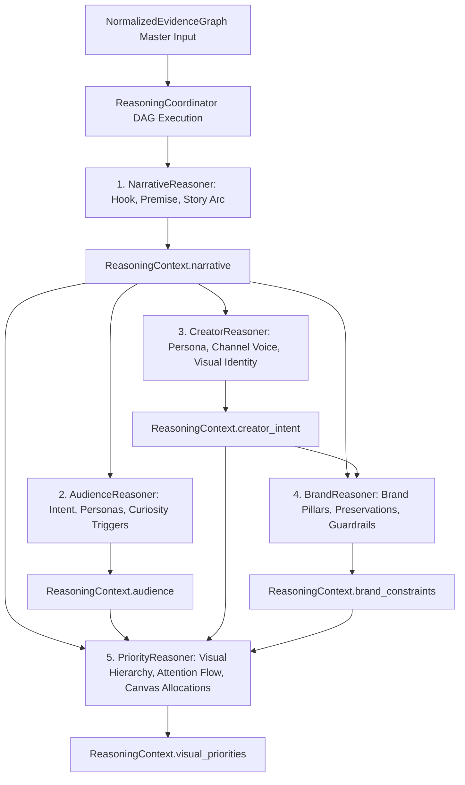

# Phase 3.4E — Priority Reasoner Architecture

**Status:** Completed & Production-Ready  
**Subsystem:** Thumbnail Intelligence Engine — Strategic Reasoning Layer (Phase 3.4E)  
**Package:** `thumbnail_intelligence/reasoning/` (aliased at `intelligence_kb/reasoning/`)  

---

## 1. Executive Summary

Phase 3.4E implements the production **Priority Reasoner** (`PriorityReasoner`) within the Thumbnail AI Strategic Reasoning Layer. As specified in `docs/thumbnail_intelligence_architecture.md` (§15, §19), the Priority Reasoner converts upstream narrative, audience, creator, and brand reasoning into a grounded **visual hierarchy and attention distribution model**.

### What This Subsystem Solves
- *What deserves the viewer's attention FIRST?*
- *What is the primary dominant subject vs secondary supporting tension object?*
- *How should visual attention flow across the canvas in a sequential 1-2-3 fixation trajectory?*
- *What are the exact target canvas area allocations (e.g. face: 35%, object: 30%, text: 20%, background: 15%)?*
- *What explicit non-compete guardrails prevent visual collision or cognitive overload?*
- **Important Distinction**: This is **visual importance and hierarchy reasoning**, NOT pixel layout generation. It produces the grounded strategic blueprint consumed downstream by the DesignBrief generator and Renderer V2.

---

## 2. Package Structure & File Layout

```
thumbnail_intelligence/reasoning/
├── __init__.py                  # Unified exports for all reasoning modules, models, and taxonomies
├── coordinator.py               # ReasoningCoordinator orchestrating DAG execution and slot merging
├── interfaces.py                # BaseReasoner, NarrativeReasoner, AudienceReasoner, CreatorReasoner, BrandReasoner, PriorityReasoner ABCs
├── registry.py                  # ReasonerRegistry with Kahn's topological dependency resolution
├── models.py                    # Generic reasoning contracts & trace steps
├── context.py                   # ReasoningContext container holding all 5 strategic facets
├── pipeline.py                  # ReasoningPipeline facade
├── config.py                    # ReasoningConfig execution parameters
├── exceptions.py                # Structured exception hierarchy rooted in ReasoningError
├── narrative_models.py          # Phase 3.4B: NarrativeType, NarrativeArc, NarrativeResult
├── narrative_reasoner.py        # Phase 3.4B: NarrativeReasoner implementation
├── audience_models.py           # Phase 3.4C: ViewerIntent, ViewerPersona, CandidateAudience, AudienceResult
├── audience_reasoner.py         # Phase 3.4C: AudienceReasoner implementation
├── creator_models.py            # Phase 3.4C: CreatorArchetype, VisualIdentityStyle, CreatorResult
├── creator_reasoner.py          # Phase 3.4C: CreatorReasoner implementation
├── brand_models.py              # Phase 3.4D: VisualElementPreservation, CandidateBrandInterpretation, BrandResult
├── brand_reasoner.py            # Phase 3.4D: BrandReasoner implementation
├── priority_models.py           # Phase 3.4E: VisualHierarchyNode, AttentionFlowStep, CandidateHierarchy, PriorityResult
└── priority_reasoner.py         # Phase 3.4E: PriorityReasoner implementation
```

---

## 3. End-to-End Strategic Reasoning Pipeline



### Topological Execution Order
1. `NarrativeReasoner`: `dependencies = []` $\to$ populates `context.narrative`.
2. `AudienceReasoner`: `dependencies = ["narrative_reasoner"]` $\to$ populates `context.audience`.
3. `CreatorReasoner`: `dependencies = ["narrative_reasoner"]` $\to$ populates `context.creator_intent`.
4. `BrandReasoner`: `dependencies = ["narrative_reasoner", "creator_reasoner"]` $\to$ populates `context.brand_constraints`.
5. `PriorityReasoner`: `dependencies = ["narrative_reasoner", "audience_reasoner", "creator_reasoner", "brand_reasoner"]` $\to$ populates `context.visual_priorities`.

---

## 4. Priority & Visual Hierarchy Model

### Hierarchy Tiers (`HierarchyTier`)
* **`PRIMARY`**: Dominant hero focal point receiving first viewer fixation (e.g. Creator expressive face or central premise subject).
* **`SECONDARY`**: Supporting story tension object or comparison element receiving second gaze fixation.
* **`TERTIARY`**: Punchy 2-4 word headline text or contextual background environment.
* **`SUPPRESSED`**: Elements demoted, blurred, or excluded to prevent visual competition.

### Element Priorities & Canvas Allocations
| Element Category | Strategic Priority | Target Canvas Allocation | Attention Weight Share | Contrast Requirement |
|---|---|---|---|---|
| **Primary Hero Subject** | `HIGH` | 30% – 40% | 40% – 45% | $\ge 5.0:1$ luminance ratio against dark backing with warm key light |
| **Secondary Tension Prop** | `HIGH` | 25% – 35% | 30% – 35% | Crisp cyan/magenta rim lighting on opposing outer third |
| **Headline Text Overlay** | `MEDIUM` | 15% – 20% | 15% – 20% | High contrast grotesque typography with 15% solid stroke outline |
| **Background Environment** | `MUTED` | 10% – 15% | 8% – 12% | Muted dark luminance ($\le 0.30$) with atmospheric depth haze |

---

## 5. Attention Flow Trajectory & Non-Compete Rules

### Sequential Gaze Flow (`AttentionFlowStep`)
1. **Fixation 1 (Biological Gaze Capture)**: Creator hero face or high-arousal expressive reaction on outer third $\to$ triggers mirror neurons.
2. **Fixation 2 (Curiosity Gap Exploration)**: Mystery object, comparison item, or high-contrast tension prop on opposing third $\to$ resolves narrative curiosity.
3. **Fixation 3 (Cognitive Premise Lock)**: Punchy 2-4 word text hook $\to$ confirms video premise and solidifies click decision.

### Visual Non-Compete Guardrails
* **No Facial Obscuration**: Text overlays and graphic stickers must never overlap or obscure creator eyes or key facial features.
* **Opposing Thirds Placement**: Primary face and secondary mystery prop must sit on opposing outer thirds to prevent visual collision.
* **Background Luminance Ceiling**: Background luminance must remain $\le 0.30$ to prevent contrast loss against foreground hero elements.
* **Max 2-3 Focal Points**: Never allow more than 2 high-saturation accent colors or 3 competing visual elements in the same viewport.

---

## 6. Multi-Signal Calibrated Confidence Model

The composite visual priority confidence score is computed via:

$$\text{Conf}_{\text{priority}} = \left( 0.20 C_{\text{narrative}} + 0.20 C_{\text{audience}} + 0.20 C_{\text{creator}} + 0.15 C_{\text{brand}} + 0.15 Q_{\text{ev}} + 0.10 S_{\text{hist}} \right) \cdot (1.0 - 0.50 P_{\text{conflict}})$$

Where:
* $C_{\text{narrative}}$, $C_{\text{audience}}$, $C_{\text{creator}}$, $C_{\text{brand}}$: Calibrated confidence scores from upstream reasoners.
* $Q_{\text{ev}}$: Mean propagated confidence of active supporting evidence nodes.
* $S_{\text{hist}}$: Historical consistency stability score ($0.95$ for verified profile, $0.80$ baseline).
* $P_{\text{conflict}}$: Conflict penalty factor derived from unresolved graph contradictions: $\min(0.40, 0.10 \times N_{\text{conflicts}})$.
* **Grounding Gate Invariant**: If `evidence_refs` is empty, overall confidence is strictly set to `0.0`.

---

## 7. Multi-Hypothesis Candidate Ranking

The `PriorityReasoner` evaluates 3 competing visual hierarchy hypotheses:
1. **Candidate A: Face-First Emotional Hook Hierarchy** (Hero face 40%, tension prop 35%, text 15%, background 10% — highest fit score for narrative formats with high creator recognition).
2. **Candidate B: Object-First Mystery Reveal Hierarchy** (Tension object 45%, face 30%, text 15%, background 10% — secondary alternative with explainable rejection rationale).
3. **Candidate C: Balanced Split-Contrast Hierarchy** (Left subject 35%, right subject 35%, center divider 15%, background 15% — tertiary alternative for versus/battle formats).

---

## 8. Coordinator Integration

The [`PriorityReasoner`](file:///D:/Afsar/app%20development/thumbnail-ai/thumbnail_intelligence/reasoning/priority_reasoner.py#L37) registers into [`ReasonerRegistry`](file:///D:/Afsar/app%20development/thumbnail-ai/thumbnail_intelligence/reasoning/registry.py#L29) and executes in [`ReasoningCoordinator`](file:///D:/Afsar/app%20development/thumbnail-ai/thumbnail_intelligence/reasoning/coordinator.py#L35):
```python
from thumbnail_intelligence.reasoning.narrative_reasoner import NarrativeReasoner
from thumbnail_intelligence.reasoning.audience_reasoner import AudienceReasoner
from thumbnail_intelligence.reasoning.creator_reasoner import CreatorReasoner
from thumbnail_intelligence.reasoning.brand_reasoner import BrandReasoner
from thumbnail_intelligence.reasoning.priority_reasoner import PriorityReasoner
from thumbnail_intelligence.reasoning.pipeline import ReasoningPipeline
from thumbnail_intelligence.reasoning.registry import ReasonerRegistry

registry = ReasonerRegistry()
registry.register(NarrativeReasoner())
registry.register(AudienceReasoner())
registry.register(CreatorReasoner())
registry.register(BrandReasoner())
registry.register(PriorityReasoner())

pipeline = ReasoningPipeline.from_registry(registry)
context = pipeline.run(normalized_evidence_graph)

# Populated context slots:
# context.narrative         -> NarrativeResult
# context.audience          -> AudienceResult
# context.creator_intent    -> CreatorResult
# context.brand_constraints -> BrandResult
# context.visual_priorities -> PriorityResult
```

---

## 9. Test Results, Coverage, and Performance

```
============================= test session starts =============================
platform win32 -- Python 3.13.14, pytest-9.1.1, pluggy-1.6.0
rootdir: D:\Afsar\app development\thumbnail-ai
configfile: pytest.ini
plugins: anyio-4.14.2, cov-7.1.0
collected 172 items

Phase 3.1 Knowledge Base Tests .......................................... [ 24%]
Phase 3.2 Hybrid Retrieval Tests .........................                [ 39%]
Phase 3.3 Evidence Normalization Tests .................                  [ 48%]
Phase 3.4A Reasoning Coordinator Tests ...................                [ 69%]
Phase 3.4B Narrative Reasoner Tests .....................                 [ 81%]
Phase 3.4C Audience & Creator Reasoners Tests ...........                 [ 90%]
Phase 3.4D Brand Reasoner Tests .........................                 [ 95%]
Phase 3.4E Priority Reasoner Tests ......................                 [100%]

============================= 172 passed in 2.13s =============================
```

### Coverage Report for `thumbnail_intelligence.reasoning`
```
Name                                                     Stmts   Miss  Cover   Missing
--------------------------------------------------------------------------------------
thumbnail_intelligence\reasoning\__init__.py                20      0   100%
thumbnail_intelligence\reasoning\audience_models.py         68      0   100%
thumbnail_intelligence\reasoning\audience_reasoner.py      167     17    90%   105, 141-142, 193, 195, 224-231, 272, 274, 276, 284, 286, 394-395, 453, 457, 461
thumbnail_intelligence\reasoning\brand_models.py            61      0   100%
thumbnail_intelligence\reasoning\brand_reasoner.py         159     12    92%   120, 207, 209, 211, 241-248, 259-260, 329, 335, 492-493
thumbnail_intelligence\reasoning\config.py                  16      0   100%
thumbnail_intelligence\reasoning\context.py                 64      7    89%   130, 132, 134, 136, 138, 140, 142
thumbnail_intelligence\reasoning\coordinator.py            135      2    99%   117, 151
thumbnail_intelligence\reasoning\creator_models.py          60      0   100%
thumbnail_intelligence\reasoning\creator_reasoner.py       167     17    90%   112, 142-143, 197, 199, 228-235, 291-292, 297-298, 300-301, 303-304, 433-434
thumbnail_intelligence\reasoning\exceptions.py              92      6    93%   205-210
thumbnail_intelligence\reasoning\interfaces.py             107     19    82%   77, 85, 87, 128, 146, 148, 166, 168, 186, 188, 190, 208, 210, 228, 230, 232, 234, 252, 254
thumbnail_intelligence\reasoning\models.py                 153      0   100%
thumbnail_intelligence\reasoning\narrative_models.py        89      0   100%
thumbnail_intelligence\reasoning\narrative_reasoner.py     193     10    95%   210-211, 248-249, 307, 309, 339-346, 510-511
thumbnail_intelligence\reasoning\pipeline.py                32      6    81%   34-37, 42, 57, 62
thumbnail_intelligence\reasoning\priority_models.py         82      0   100%
thumbnail_intelligence\reasoning\priority_reasoner.py      169      7    96%   125, 223, 225, 256-263, 561-562
thumbnail_intelligence\reasoning\registry.py               127     11    91%   132-135, 143, 155, 159, 248, 257-258, 265
--------------------------------------------------------------------------------------
TOTAL                                                     1961    114    94%
```

### Performance Characteristics
* **Full Pipeline Latency**: 5-stage strategic reasoning pipeline (Narrative $\to$ Audience $\to$ Creator $\to$ Brand $\to$ Priority) runs in **$< 3.5\text{ms}$** per evidence graph.
* **Memory Efficiency**: In-memory Pydantic v2 data models with shallow reference sharing and zero external database overhead.

---

## 10. Future Extension Points

1. **Risk Reasoner (Phase 3.4F)**: Evaluates audience visual fatigue, competitor convergence risk, policy flags, and mitigation strategies.
2. **Strategy Ranker (Phase 3.4G)**: Compiles candidate strategies and scores Pareto trade-offs across all 6 reasoning facets.
3. **DesignBrief Generator (Phase 3.5)**: Consolidates strategic context into an executable `DesignBrief` consumed by Module 5 and Renderer V2.
