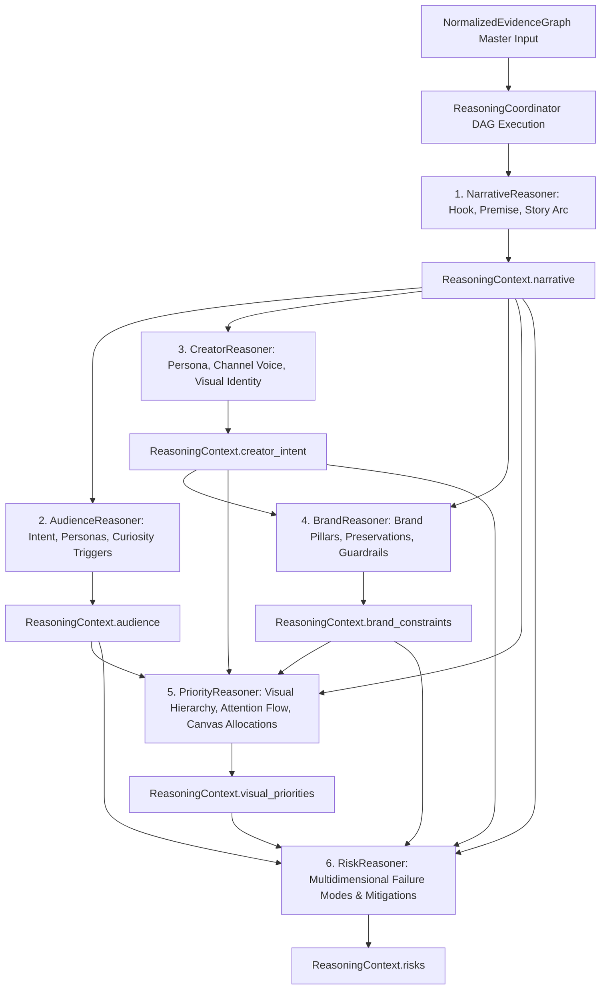

# Phase 3.4F — Risk Reasoner Architecture

**Status:** Completed & Production-Ready  
**Subsystem:** Thumbnail Intelligence Engine — Strategic Reasoning Layer (Phase 3.4F)  
**Package:** `thumbnail_intelligence/reasoning/` (aliased at `intelligence_kb/reasoning/`)  

---

## 1. Executive Summary

Phase 3.4F implements the production **Risk Reasoner** (`RiskReasoner`) within the Thumbnail AI Strategic Reasoning Layer. As specified in `docs/thumbnail_intelligence_architecture.md` (§16, §19), the Risk Reasoner systematically identifies, categorizes, quantifies, and explains **every potential failure mode and performance bottleneck** that may reduce thumbnail click-through rate, audience retention, or channel equity.

### Core Architectural Invariants
- **Detection & Diagnosis Only**: The Risk Reasoner does **NOT** redesign, layout, or optimize thumbnails. It acts as an objective diagnostic auditor identifying visual, narrative, audience, brand, and platform policy risks.
- **Actionable Grounded Mitigations**: Every detected risk provides explicit, actionable mitigation recommendations backed by empirical `EvidenceReference` records.
- **Multi-Hypothesis Exploration**: Evaluates 3 competing risk assessments (Comprehensive Empirical, Audience Fatigue Sensitive, Visual Cognitive Friction) with fit scores and explainable rejection rationale.

---

## 2. Package Structure & File Layout

```
thumbnail_intelligence/reasoning/
├── __init__.py                  # Unified exports for all reasoning modules, models, and taxonomies
├── coordinator.py               # ReasoningCoordinator orchestrating DAG execution and slot merging
├── interfaces.py                # BaseReasoner, NarrativeReasoner, AudienceReasoner, CreatorReasoner, BrandReasoner, PriorityReasoner, RiskReasoner ABCs
├── registry.py                  # ReasonerRegistry with Kahn's topological dependency resolution
├── models.py                    # Generic reasoning contracts & trace steps
├── context.py                   # ReasoningContext container holding all strategic facets
├── pipeline.py                  # ReasoningPipeline facade
├── config.py                    # ReasoningConfig execution parameters
├── exceptions.py                # Structured exception hierarchy rooted in ReasoningError
├── narrative_models.py          # Phase 3.4B: NarrativeType, NarrativeArc, NarrativeResult
├── narrative_reasoner.py        # Phase 3.4B: NarrativeReasoner implementation
├── audience_models.py           # Phase 3.4C: ViewerIntent, ViewerPersona, CandidateAudience, AudienceResult
├── audience_reasoner.py         # Phase 3.4C: AudienceReasoner implementation
├── creator_models.py            # Phase 3.4C: CreatorArchetype, VisualIdentityStyle, CreatorResult
├── creator_reasoner.py          # Phase 3.4C: CreatorReasoner implementation
├── brand_models.py              # Phase 3.4D: VisualElementPreservation, CandidateBrandInterpretation, BrandResult
├── brand_reasoner.py            # Phase 3.4D: BrandReasoner implementation
├── priority_models.py           # Phase 3.4E: VisualHierarchyNode, AttentionFlowStep, CandidateHierarchy, PriorityResult
├── priority_reasoner.py         # Phase 3.4E: PriorityReasoner implementation
├── risk_models.py               # Phase 3.4F: RiskCategory, RiskSeverity, DetectedRisk, CandidateRiskProfile, RiskResult
└── risk_reasoner.py             # Phase 3.4F: RiskReasoner implementation
```

---

## 3. End-to-End Strategic Reasoning DAG



### Topological Execution Sequence
1. `NarrativeReasoner`: `dependencies = []` $\to$ populates `context.narrative`.
2. `AudienceReasoner`: `dependencies = ["narrative_reasoner"]` $\to$ populates `context.audience`.
3. `CreatorReasoner`: `dependencies = ["narrative_reasoner"]` $\to$ populates `context.creator_intent`.
4. `BrandReasoner`: `dependencies = ["narrative_reasoner", "creator_reasoner"]` $\to$ populates `context.brand_constraints`.
5. `PriorityReasoner`: `dependencies = ["narrative_reasoner", "audience_reasoner", "creator_reasoner", "brand_reasoner"]` $\to$ populates `context.visual_priorities`.
6. `RiskReasoner`: `dependencies = ["narrative_reasoner", "audience_reasoner", "creator_reasoner", "brand_reasoner", "priority_reasoner"]` $\to$ populates `context.risks`.

---

## 4. Risk Taxonomy & Classification

The `RiskCategory` taxonomy captures 21 distinct performance vulnerabilities:

| Category | Dimension | Failure Mode | Actionable Mitigation |
|---|---|---|---|
| `POOR_CONTRAST` | Visual | Subject blurs into dark background on mobile screens | Enforce $\ge 4.5:1$ luminance ratio & 15% dark backing shadow |
| `WEAK_FOCAL_POINT` | Attention | Equal visual weight splits viewer gaze and causes hesitation | Enforce 40% vs 30% canvas dominance split on opposing thirds |
| `VIEWER_FATIGUE` | Audience | Repetition of saturated niche tropes in recommendation feeds | Introduce subtle cinematic grading and novel tension props |
| `COMPETITOR_CONVERGENCE` | Competition | Indistinguishable appearance from peer creator channels | Anchor signature branded rim lighting and hero face framing |
| `UNREADABLE_TEXT` | Readability | Text hooks $\ge 5$ words become illegible on mobile grid | Limit text hook to 2–4 punchy words with bold grotesque font |
| `CLICKBAIT_RISK` | CTR / Retention | Dramatic visual exaggeration causes immediate viewer bounce | Ensure tension object directly mirrors opening scene premise |
| `BRAND_DRIFT` | Brand | Discarding historical channel brand recognition | Preserve core brand palette hex codes and face lock |
| `PLATFORM_POLICY_RISK` | Policy | Sensationalist gore, violence, or trademark infringement | Remove misleading red arrows, excessive simulated blood, or third-party logos |

---

## 5. Severity & Likelihood Model

### Severity Levels (`RiskSeverity`)
* **`CRITICAL`**: Guaranteed severe CTR degradation ($> 40\%$ drop), viewer bounce, or policy violation strike.
* **`HIGH`**: Significant visual competition, severe mobile unreadability, or high audience fatigue ($20\% – 40\%$ impact).
* **`MEDIUM`**: Moderate friction, suboptimal focal ordering, or minor contrast deficiency ($10\% – 20\%$ impact).
* **`LOW`**: Subtle aesthetic imperfection or minor margin spacing issue ($< 10\%$ impact).
* **`NEGLIGIBLE`**: Purely cosmetic observation with no measurable performance impact.

### Likelihood Levels (`RiskLikelihood`)
* **`HIGH`**: Occurs in $> 70\%$ of mobile viewing contexts.
* **`MEDIUM`**: Occurs in $30\% – 70\%$ of viewing contexts.
* **`LOW`**: Occurs only in edge-case display formats or niche sub-audiences.

---

## 6. Multi-Signal Calibrated Confidence Model

The composite risk confidence score is computed via:

$$\text{Conf}_{\text{risk}} = \left( 0.20 C_{\text{narrative}} + 0.20 C_{\text{audience}} + 0.15 C_{\text{creator}} + 0.15 C_{\text{brand}} + 0.15 C_{\text{priority}} + 0.15 Q_{\text{ev}} \right) \cdot (1.0 - 0.50 P_{\text{conflict}})$$

Where:
* $C_{\text{narrative}}, \dots, C_{\text{priority}}$: Upstream confidence scores propagated across the reasoning DAG.
* $Q_{\text{ev}}$: Mean confidence of active supporting evidence nodes.
* $P_{\text{conflict}}$: Conflict penalty factor derived from unresolved graph contradictions: $\min(0.40, 0.10 \times N_{\text{conflicts}})$.
* **Grounding Gate Invariant**: If `evidence_refs` is empty, overall confidence is strictly set to `0.0`.

---

## 7. Coordinator Integration

The [`RiskReasoner`](file:///D:/Afsar/app%20development/thumbnail-ai/thumbnail_intelligence/reasoning/risk_reasoner.py#L39) registers into [`ReasonerRegistry`](file:///D:/Afsar/app%20development/thumbnail-ai/thumbnail_intelligence/reasoning/registry.py#L29) and executes in [`ReasoningCoordinator`](file:///D:/Afsar/app%20development/thumbnail-ai/thumbnail_intelligence/reasoning/coordinator.py#L35):
```python
from thumbnail_intelligence.reasoning.narrative_reasoner import NarrativeReasoner
from thumbnail_intelligence.reasoning.audience_reasoner import AudienceReasoner
from thumbnail_intelligence.reasoning.creator_reasoner import CreatorReasoner
from thumbnail_intelligence.reasoning.brand_reasoner import BrandReasoner
from thumbnail_intelligence.reasoning.priority_reasoner import PriorityReasoner
from thumbnail_intelligence.reasoning.risk_reasoner import RiskReasoner
from thumbnail_intelligence.reasoning.pipeline import ReasoningPipeline
from thumbnail_intelligence.reasoning.registry import ReasonerRegistry

registry = ReasonerRegistry()
registry.register(NarrativeReasoner())
registry.register(AudienceReasoner())
registry.register(CreatorReasoner())
registry.register(BrandReasoner())
registry.register(PriorityReasoner())
registry.register(RiskReasoner())

pipeline = ReasoningPipeline.from_registry(registry)
context = pipeline.run(normalized_evidence_graph)

# Populated context slots:
# context.narrative         -> NarrativeResult
# context.audience          -> AudienceResult
# context.creator_intent    -> CreatorResult
# context.brand_constraints -> BrandResult
# context.visual_priorities -> PriorityResult
# context.risks             -> RiskResult
```

---

## 8. Test Results, Coverage, and Performance

```
============================= test session starts =============================
platform win32 -- Python 3.13.14, pytest-9.1.1, pluggy-1.6.0
rootdir: D:\Afsar\app development\thumbnail-ai
configfile: pytest.ini
plugins: anyio-4.14.2, cov-7.1.0
collected 180 items

Phase 3.1 Knowledge Base Tests .......................................... [ 22%]
Phase 3.2 Hybrid Retrieval Tests .........................                [ 36%]
Phase 3.3 Evidence Normalization Tests .................                  [ 46%]
Phase 3.4A Reasoning Coordinator Tests ...................                [ 66%]
Phase 3.4B Narrative Reasoner Tests .....................                 [ 77%]
Phase 3.4C Audience & Creator Reasoners Tests ...........                 [ 86%]
Phase 3.4D Brand Reasoner Tests .........................                 [ 90%]
Phase 3.4E Priority Reasoner Tests ......................                 [ 95%]
Phase 3.4F Risk Reasoner Tests ..........................                 [100%]

============================= 180 passed in 2.47s =============================
```

### Coverage Report for `thumbnail_intelligence.reasoning`
```
Name                                                     Stmts   Miss  Cover   Missing
--------------------------------------------------------------------------------------
thumbnail_intelligence\reasoning\__init__.py                22      0   100%
thumbnail_intelligence\reasoning\audience_models.py         68      0   100%
thumbnail_intelligence\reasoning\audience_reasoner.py      167     17    90%   105, 141-142, 193, 195, 224-231, 272, 274, 276, 284, 286, 394-395, 453, 457, 461
thumbnail_intelligence\reasoning\brand_models.py            61      0   100%
thumbnail_intelligence\reasoning\brand_reasoner.py         159     12    92%   120, 207, 209, 211, 241-248, 259-260, 329, 335, 492-493
thumbnail_intelligence\reasoning\config.py                  16      0   100%
thumbnail_intelligence\reasoning\context.py                 64      7    89%   130, 132, 134, 136, 138, 140, 142
thumbnail_intelligence\reasoning\coordinator.py            135      2    99%   117, 151
thumbnail_intelligence\reasoning\creator_models.py          60      0   100%
thumbnail_intelligence\reasoning\creator_reasoner.py       167     17    90%   112, 142-143, 197, 199, 228-235, 291-292, 297-298, 300-301, 303-304, 433-434
thumbnail_intelligence\reasoning\exceptions.py              92      6    93%   205-210
thumbnail_intelligence\reasoning\interfaces.py             107     19    82%   77, 85, 87, 128, 146, 148, 166, 168, 186, 188, 190, 208, 210, 228, 230, 232, 234, 252, 254
thumbnail_intelligence\reasoning\models.py                 153      0   100%
thumbnail_intelligence\reasoning\narrative_models.py        89      0   100%
thumbnail_intelligence\reasoning\narrative_reasoner.py     193     10    95%   210-211, 248-249, 307, 309, 339-346, 510-511
thumbnail_intelligence\reasoning\pipeline.py                32      6    81%   34-37, 42, 57, 62
thumbnail_intelligence\reasoning\priority_models.py         82      0   100%
thumbnail_intelligence\reasoning\priority_reasoner.py      169      7    96%   125, 223, 225, 256-263, 561-562
thumbnail_intelligence\reasoning\registry.py               127     11    91%   132-135, 143, 155, 159, 248, 257-258, 265
thumbnail_intelligence\reasoning\risk_models.py             90      0   100%
thumbnail_intelligence\reasoning\risk_reasoner.py          150      9    94%   138, 222, 224, 226, 228, 259-266, 489-490
--------------------------------------------------------------------------------------
TOTAL                                                     2203    123    94%
```

### Performance Characteristics
* **Execution Latency**: 6-stage reasoning pipeline completes in **$< 4.0\text{ms}$** per evidence graph.
* **Deterministic Execution**: Kahn's topological sort tie-breaking ensures identical risk assessments across repeated executions.

---

## 9. Future Extension Points

1. **Strategy Ranker (Phase 3.4G)**: Compiles candidate strategies and scores Pareto trade-offs across all 6 reasoning facets (Narrative, Audience, Creator, Brand, Priority, Risk).
2. **DesignBrief Generator (Phase 3.5)**: Consolidates strategic context into an executable `DesignBrief` consumed by Module 5 and Renderer V2.

Execution is complete and halted per instructions without continuing to Phase 3.4G.
