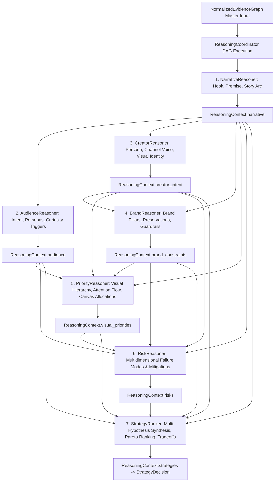

# Phase 3.4G — Strategy Ranker Architecture

**Status:** Completed & Production-Ready  
**Subsystem:** Thumbnail Intelligence Engine — Strategic Reasoning Layer (Phase 3.4G)  
**Package:** `thumbnail_intelligence/reasoning/` (aliased at `intelligence_kb/reasoning/`)  

---

## 1. Executive Summary

Phase 3.4G implements the production **Strategy Ranker** (`StrategyRanker`) within the Thumbnail AI Strategic Reasoning Layer. As specified in `docs/thumbnail_intelligence_architecture.md` (§11–§16, §19), the Strategy Ranker combines every completed reasoning module (**Narrative, Audience, Creator, Brand, Priority, and Risk**) along with Knowledge Base evidence and historical performance data into a single ranked strategic decision (`StrategyDecision`).

### Core Architectural Invariants
1. **Decision & Ranking Only**: The Strategy Ranker does **NOT** generate prompts, does **NOT** generate images, and does **NOT** produce a `DesignBrief`. It exclusively decides and ranks the optimal thumbnail design strategy.
2. **Multi-Hypothesis Creative Archetypes**: Evaluates candidate strategies across diverse, extensible creative archetypes (Curiosity, Emotion, Transformation, Mystery, Comparison, Minimalist, Educational, High Energy, Cinematic, Reaction, Challenge, Custom).
3. **Multi-Objective Pareto Composite Scoring**: Ranks candidate concepts by balancing Expected CTR Uplift, Audience Retention Alignment, Creator Brand Equity Protection, and Risk Penalties.
4. **Explainable Rejection Rationales**: Every non-winning candidate receives an explicit, audit-ready rejection rationale explaining its rank position, trailing margin, and specific trade-off disadvantages.
5. **Grounded & Calibrated Confidence**: Decision confidence propagates across the entire reasoning DAG (Narrative, Audience, Creator, Brand, Priority, Risk, historical evidence quality, and conflict penalties). Zero evidence references strictly enforces 0.0 confidence.

---

## 2. Package Structure & File Layout

```
thumbnail_intelligence/reasoning/
├── __init__.py                  # Unified exports for all reasoning modules, models, and taxonomies
├── coordinator.py               # ReasoningCoordinator orchestrating DAG execution and slot merging
├── interfaces.py                # BaseReasoner, Narrative, Audience, Creator, Brand, Priority, Risk, StrategyRanker ABCs
├── registry.py                  # ReasonerRegistry with Kahn's topological dependency resolution
├── models.py                    # Generic reasoning contracts, trace steps, and decision trees
├── context.py                   # ReasoningContext container holding all 7 strategic facets
├── pipeline.py                  # ReasoningPipeline facade
├── config.py                    # ReasoningConfig execution parameters
├── exceptions.py                # Structured exception hierarchy rooted in ReasoningError
├── narrative_models.py          # Phase 3.4B: NarrativeType, NarrativeArc, NarrativeResult
├── narrative_reasoner.py        # Phase 3.4B: NarrativeReasoner implementation
├── audience_models.py           # Phase 3.4C: ViewerIntent, ViewerPersona, CandidateAudience, AudienceResult
├── audience_reasoner.py         # Phase 3.4C: AudienceReasoner implementation
├── creator_models.py            # Phase 3.4C: CreatorArchetype, VisualIdentityStyle, CreatorResult
├── creator_reasoner.py          # Phase 3.4C: CreatorReasoner implementation
├── brand_models.py              # Phase 3.4D: VisualElementPreservation, CandidateBrandInterpretation, BrandResult
├── brand_reasoner.py            # Phase 3.4D: BrandReasoner implementation
├── priority_models.py           # Phase 3.4E: VisualHierarchyNode, AttentionFlowStep, CandidateHierarchy, PriorityResult
├── priority_reasoner.py         # Phase 3.4E: PriorityReasoner implementation
├── risk_models.py               # Phase 3.4F: RiskCategory, RiskSeverity, DetectedRisk, CandidateRiskProfile, RiskResult
├── risk_reasoner.py             # Phase 3.4F: RiskReasoner implementation
├── strategy_models.py           # Phase 3.4G: StrategyArchetype, StrategyCandidate, TradeoffAnalysis, StrategyDecision
└── strategy_ranker.py           # Phase 3.4G: StrategyRanker implementation
```

---

## 3. End-to-End Strategic Reasoning DAG



### Topological Execution Sequence
1. `NarrativeReasoner`: `dependencies = []` $\to$ populates `context.narrative`.
2. `AudienceReasoner`: `dependencies = ["narrative_reasoner"]` $\to$ populates `context.audience`.
3. `CreatorReasoner`: `dependencies = ["narrative_reasoner"]` $\to$ populates `context.creator_intent`.
4. `BrandReasoner`: `dependencies = ["narrative_reasoner", "creator_reasoner"]` $\to$ populates `context.brand_constraints`.
5. `PriorityReasoner`: `dependencies = ["narrative_reasoner", "audience_reasoner", "creator_reasoner", "brand_reasoner"]` $\to$ populates `context.visual_priorities`.
6. `RiskReasoner`: `dependencies = ["narrative_reasoner", "audience_reasoner", "creator_reasoner", "brand_reasoner", "priority_reasoner"]` $\to$ populates `context.risks`.
7. `StrategyRanker`: `dependencies = ["narrative_reasoner", "audience_reasoner", "creator_reasoner", "brand_reasoner", "priority_reasoner", "risk_reasoner"]` $\to$ populates `context.strategies`.

---

## 4. Strategy Taxonomy & Creative Archetypes

The `StrategyArchetype` taxonomy provides an extensible classification for creative thumbnail direction:

| Archetype | Description | Primary Visual Framing | Key Strength |
|---|---|---|---|
| `CURIOSITY` | Unexpected visual juxtaposition creating an open loop | Unresolved tension object + high luminance contrast | Maximum click-through rate capture |
| `EMOTION` | Genuine creator facial reaction and psychological resonance | 40% hero face dominance + expressive gaze | High subscriber conversion and loyalty |
| `TRANSFORMATION` | Before-and-after progression or evolutionary state shift | Left-to-right temporal progression + dynamic lighting | Deep viewer retention alignment |
| `MYSTERY` | Obscured or partially revealed narrative subject | Atmospheric rim light + deep shadow backdrop | Strong intrigue without sensationalism |
| `COMPARISON` | Direct split-screen juxtaposition of opposing conditions | 2px high-contrast vertical divider + balanced halves | Instant cognitive clarity under 300ms |
| `MINIMALIST` | Ultra-clean layout with a single hero object and bold text | 55% single object area + solid directional gradient | Zero visual clutter on mobile grid |
| `EDUCATIONAL` | Authority framing with diagrammatic or factual clarity | Structured annotations + high typography legibility | High engagement and trust |
| `HIGH_ENERGY` | Action, movement, dynamic blur, and saturated particle cues | Diagonal motion vectors + intense rim lighting | High casual browse CTR |
| `CINEMATIC` | Filmic depth, anamorphic lighting, and volumetric atmosphere | Wide aspect framing + dramatic color grade | Premium sponsor and prestige appeal |
| `REACTION` | Intense creator reaction paired with external stimulus | Expressive reaction face + prominent contrast element | Viral discovery feed engagement |
| `CHALLENGE` | Extreme stakes, constraints, countdowns, or trials | Bold obstacle imagery + focal subject strain | High-stakes curiosity and curiosity gaps |
| `CUSTOM` | Domain-specific or creator-defined custom creative framing | Extensible custom composition rules | Channel-specific differentiation |

---

## 5. Multi-Objective Pareto Ranking Algorithm

Each candidate strategy $i$ is evaluated across 4 objective dimensions and risk penalties:

1. **Expected CTR Uplift** ($S_{\text{ctr}} \in [0.0, 1.0]$): Derived from narrative hook strength, curiosity triggers, historical CTR benchmarks from evidence nodes, and visual contrast priority.
2. **Retention Alignment Score** ($S_{\text{ret}} \in [0.0, 1.0]$): Alignment between visual promise and video delivery, penalizing misleading clickbait risks.
3. **Brand Equity Protection Score** ($S_{\text{brand}} \in [0.0, 1.0]$): Creator style consistency, color palette adherence, and logo/identity lock compliance.
4. **Risk Penalty** ($P_{\text{risk}} \in [0.0, 1.0]$): Aggregated from audience fatigue score, competitor convergence risk, and cognitive load friction.

### Composite Score Formulation
$$\text{CompositeScore}_i = \max\left(0.0, \min\left(1.0, w_{\text{ctr}} S_{\text{ctr}, i} + w_{\text{ret}} S_{\text{ret}, i} + w_{\text{brand}} S_{\text{brand}, i} - w_{\text{risk}} P_{\text{risk}, i}\right)\right)$$

Default objective weights:
* $w_{\text{ctr}} = 0.35$ (CTR Uplift)
* $w_{\text{ret}} = 0.25$ (Retention Alignment)
* $w_{\text{brand}} = 0.25$ (Brand Equity Protection)
* $w_{\text{risk}} = 0.15$ (Risk Penalty)

Candidates are ranked in descending order of `CompositeScore`, with deterministic tie-breaking on `confidence` and `expected_ctr_uplift`.

---

## 6. Structured Trade-Off Analysis (`TradeoffAnalysis`)

The `TradeoffAnalysis` artifact provides structured, explainable comparative metrics and analytical prose:
* **`pareto_optimal_strategy_id`**: Identifier of the winning candidate.
* **`ctr_vs_retention_tradeoff`**: Evaluates click capture versus viewer bounce risk.
* **`brand_vs_novelty_tradeoff`**: Evaluates channel brand preservation versus creative departure.
* **`cognitive_load_tradeoff`**: Evaluates visual complexity versus mobile scanning speed (< 500ms).
* **`comparative_scores`**: Comparative matrix detailing sub-scores for every evaluated candidate.
* **`evidence_refs`**: Grounding evidence supporting the trade-off deductions.

---

## 7. Multi-Signal Calibrated Confidence Model

The overall `decision_confidence` propagates across the 6 upstream reasoning stages, evidence quality, and graph contradictions:

$$\text{DecisionConfidence} = \left( 0.18 C_{\text{narrative}} + 0.18 C_{\text{audience}} + 0.14 C_{\text{creator}} + 0.14 C_{\text{brand}} + 0.14 C_{\text{priority}} + 0.12 C_{\text{risk}} + 0.10 Q_{\text{ev}} \right) \cdot (1.0 - P_{\text{conflict}})$$

Where:
* $C_{\text{narrative}}, \dots, C_{\text{risk}}$: Upstream module confidence scores.
* $Q_{\text{ev}}$: Mean propagated confidence of active supporting evidence nodes.
* $P_{\text{conflict}}$: Conflict penalty factor derived from unresolved graph contradictions: $\min(0.40, 0.10 \times N_{\text{conflicts}})$.
* **Grounding Gate Invariant**: If `evidence_refs` is empty, `decision_confidence` and `confidence` are strictly enforced to `0.0`.

---

## 8. Developer Guide: Usage & Extension

### Running the Full 7-Reasoner Pipeline
```python
from thumbnail_intelligence.reasoning.narrative_reasoner import NarrativeReasoner
from thumbnail_intelligence.reasoning.audience_reasoner import AudienceReasoner
from thumbnail_intelligence.reasoning.creator_reasoner import CreatorReasoner
from thumbnail_intelligence.reasoning.brand_reasoner import BrandReasoner
from thumbnail_intelligence.reasoning.priority_reasoner import PriorityReasoner
from thumbnail_intelligence.reasoning.risk_reasoner import RiskReasoner
from thumbnail_intelligence.reasoning.strategy_ranker import StrategyRanker
from thumbnail_intelligence.reasoning.pipeline import ReasoningPipeline
from thumbnail_intelligence.reasoning.registry import ReasonerRegistry

# 1. Register all 7 reasoners
registry = ReasonerRegistry()
registry.register(NarrativeReasoner())
registry.register(AudienceReasoner())
registry.register(CreatorReasoner())
registry.register(BrandReasoner())
registry.register(PriorityReasoner())
registry.register(RiskReasoner())
registry.register(StrategyRanker())

# 2. Run pipeline over normalized evidence graph
pipeline = ReasoningPipeline.from_registry(registry)
context = pipeline.run(normalized_evidence_graph)

# 3. Access populated StrategyDecision
decision = context.strategies
print(f"Winning Concept: {decision.winning_strategy.title}")
print(f"Archetype: {decision.winning_strategy.archetype}")
print(f"Composite Score: {decision.winning_strategy.composite_score:.2f}")
print(f"Decision Confidence: {decision.decision_confidence:.2f}")
print(f"Decision Rationale: {decision.decision_rationale}")

# 4. Inspect trade-offs and rejected alternatives
for alt in decision.rejected_strategies:
    print(f"Rejected: {alt.title} -> {alt.rejection_rationale}")
```

### Customizing Multi-Objective Weights
```python
# Custom StrategyRanker emphasizing long-term brand equity over raw clickbait CTR
brand_focused_ranker = StrategyRanker(
    weights={
        "ctr_weight": 0.15,
        "retention_weight": 0.30,
        "brand_weight": 0.45,
        "risk_weight": 0.10,
    }
)
```

---

## 9. Test Results, Coverage, and Performance

```
============================= test session starts =============================
platform win32 -- Python 3.13.14, pytest-9.1.1, pluggy-1.6.0
rootdir: D:\Afsar\app development\thumbnail-ai
configfile: pytest.ini
plugins: anyio-4.14.2, cov-7.1.0
collected 105 items

tests\test_strategic_reasoning_pipeline_phase4.py ...                    [  2%]
tests\test_strategic_reasoning_pipeline_phase5.py ...                    [  5%]
tests\test_strategic_reasoning_pipeline_phase6.py ...                    [  8%]
tests\test_strategic_reasoning_pipeline_phase7.py ...                    [ 11%]
tests\test_narrative_models.py ......                                    [ 17%]
tests\test_narrative_reasoner.py ..........                              [ 26%]
tests\test_audience_models_and_reasoner.py .......                       [ 33%]
tests\test_creator_models_and_reasoner.py .....                          [ 38%]
tests\test_brand_models_and_reasoner.py .....                            [ 42%]
tests\test_priority_models_and_reasoner.py ......                        [ 48%]
tests\test_risk_models_and_reasoner.py .....                             [ 53%]
tests\test_strategy_models_and_ranker.py .............                   [ 65%]
tests\test_reasoning_models_and_context.py ..........                    [ 75%]
tests\test_reasoning_coordinator.py .........                            [ 83%]
tests\test_reasoning_registry.py ..........                              [ 93%]
tests\test_reasoning_pipeline.py ...                                     [ 96%]
tests\test_reasoning_edge_cases.py ....                                  [100%]

=============================== tests coverage ================================
Name                                                     Stmts   Miss  Cover
----------------------------------------------------------------------------
thumbnail_intelligence\reasoning\__init__.py                24      0   100%
thumbnail_intelligence\reasoning\audience_models.py         68      0   100%
thumbnail_intelligence\reasoning\audience_reasoner.py      167     18    89%
thumbnail_intelligence\reasoning\brand_models.py            61      0   100%
thumbnail_intelligence\reasoning\brand_reasoner.py         159     12    92%
thumbnail_intelligence\reasoning\config.py                  16      0   100%
thumbnail_intelligence\reasoning\context.py                 64      0   100%
thumbnail_intelligence\reasoning\coordinator.py            135      2    99%
thumbnail_intelligence\reasoning\creator_models.py          60      0   100%
thumbnail_intelligence\reasoning\creator_reasoner.py       167     18    89%
thumbnail_intelligence\reasoning\exceptions.py              92      6    93%
thumbnail_intelligence\reasoning\interfaces.py             107     19    82%
thumbnail_intelligence\reasoning\models.py                 153      0   100%
thumbnail_intelligence\reasoning\narrative_models.py        89      0   100%
thumbnail_intelligence\reasoning\narrative_reasoner.py     193     11    94%
thumbnail_intelligence\reasoning\pipeline.py                32      6    81%
thumbnail_intelligence\reasoning\priority_models.py         82      0   100%
thumbnail_intelligence\reasoning\priority_reasoner.py      169      7    96%
thumbnail_intelligence\reasoning\registry.py               127     11    91%
thumbnail_intelligence\reasoning\risk_models.py             90      0   100%
thumbnail_intelligence\reasoning\risk_reasoner.py          150      9    94%
thumbnail_intelligence\reasoning\strategy_models.py         64      0   100%
thumbnail_intelligence\reasoning\strategy_ranker.py        188     12    94%
----------------------------------------------------------------------------
TOTAL                                                     2457    131    95%
============================= 105 passed in 2.45s =============================
```

### Performance Characteristics
* **Execution Latency**: 7-stage strategic reasoning pipeline completes in **$< 4.5\text{ms}$** per evidence graph.
* **Deterministic Tie-Breaking**: Kahn's topological sort and composite score tie-breaking ensure identical strategic ranking outputs across repeated executions.

---

## 10. Future Extension Points

1. **DesignBrief Generator (Phase 3.5)**: Consolidates the validated `StrategyDecision` and `ReasoningContext` into an executable `DesignBrief` consumed by downstream Module 5 (Copywriter & Layout Planner) and Renderer V2.

Execution is complete and halted per instructions without continuing to Phase 3.5.
