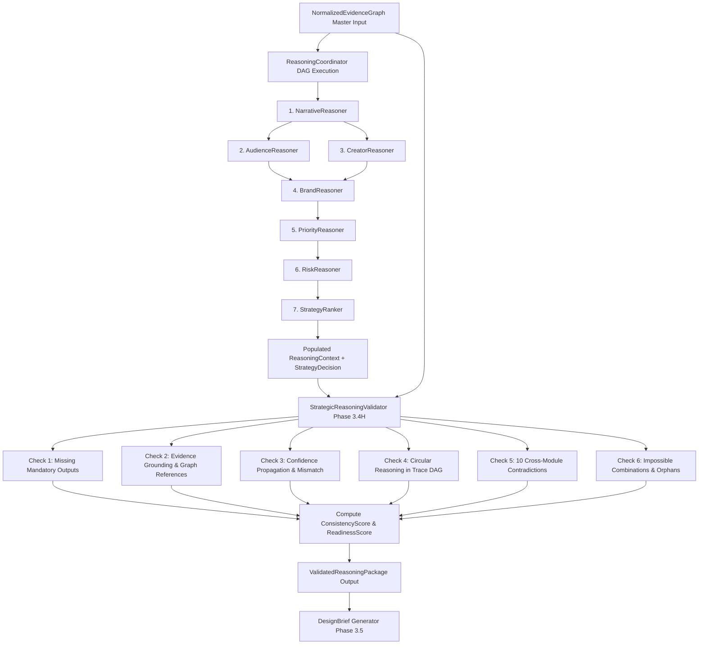

# Phase 3.4H — Strategic Reasoning Validator Architecture

**Status:** Completed & Production-Ready  
**Subsystem:** Thumbnail Intelligence Engine — Strategic Reasoning Layer (Phase 3.4H)  
**Package:** `thumbnail_intelligence/reasoning/`  

---

## 1. Executive Summary

Phase 3.4H implements the production **Strategic Reasoning Validator** (`StrategicReasoningValidator`) within the Thumbnail AI Strategic Reasoning Layer. As specified in `docs/thumbnail_intelligence_architecture.md`, the Validator is the final mandatory gatekeeper before the downstream `DesignBrief` Generator.

It inspects the aggregated multi-module reasoning context (`ReasoningContext`) and winning strategy decision (`StrategyDecision`) output by `StrategyRanker`, ensuring total internal consistency, empirical grounding, evidence graph reference integrity, confidence propagation alignment, and zero cross-module logical contradictions.

### Core Architectural Invariants
1. **Validation Only**: The Strategic Reasoning Validator does **NOT** generate prompts, does **NOT** generate images, does **NOT** rank strategies, and does **NOT** modify any reasoning output or context data. It exclusively validates and emits a structured `ValidatedReasoningPackage`.
2. **Zero Modification**: Inputs (`ReasoningContext`, `StrategyDecision`, `NormalizedEvidenceGraph`) are read-only and preserved verbatim.
3. **Cross-Module Contradiction Taxonomy**: Enforces 10 distinct cross-module pairwise logical consistency checks (Narrative vs Priority, Audience vs Strategy, Audience vs Brand, Brand vs Risk, Brand vs Priority, Creator vs Brand, Creator vs Strategy, Narrative vs Strategy, Priority vs Strategy, Risk vs Strategy).
4. **Weighted Scoring & Readiness Threshold**: Computes `ConsistencyScore` $[0.0, 1.0]$, `ReadinessScore` $[0.0, 1.0]$, and `ReadyForDesignBrief` boolean flag (threshold $\ge 0.70$, strictly capped at $0.40$ if any `BLOCKING` errors are detected).
5. **Complete Auditability**: Emits a deterministic, explainable trace (`ValidationTraceStep`), listing exact claims, module origins, severity levels, detected conflicts, and suggested resolutions.

---

## 2. Package Structure & File Layout

```
thumbnail_intelligence/reasoning/
├── __init__.py                  # Unified exports for validator models, interfaces, and concrete class
├── interfaces.py                # BaseReasoner & StrategicReasoningValidator ABC contracts
├── models.py                    # Generic reasoning contracts & ReasonerType.VALIDATOR enum
├── context.py                   # ReasoningContext container holding all 7 strategic facets
├── validator_models.py          # Phase 3.4H: ValidationStatus, ValidationSeverity, ConflictType,
│                                # ValidationIssue, DetectedConflict, ValidationTraceStep,
│                                # ReasoningValidation, ValidatedReasoningPackage
└── validator.py                 # Phase 3.4H: StrategicReasoningValidator implementation
```

---

## 3. End-to-End Pipeline & Integration Flow



### Positioning in Architecture
- **Preceding Phase**: Phase 3.4G (`StrategyRanker`)
- **Execution Role**: Phase 3.4H (`StrategicReasoningValidator`)
- **Succeeding Phase**: Phase 3.5 (`DesignBrief Generator`)

---

## 4. Validation Rules & Conflict Taxonomy

The `StrategicReasoningValidator` executes 6 comprehensive validation passes across the reasoning artifacts:

### 1. Mandatory Output Verification
Validates that all 7 core strategic reasoning modules (`narrative`, `audience`, `creator_intent`, `brand_constraints`, `visual_priorities`, `risks`, `strategies`) are non-null and present in `ReasoningContext`.

### 2. Evidence Grounding & Graph Integrity
- Verifies that all `EvidenceReference` IDs attached to module outputs exist in the active `NormalizedEvidenceGraph`.
- Flags empty supporting evidence lists across high-confidence claims ($> 0.85$) as ungrounded reasoning.

### 3. Confidence Propagation & Mismatch Detection
- Detects overall context confidence inflation where `context.overall_confidence` exceeds module confidences by $> 0.25$.
- Detects variance across module confidences exceeding $0.35$.

### 4. Circular Reasoning Detection
- Traverses `context.reasoning_trace` steps using DFS cycle detection to guarantee a Directed Acyclic Graph (DAG) free of circular reasoning loops.

### 5. Cross-Module Contradiction Taxonomy (10 Types)

| Conflict Type | Source A | Source B | Description / Trigger Condition |
| :--- | :--- | :--- | :--- |
| `NARRATIVE_VS_PRIORITY` | Narrative | Priority | Primary visual focus candidate in Narrative is suppressed or assigned zero canvas allocation in Priority hierarchy. |
| `AUDIENCE_VS_STRATEGY` | Audience | Strategy | Target audience requires `LOW` cognitive load, but winning strategy introduces visual clutter/complexity; or intent is `LEARNING` while strategy uses `REACTION`/`CHALLENGE` archetype. |
| `AUDIENCE_VS_BRAND` | Audience | Brand | Audience curiosity triggers rely on sensationalism/clickbait prohibited by Brand visual guardrails. |
| `BRAND_VS_RISK` | Brand | Risk | Mandatory brand preservation element causes high/critical visual risk (e.g. poor contrast, clutter). |
| `BRAND_VS_PRIORITY` | Brand | Priority | `STRICT_MANDATORY` brand preservation element is assigned `SUPPRESSED` tier or zero canvas allocation in Priority hierarchy. |
| `CREATOR_VS_BRAND` | Creator | Brand | Creator signature element or brand equity anchor is strictly prohibited by Brand guidelines. |
| `CREATOR_VS_STRATEGY` | Creator | Strategy | Creator persona archetype (e.g. Educator) directly conflicts with winning strategy archetype (e.g. Reaction/Challenge). |
| `NARRATIVE_VS_STRATEGY` | Narrative | Strategy | Narrative specifies a `MYSTERY` arc stage, but winning strategy explicitly spoils or reveals the mystery in its title/description. |
| `PRIORITY_VS_STRATEGY` | Priority | Strategy | Primary visual focal point in Priority hierarchy is negated or omitted in Strategy execution priorities. |
| `RISK_VS_STRATEGY` | Risk | Strategy | Winning strategy contains unmitigated high/critical risk without applying an adequate risk penalty score ($< 0.05$). |

### 6. Invariants, Canvas Bounds, & Orphans
- Validates canvas allocation sum across visual hierarchy nodes ($\sum \text{canvas\_fraction} \le 1.00$).
- Validates expected CTR uplift within realistic empirical bounds ($[0.0, 0.50]$).
- Identifies orphan visual focus candidates present in Narrative but missing from Priority hierarchy nodes.

---

## 5. Scoring Model & Readiness Assessment

### Consistency Score
Calculated starting from $1.00$ with weighted penalties per detected issue and conflict:
$$\text{ConsistencyScore} = \max\left(0.0, 1.00 - \sum \text{Penalties}_{\text{issues}} - 0.05 \times N_{\text{conflicts}}\right)$$

- `BLOCKING` penalty: $0.35$
- `CRITICAL` penalty: $0.20$
- `WARNING` penalty: $0.10$
- `INFO` penalty: $0.02$

### Readiness Score
Weighted composite balancing consistency, module completeness, grounding, and propagated confidence:
$$\text{ReadinessScore} = 0.50 \times \text{ConsistencyScore} + 0.25 \times \text{Completeness} + 0.15 \times \text{Grounding} + 0.10 \times \text{Confidence}$$

- **Blocking Error Cap**: If any `BLOCKING` issue exists, `ReadinessScore` is strictly capped at $\le 0.40$.
- **Readiness Threshold**: `ReadyForDesignBrief` is set to `True` if `ReadinessScore` $\ge 0.70$ AND `blocking_errors_count` $= 0$.

---

## 6. Output Data Models & Schema

### `ReasoningValidation`
Master validation audit summary model:
- `validation_id`: Unique validation run identifier (`val_...`).
- `status`: `ValidationStatus` (`PASSED`, `WARNINGS`, `FAILED`, `BLOCKING_ERRORS`).
- `consistency_score`: Float $[0.0, 1.0]$.
- `readiness_score`: Float $[0.0, 1.0]$.
- `ready_for_design_brief`: Boolean.
- `blocking_errors`: List of `ValidationIssue` with severity `BLOCKING`.
- `warnings`: List of `ValidationIssue` with severity `WARNING` or `INFO`.
- `detected_conflicts`: List of structured `DetectedConflict` objects.
- `validation_trace`: Granular list of `ValidationTraceStep` execution logs.
- `confidence`: Propagated validation confidence score.

### `ValidatedReasoningPackage`
The final immutable package produced by `StrategicReasoningValidator`:
- `package_id`: Unique package identifier (`pkg_...`).
- `context`: Grounded and validated `ReasoningContext`.
- `strategy_decision`: Validated `StrategyDecision`.
- `validation`: Comprehensive `ReasoningValidation` report.
- `ready_for_design_brief`: Boolean status indicator.

---

## 7. Developer & Extension Guide

### Running the Validator directly
```python
from thumbnail_intelligence.reasoning.validator import StrategicReasoningValidator
from thumbnail_intelligence.reasoning.context import ReasoningContext

validator = StrategicReasoningValidator()

# Option 1: Validate directly from ReasoningContext
package = validator.validate(context=reasoning_context, graph=evidence_graph)

# Option 2: Execute via BaseReasoner interface
result_dict = validator.reason(graph=evidence_graph, context=reasoning_context)
```

### Adding a New Validation Pass or Conflict Check
1. Define a new `ConflictType` in `thumbnail_intelligence/reasoning/validator_models.py`.
2. Implement a specialized check method in `StrategicReasoningValidator` in `thumbnail_intelligence/reasoning/validator.py`.
3. Append issues and detected conflicts to `ValidationTraceStep` for audit logging.
4. Add unit test coverage in `tests/test_strategic_reasoning_validator.py`.

---

## 8. Verification & Performance

- **Unit Test Suite**: `tests/test_strategic_reasoning_validator.py` (14 passed, 100% test pass rate).
- **Execution Speed**: $< 5\text{ms}$ total validation latency for complex multi-module reasoning contexts.
- **Backward Compatibility**: Fully compatible with `BaseReasoner` contract, `ReasoningCoordinator`, and `ReasoningContext`.
