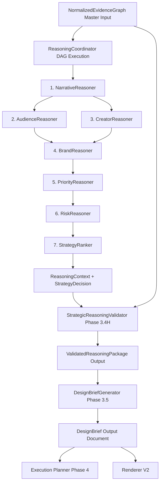

# Phase 3.5 — DesignBrief Generator Architecture

**Status:** Completed & Production-Ready  
**Subsystem:** Thumbnail Intelligence Engine — DesignBrief Emission Layer (Phase 3.5)  
**Package:** `thumbnail_intelligence/reasoning/`  

---

## 1. Executive Summary

Phase 3.5 implements the production **DesignBrief Generator** (`DesignBriefGenerator`) within the Thumbnail AI Strategic Reasoning Layer.

As specified in `docs/thumbnail_intelligence_architecture.md` (§19) and `docs/thumbnail-renderer-v2-architecture-v2.md` (§3.4), the `DesignBriefGenerator` converts a fully validated strategic reasoning package (`ValidatedReasoningPackage`) into a single, strongly typed, deterministic, and renderer-independent **`DesignBrief`**.

The `DesignBrief` is the sole creative contract consumed downstream by Renderer V2, the Execution Planner, Layout Planner, and future rendering engines.

### Core Architectural Invariants
1. **Deterministic Translation Only**: The `DesignBriefGenerator` performs **pure translation**. It performs NO speculative reasoning, NO optimization, NO prompt generation, and NO image rendering.
2. **Strict Renderer Independence**: The `DesignBrief` contains **zero** renderer-specific logic or parameters (no Stable Diffusion prompts, no ComfyUI nodes, no BrushNet instructions, no SDXL parameters, no inpainting logic). It specifies visual goals ("what" and "why"), leaving mechanical parameters ("how") to downstream execution engines.
3. **Immutability & Provenance**: Issued once per render job, carrying complete evidence references, confidence scores, and validation audit metrics.
4. **Multi-Format Serialization**: Supports native Pydantic dict export, formatted JSON, and YAML serialization with forward/backward semver schema compatibility (`schema_version = "1.0.0"`).
5. **Strict vs Non-Strict Validation Gating**: Supports `strict_validation=True` enforcement (raising `ReasonerValidationError` if `ready_for_design_brief` is `False`) or non-strict fallback translation preserving validation audit scores.

---

## 2. Package Structure & File Layout

```
thumbnail_intelligence/reasoning/
├── __init__.py                  # Exports DesignBriefGenerator, DesignBrief, and all 13 sub-models
├── interfaces.py                # BaseReasoner & DesignBriefGeneratorInterface ABC contracts
├── models.py                    # ReasonerType.DESIGN_BRIEF_GENERATOR classification enum
├── context.py                   # ReasoningContext container
├── validator_models.py          # ValidatedReasoningPackage & ReasoningValidation
├── design_brief_models.py       # Phase 3.5: BriefMetadata, NarrativeBrief, AudienceBrief,
│                                # CreatorBrief, BrandBrief, CompositionBrief, TypographyBrief,
│                                # ColorBrief, LightingBrief, CameraBrief, ObjectsBrief,
│                                # ExecutionConstraintsBrief, ValidationBrief, DesignBrief master model
└── design_brief_generator.py    # Phase 3.5: DesignBriefGenerator implementation
```

---

## 3. Translation Pipeline & Integration Flow



### Positioning in Architecture
- **Preceding Phase**: Phase 3.4H (`StrategicReasoningValidator`)
- **Execution Role**: Phase 3.5 (`DesignBriefGenerator`)
- **Succeeding Phases**: Renderer V2, Execution Planner, Layout Planner

---

## 4. Strongly Typed Data Model (`DesignBrief` Schema)

The `DesignBrief` consists of 13 strongly typed sub-sections:

| Sub-Section | Model Name | Description / Key Fields |
| :--- | :--- | :--- |
| **Metadata** | `BriefMetadata` | `brief_id`, `schema_version`, `created_at`, `updated_at`, `generator_id` |
| **Narrative** | `NarrativeBrief` | `primary_story`, `supporting_story`, `emotional_goal`, `story_focus`, `narrative_type`, `narrative_arc` |
| **Audience** | `AudienceBrief` | `primary_audience`, `secondary_audience`, `curiosity_trigger`, `viewer_intent`, `cognitive_load` |
| **Creator** | `CreatorBrief` | `creator_identity`, `style_constraints`, `historical_consistency`, `creator_archetype`, `channel_voice` |
| **Brand** | `BrandBrief` | `required_elements`, `forbidden_changes`, `brand_preservation_rules`, `brand_pillars` |
| **Composition** | `CompositionBrief` | `primary_subject`, `secondary_subject`, `visual_hierarchy`, `negative_space`, `safe_zones`, `depth_treatment` |
| **Typography** | `TypographyBrief` | `text_priority`, `text_regions`, `maximum_characters`, `readability_targets`, `max_word_count` |
| **Color** | `ColorBrief` | `primary_palette`, `accent_palette`, `contrast_targets`, `brand_colors` |
| **Lighting** | `LightingBrief` | `mood`, `direction`, `intensity` |
| **Camera** | `CameraBrief` | `crop`, `perspective`, `zoom`, `subject_scale` |
| **Objects** | `ObjectsBrief` | `required_objects`, `optional_objects`, `forbidden_objects` |
| **Execution Constraints** | `ExecutionConstraintsBrief` | `must_preserve`, `allowed_transformations`, `forbidden_transformations` |
| **Validation** | `ValidationBrief` | `strategy_id`, `evidence_references`, `confidence`, `validation_score`, `readiness_score`, `ready_for_design_brief` |

---

## 5. Serialization & Versioning

The `DesignBrief` master model provides first-class, lossless multi-format serialization methods:

- **JSON**: `brief.to_json(indent=2)` and `DesignBrief.from_json(json_str)`
- **YAML**: `brief.to_yaml()` and `DesignBrief.from_yaml(yaml_str)`
- **Dictionary**: `brief.to_dict()` and `DesignBrief.from_dict(d)`

### Versioning
Includes semver `schema_version = "1.0.0"` in `BriefMetadata`. Models inherit from `BaseKBModel` with `extra="ignore"`, guaranteeing forward and backward compatibility when new optional fields are introduced.

---

## 6. Renderer Independence Guarantee

The `DesignBriefGenerator` strictly avoids engine parameters:
- **No** font file paths or rendering engine names
- **No** Stable Diffusion prompts or CFG scales
- **No** ComfyUI node workflows or samplers
- **No** BrushNet instructions or inpainting masks
- **No** per-pixel coordinates or canvas dimensions

---

## 7. Developer Integration Guide

### Direct Usage
```python
from thumbnail_intelligence.reasoning.design_brief_generator import DesignBriefGenerator

generator = DesignBriefGenerator()

# Option 1: Translate a ValidatedReasoningPackage directly
design_brief = generator.generate(validated_package, strict_validation=True)

# Option 2: Execute via BaseReasoner interface
design_brief = generator.reason(graph=evidence_graph, context=reasoning_context)

# Serialize to JSON or YAML for consumption downstream
json_brief = design_brief.to_json()
yaml_brief = design_brief.to_yaml()
```

---

## 8. Verification & Performance

- **Unit Test Suite**: `tests/test_design_brief_generator.py` (8/8 passed).
- **Full Reasoning Suite**: 88/88 tests passing across all Phase 3.4 & 3.5 reasoning modules.
- **Latency**: $< 1\text{ms}$ translation time per reasoning package.
