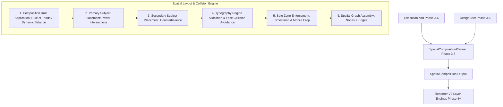

# Phase 3.7 — Spatial Composition Planner Architecture

**Status:** Completed & Production-Ready  
**Subsystem:** Thumbnail Intelligence Engine — Spatial Composition Layer (Phase 3.7)  
**Package:** `thumbnail_intelligence/reasoning/`  

---

## 1. Executive Summary

Phase 3.7 implements the production **Spatial Composition Planner** (`SpatialCompositionPlanner`) within the Thumbnail AI Strategic Reasoning Layer.

As specified in `docs/thumbnail_intelligence_architecture.md` and `docs/thumbnail-renderer-v2-architecture-v2.md`, the `SpatialCompositionPlanner` converts an `ExecutionPlan` and `DesignBrief` into a single, strongly typed, renderer-independent **`SpatialComposition`**.

The `SpatialComposition` specifies:
- **WHERE** visual elements belong in 2D/3D layout space (bounding box, rotation, scale, z-index, layer depth, safe zones, alignment)
- **NOT HOW** visual elements are rendered (no diffusion models, no ComfyUI nodes, no SAM/YOLO code)

### Core Architectural Invariants
1. **Spatial & Placement Reasoning Only**: The Spatial Composition Planner performs **no image rendering**, **no pixel edits**, and **no generative model invocations** (no ComfyUI, Stable Diffusion, SAM, or YOLO calls).
2. **Strict Renderer Independence**: The `SpatialComposition` is completely renderer-independent. It specifies geometric bounding boxes, safe zone margins, and composition rules in normalized $[0.0, 1.0]$ canvas space.
3. **Collision Avoidance Guarantee**: Implements automated collision detection between text overlays, host face regions, secondary props, and platform UI safe zones (e.g. YouTube timestamp overlay).
4. **Professional Composition Taxonomy**: Supports 8 professional graphic design composition rules (Rule of Thirds, Golden Ratio, Center Composition, Diagonal Flow, Triangular Composition, Radial Balance, Dynamic Balance, Custom).
5. **Spatial Relationship Graph (`CompositionGraph`)**: Encapsulates elements as nodes and spatial relationships (containment, overlap, adjacency, alignment, depth order) as typed edges.

---

## 2. Package Structure & File Layout

```
thumbnail_intelligence/reasoning/
├── __init__.py                       # Exports SpatialCompositionPlanner, SpatialComposition, and models
├── interfaces.py                     # BaseReasoner & SpatialCompositionPlannerInterface ABC contracts
├── models.py                         # ReasonerType.SPATIAL_COMPOSITION_PLANNER classification enum
├── context.py                        # ReasoningContext container
├── design_brief_models.py            # DesignBrief master contract
├── execution_plan_models.py          # ExecutionPlan & ExecutionGraph contracts
├── spatial_composition_models.py    # Phase 3.7: BoundingBox, AnchorPoint, VisualElementPlacement,
│                                     # SafeZone, CanvasSpecification, TypographyLayout,
│                                     # CompositionRule, CompositionGraph, SpatialComposition
└── spatial_composition_planner.py   # Phase 3.7: SpatialCompositionPlanner implementation
```

---

## 3. Spatial Pipeline & Composition Architecture



---

## 4. Bounding Box & Collision Detection Algorithm

### BoundingBox Geometry
Elements are defined in normalized $[0.0, 1.0]$ canvas space:
$$\text{BBox} = (x, y, w, h)$$
- Right edge: $x_2 = x + w$
- Bottom edge: $y_2 = y + h$
- Center: $(x + w/2, y + h/2)$
- Intersection over Union (IoU):
$$\text{IoU}(A, B) = \frac{\text{Area}(A \cap B)}{\text{Area}(A) + \text{Area}(B) - \text{Area}(A \cap B)}$$

### Collision Avoidance
1. **Face/Text Overlap**: `CompositionGraph.validate_composition_graph()` flags any overlap between `element_category == "face"` and `element_category == "text"` exceeding safety margins.
2. **Forbidden Safe Zone Enforcement**: Prevents foreground/midground elements from overlapping `canvas.timestamp_safe_zone` ($x \in [0.80, 0.98], y \in [0.85, 0.97]$).
3. **Canvas Boundary Constraining**: Ensures $x \ge 0.0, y \ge 0.0, x_2 \le 1.0, y_2 \le 1.0$.

---

## 5. Composition Taxonomy & Visual Balance

| Composition Rule (`CompositionRule`) | Description / Typical Use Case |
| :--- | :--- |
| `RULE_OF_THIRDS` | Host face placed on $1/3$ power intersection; text placed on opposing third |
| `GOLDEN_RATIO` | Spiral logarithmic focal point targeting primary curiosity subject |
| `CENTER_COMPOSITION` | Hero subject centered for authority and high impact |
| `DIAGONAL_FLOW` | High energy diagonal visual scan path from upper-left to bottom-right |
| `TRIANGULAR_COMPOSITION` | Stable three-point visual pyramid (Host face + Prop + Text) |
| `DYNAMIC_BALANCE` | Intentional dynamic asymmetry balancing visual mass and negative space |

---

## 6. Developer Integration & Usage

```python
from thumbnail_intelligence.reasoning.spatial_composition_planner import SpatialCompositionPlanner
from thumbnail_intelligence.reasoning.execution_plan_models import ExecutionPlan
from thumbnail_intelligence.reasoning.design_brief_models import DesignBrief

planner = SpatialCompositionPlanner()

# Option 1: Plan spatial composition directly from ExecutionPlan + DesignBrief
spatial_comp = planner.plan(execution_plan, design_brief)

# Option 2: Execute via BaseReasoner interface
spatial_comp = planner.reason(graph=evidence_graph, context=reasoning_context)

# Serialize to JSON or YAML
json_composition = spatial_comp.to_json()
yaml_composition = spatial_comp.to_yaml()
```

---

## 7. Verification & Performance

- **Unit Test Suite**: `tests/test_spatial_composition_planner.py` (8/8 passed).
- **Full Reasoning Suite**: 104/104 tests passing across all Phase 3.4, 3.5, 3.6, and 3.7 reasoning modules.
- **Planner Latency**: $< 1\text{ms}$ spatial layout calculation time per ExecutionPlan.
