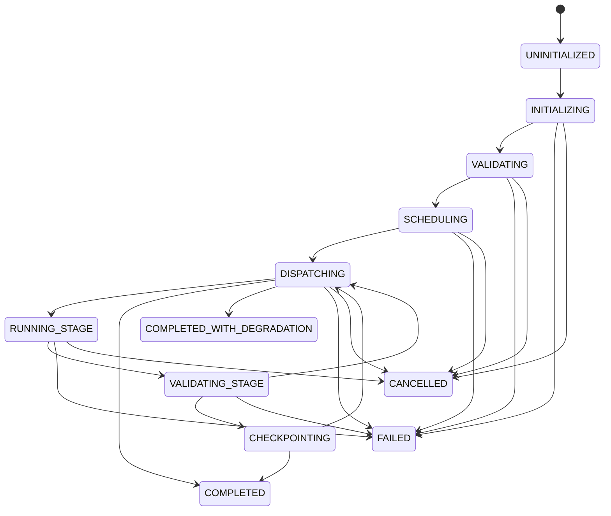

# Phase 4.1 — Execution Engine Foundation Implementation

**Status:** Completed  
**Subsystem:** Renderer V2 — Execution Layer  
**Consumes:** `RenderExecutionPackage` (Phase 3.8 `RendererAdapter` output) — **and nothing else**  
**Produces:** `RenderJobReport` + Executed Job Context & Workspace  

---

## 1. Overview & Architectural Boundaries

Phase 4.1 establishes the pure **Execution Engine Foundation** for Renderer V2. It provides the orchestration framework responsible for consuming a validated `RenderExecutionPackage`, validating package integrity, constructing job contexts and workspaces, building topological execution graphs (DAGs), scheduling ready operations under single-GPU residency constraints, dispatching operations to stage interfaces, and assembling comprehensive execution reports.

### Strict Boundary Invariants

1. **Input Isolation:** The `ExecutionEngine.execute()` entry point consumes **ONLY** a `RenderExecutionPackage`. Passing upstream reasoning artifacts (`DesignBrief`, `ExecutionPlan`, `SpatialComposition`, `ReasoningContext`) raises a `TypeError` / `PackageValidationError`.
2. **Zero Model Execution / Zero Rendering:** Phase 4.1 implements the control-plane execution framework **only**. No AI models (GroundingDINO, SAM2, BiRefNet, Depth Anything, SDXL, CodeFormer, GFPGAN) are loaded or executed, no diffusion inpainting is performed, no segmentation is triggered, and no external renderer backend is invoked. All 11 stage components are defined as pure placeholder interfaces.
3. **Execution-Level Critique Scope:** Critique loops operating on quality failure reports re-dispatch operations within the Execution Engine against the *same* immutable `RenderExecutionPackage`. Reasoning or planning is never re-invoked.

---

## 2. Component Architecture

The Execution Engine Foundation is contained entirely within `renderer_v2/execution/`:

```
renderer_v2/execution/
├── __init__.py           # Package exports
├── context.py            # RenderJobContext (job identifiers, timing, cancellation)
├── dispatcher.py         # ExecutionDispatcher (maps 14 op primitives to stages)
├── engine.py             # ExecutionEngine (master entry point execute())
├── exceptions.py         # Custom exception hierarchy
├── fsm.py                # ExecutionFSM & ExecutionState (state machine)
├── graph.py               # ExecutionGraph & ExecutionScheduler (DAG, Kahn/Tarjan topo/cycle)
├── models.py             # LayerBuffer, SceneInstance, WorkspaceSnapshot
├── reports.py            # StageExecutionReport, RenderJobReport, CritiqueReport
├── stages.py             # Placeholder stage interfaces (AssetLoader, ModelManager, etc.)
├── validation.py         # Package, Graph, Workspace, Operation, and Execution Validators
└── workspace.py          # RenderWorkspace (layers, masks, instances, checkpoints)
```

---

## 3. Data Contracts

### 3.1 `RenderJobContext` (`context.py`)

Scoped read-only context wrapper created once per job attempt:
- `job_id`: Unique identifier (`job_<uuid12>`).
- `correlation_id`: Tracing correlation identifier (`corr_<uuid12>`).
- `attempt`: Monotonically increasing integer (starts at 1).
- `execution_metadata`: Dictionary of runtime parameters, output paths, and resolution targets.
- `timing`: Precision start/end timestamps and elapsed wall-clock duration calculations.
- `cancellation`: Thread-safe cancellation support via `cancel()` and `check_cancellation()`.

### 3.2 `RenderWorkspace` (`workspace.py`)

Central in-memory working state for a job attempt:
- `layers`: `Dict[str, LayerBuffer]` — Raster layer buffers with z-index and opacity metadata.
- `masks`: `Dict[str, Any]` — In-painting and subject isolation masks.
- `scene_instances`: `Dict[str, SceneInstance]` — Decomposition records (masks, alpha mattes, bboxes, depth, lock flags).
- `depth_map`: `Optional[Any]` — Full-frame depth map placeholder.
- `intermediate_artifacts`: `Dict[str, Any]` — Named debug blobs (e.g. `01_..13_`).
- `stage_reports`: `List[StageExecutionReport]` — History of executed stage reports.
- `op_history`: `List[Dict[str, Any]]` — Timing and status log per operation primitive.
- `checkpoints`: `Dict[str, WorkspaceSnapshot]` — Named snapshots for point-in-time state recovery.

---

## 4. Execution State Machine & Lifecycle (`fsm.py`)

`ExecutionFSM` enforces legal lifecycle transitions across 12 discrete states:



Illegal state transitions (e.g. transitioning from a terminal state or skipping validation) raise an `InvalidStateTransitionError`.

---

## 5. Execution Graph & Scheduler (`graph.py`)

### 5.1 Graph Building & Dependency Invariant

`ExecutionGraph.build_from_package(package)` translates operations into a Directed Acyclic Graph (DAG):
1. **Dataflow edges:** Operations producing an `output_key` referenced in another operation's `input_keys` establish explicit producer-consumer prerequisite edges.
2. **Sequential fallback edges:** Operations without explicit dataflow dependencies maintain package sequence ordering.

### 5.2 Topological Sorting & Cycle Detection

- **Kahn's Algorithm:** Used for primary in-degree topological sorting.
- **Tarjan's DFS Algorithm:** Used to detect cycles and isolate cyclic dependency nodes if Kahn's sorting fails. Cyclic graphs raise `GraphValidationError`.

### 5.3 Single-GPU Residency Constraint

`ExecutionScheduler` enforces the architectural rule that **at most one GPU-bound heavy model operation runs at a time**. Operations marked `is_gpu_bound` (`EXTRACT_SUBJECT`, `GENERATE_BACKGROUND`, `ENHANCE_SUBJECT`) acquire exclusive slot reservation before dispatching.

---

## 6. Execution Dispatcher & Placeholder Stages

`ExecutionDispatcher` maps all 14 `RenderOperationType` primitives to 11 placeholder stage handlers:

| `RenderOperationType` | Mapped Stage Handler | GPU-Bound? |
|---|---|---|
| `LOAD_ASSET` | `AssetLoader` | No |
| `PREPARE_CANVAS` | `LayerComposer` | No |
| `GENERATE_BACKGROUND` | `BackgroundGenerator` | Yes |
| `EXTRACT_SUBJECT` | `SubjectExtractor` | Yes |
| `ENHANCE_SUBJECT` | `SubjectEnhancer` | Yes (conditional) |
| `APPLY_LIGHTING` | `LightingEngine` | No |
| `GENERATE_SHADOW` | `LightingEngine` | No |
| `RENDER_TYPOGRAPHY` | `TypographyRenderer` | No |
| `COMPOSE_LAYER` | `LayerComposer` | No |
| `APPLY_COLOR_GRADE` | `LayerComposer` | No |
| `ADJUST_CONTRAST` | `LayerComposer` | No |
| `EVALUATE_QUALITY` | `QualityValidator` / `ImageValidator` | Low |
| `COMPOSITE_FINAL` | `LayerComposer` | No |
| `CLEANUP_BUFFERS` | `ModelManager` | No |

Every stage exposes the three uniform interface methods:
- `execute(operation, context, workspace) -> StageExecutionReport`
- `validate(operation, workspace) -> List[str]`
- `cleanup(workspace) -> None`

---

## 7. Reports & Output Summaries (`reports.py`)

- `StageExecutionReport`: Logged after each operation execution. Tracks `stage`, `op_id`, `status` (`SUCCESS`, `SUCCESS_WITH_DEGRADATION`, `FAILED_RECOVERABLE`, `FAILED_FATAL`, `SKIPPED`), `latency_s`, `vram_peak_gb`, `validation_notes`, and `output_keys`.
- `RenderJobReport`: Comprehensive audit object returned by `ExecutionEngine.execute()`. Contains `job_id`, `correlation_id`, `attempt`, overall `status` (`SUCCESS`, `SUCCESS_WITH_DEGRADATION`, `FAILED_HUMAN_REVIEW`, `FAILED_FATAL`, `CANCELLED`), cumulative latency, peak VRAM, stage reports trail, output image sink path, and validation summaries.

---

## 8. Validation Suite (`validation.py`)

Comprehensive pre-execution and post-execution validation:
- `PackageValidator`: Verifies `RenderExecutionPackage` metadata, coordinate bounds, layer stack integrity, asset references, and non-empty operation list.
- `GraphValidator`: Verifies DAG acyclicity and prerequisite completeness.
- `WorkspaceValidator`: Verifies canvas dimension alignment across all layer buffers.
- `OperationValidator`: Verifies operation input key availability in workspace.
- `ExecutionValidator`: Validates non-empty layer buffers upon execution completion.

---

## 9. Developer & Integration Guide

### 9.1 How to Execute a Render Execution Package

```python
from thumbnail_intelligence.reasoning.renderer_adapter import RendererV2Adapter
from renderer_v2.execution.engine import ExecutionEngine

# 1. Translate upstream planning into a RenderExecutionPackage (Phase 3.8)
adapter = RendererV2Adapter()
package = adapter.translate(spatial_composition, execution_plan)

# 2. Instantiate Phase 4.1 ExecutionEngine
engine = ExecutionEngine()

# 3. Execute package (framework dispatch only, zero model inference)
report = engine.execute(package, context_overrides={"output_path": "output/thumbnail.jpg"})

print(f"Job Status: {report.status.value}")
print(f"Total Latency: {report.total_latency_s:.3f}s")
print(f"Executed Stages: {len(report.stage_reports)}")
```

### 9.2 How to Register a Custom Stage Handler

```python
from renderer_v2.execution.dispatcher import ExecutionDispatcher
from renderer_v2.execution.stages import BaseExecutionStage

class CustomLightingStage(BaseExecutionStage):
    @property
    def stage_name(self) -> str:
        return "CustomLightingStage"

    def execute(self, operation, context, workspace):
        # Custom stage logic
        return StageExecutionReport(stage=self.stage_name, op_id=operation.op_id, status=StageStatus.SUCCESS)

    def validate(self, operation, workspace):
        return []

    def cleanup(self, workspace):
        pass

dispatcher = ExecutionDispatcher()
dispatcher.map_operation_type(RenderOperationType.APPLY_LIGHTING, CustomLightingStage())
engine = ExecutionEngine(dispatcher=dispatcher)
```

---

## 10. Testing & Verification

A dedicated unit and integration test suite (`tests/test_execution_engine.py`) verifies all 10 core execution behaviors:
1. **Contract boundary:** Rejection of non-`RenderExecutionPackage` objects.
2. **Package validation:** Rejection of malformed packages before GPU touch.
3. **Job context:** Metadata, timing, attempt counter, and thread-safe cancellation tokens.
4. **Workspace lifecycle:** Layer/mask/instance storage, depth maps, checkpoints, restore, and cleanup.
5. **FSM state machine:** Legal state transitions and invalid transition exception handling.
6. **Execution graph:** DAG construction, Kahn's topological sorting, and Tarjan's cycle detection.
7. **Execution scheduler:** Node readiness and single-GPU-slot residency constraints.
8. **Dispatcher:** Routing for all 14 operation primitives to placeholder stages.
9. **Reports:** Assembly of `StageExecutionReport` and `RenderJobReport`.
10. **End-to-End execution:** Execution traversal of `ExecutionEngine.execute()`.
