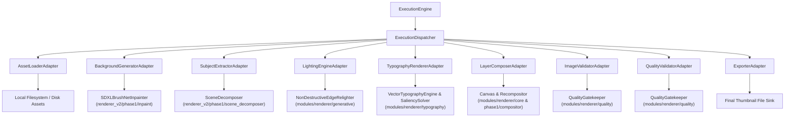

# Phase 4.2 — Renderer Stage Adapters Implementation

**Status:** Completed  
**Subsystem:** Renderer V2 — Execution Layer Stage Adapters  
**Consumes:** `RenderExecutionPackage` & `RenderWorkspace`  
**Produces:** Scaled raster layers, scene instances, depth maps, vector typography, alpha composited canvas, and export sink outputs.  

---

## 1. Overview & Architecture

Phase 4.2 replaces the placeholder stage handlers from Phase 4.1 with real, production-ready **Renderer Stage Adapters**. These adapters bridge the `ExecutionEngine`'s control-plane DAG operations with existing rendering engines in `renderer_v2/` and `modules/renderer/`.

The `ExecutionEngine` itself remains completely unchanged, continuing to consume strictly `RenderExecutionPackage` contracts and dispatching primitive operations through `ExecutionDispatcher`.



---

## 2. Reused Renderer Modules

Zero existing renderer implementations were rewritten or duplicated. The adapters delegate directly to proven project modules:

| Adapter Name | Reused Renderer Implementation | Module Path |
|---|---|---|
| `AssetLoaderAdapter` | Native OpenCV / PIL image decoders | `cv2`, `PIL.Image` |
| `BackgroundGeneratorAdapter` | `SDXLBrushNetInpainter` | `renderer_v2/phase1/inpaint/sdxl_brushnet.py` |
| `SubjectExtractorAdapter` | `SceneDecomposer` | `renderer_v2/phase1/scene_decomposer/decomposer.py` |
| `LightingEngineAdapter` | `NonDestructiveEdgeRelighter` | `modules/renderer/generative/relighter.py` |
| `TypographyRendererAdapter` | `VectorTypographyEngine`, `SaliencySolver` | `modules/renderer/typography/` |
| `LayerComposerAdapter` | `Canvas`, `Recompositor` | `modules/renderer/core/canvas.py`, `renderer_v2/phase1/compositor/recompositor.py` |
| `ImageValidatorAdapter` | `QualityGatekeeper` (structural checks) | `modules/renderer/quality/gatekeeper.py` |
| `QualityValidatorAdapter` | `QualityGatekeeper` (metric scoring) | `modules/renderer/quality/gatekeeper.py` |
| `ExporterAdapter` | Native OpenCV image writer | `cv2.imwrite` |

---

## 3. Adapter Details & Responsibilities

### 3.1 `AssetLoaderAdapter`
- **Operation:** `LOAD_ASSET`
- **Behavior:** Resolves asset paths from `RenderAssetReference`. Decodes images into `uint8` RGB/RGBA numpy arrays using OpenCV/PIL.
- **Error Handling:** If a required asset (`is_required=True`) specifies a path that does not exist or fails to decode, raises a `StageExecutionError`. Non-required missing assets fall back gracefully.

### 3.2 `BackgroundGeneratorAdapter`
- **Operation:** `GENERATE_BACKGROUND`
- **Behavior:** Invokes `SDXLBrushNetInpainter.inpaint()` with the inverse background mask. If GPU diffusion models are missing or unavailable, falls back to generating a smooth radial gradient matching `dominant_colors`, marking the report as `SUCCESS_WITH_DEGRADATION`.
- **Output:** `RenderWorkspace.layers["background"]`.

### 3.3 `SubjectExtractorAdapter`
- **Operation:** `EXTRACT_SUBJECT`
- **Behavior:** Invokes `SceneDecomposer.decompose()` across GroundingDINO, SAM2, BiRefNet, and Depth Anything V2 models. If model weights are not loaded, falls back to bounding-box segmentation.
- **Output:** Populates `workspace.scene_instances`, `workspace.masks`, and `workspace.set_depth_map()`.

### 3.4 `LightingEngineAdapter`
- **Operation:** `APPLY_LIGHTING`, `GENERATE_SHADOW`
- **Behavior:** Maps `RenderLightingInstruction` into `RelightingSpec` (`direction_angle_deg`, `intensity`, `color_hex`). Wraps subject rasters in `Layer` objects and invokes `NonDestructiveEdgeRelighter.apply_relighting()`.
- **Output:** Relit subject layer stored in `workspace.layers`.

### 3.5 `TypographyRendererAdapter`
- **Operation:** `RENDER_TYPOGRAPHY`
- **Behavior:** Maps `RenderTypographyInstruction` entries into `TypographySpec`. Calculates collision-aware placement away from visual hotspots using `SaliencySolver.find_optimal_text_bbox()`. Renders vector text using `VectorTypographyEngine.render_typography_layer()`.
- **Output:** RGBA text overlay layers stored in `workspace.layers`.

### 3.6 `LayerComposerAdapter`
- **Operation:** `COMPOSE_LAYER`, `PREPARE_CANVAS`, `APPLY_COLOR_GRADE`, `ADJUST_CONTRAST`, `COMPOSITE_FINAL`
- **Behavior:** Constructs `Canvas(width, height)`, adds `Layer` objects sorted by `z_index`, applies `Recompositor.recomposite()` for locked instance edge-feathering, and blends all layers via `canvas.composite_rgba()`.
- **Output:** Composited layer buffer written to `workspace.layers[target_layer_id]`.

### 3.7 `ImageValidatorAdapter` & `QualityValidatorAdapter`
- **Operation:** `EVALUATE_QUALITY`
- **Behavior:** `ImageValidatorAdapter` performs pre-flight structural checks (NaN/Inf pixel corruption detection, canvas dimension alignment). `QualityValidatorAdapter` invokes `QualityGatekeeper.evaluate()` to calculate visual contrast, saliency balance, and predicted CTR lift.

### 3.8 `ExporterAdapter`
- **Operation:** Final raster file export
- **Behavior:** Extracts the final composited layer buffer, converts RGBA/RGB to BGR format, creates parent output directories if needed, and writes the image file to `output_path`.
- **Output:** Path written to `workspace.intermediate_artifacts["exporter_sink"]`.

---

## 4. Error Handling Strategy

1. **Exception Isolation:** Underlying renderer exceptions (OpenCV errors, PyTorch errors, PIL errors, `ValueError` from `Canvas`) are caught within each adapter's `execute()` boundary.
2. **Standard Exception Wrap:** Renderer exceptions are wrapped in `StageExecutionError(f"{AdapterName} execution error: {e}")`. No raw low-level renderer exceptions leak out of the execution layer.
3. **Graceful Fallback:** Generative stages (`BackgroundGeneratorAdapter`, `SubjectExtractorAdapter`) log degradation warnings and fall back to procedural/structural fallbacks when GPU dependencies are missing, maintaining pipeline resilience (`StageStatus.SUCCESS_WITH_DEGRADATION`).

---

## 5. Developer Guide

### Using Stage Adapters in ExecutionEngine

```python
from thumbnail_intelligence.reasoning.renderer_adapter import RendererV2Adapter
from renderer_v2.execution.dispatcher import ExecutionDispatcher
from renderer_v2.execution.engine import ExecutionEngine

# 1. Translate upstream planning into a RenderExecutionPackage (Phase 3.8)
adapter = RendererV2Adapter()
package = adapter.translate(spatial_composition, execution_plan)

# 2. Instantiate ExecutionDispatcher with Phase 4.2 Stage Adapters (default)
dispatcher = ExecutionDispatcher(use_placeholders=False)
engine = ExecutionEngine(dispatcher=dispatcher)

# 3. Execute package end-to-end
report = engine.execute(package, context_overrides={"output_path": "output/final_thumb.jpg"})

print(f"Status: {report.status.value}")
print(f"Output: {report.output_image_path}")
```

---

## 6. Testing & Integration Results

Comprehensive tests in `tests/test_stage_adapters.py` verify all 9 stage adapters:

- `test_asset_loader_adapter_success_and_failure`: PASSED
- `test_background_generator_adapter_fallback`: PASSED
- `test_subject_extractor_adapter_fallback`: PASSED
- `test_lighting_engine_adapter_relighting`: PASSED
- `test_typography_renderer_adapter`: PASSED
- `test_layer_composer_adapter_compositing`: PASSED
- `test_validators_adapters`: PASSED
- `test_exporter_adapter_file_writing`: PASSED
- `test_execution_engine_end_to_end_with_adapters`: PASSED

Full test suite execution (`tests/test_stage_adapters.py`, `tests/test_execution_engine.py`, `tests/test_renderer_adapter.py`, `tests/phase1/`): **29 PASSED**, 0 failures in **9.62s**.
