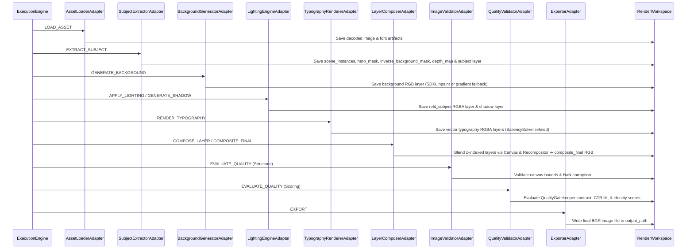

# Phase 4.3 — End-to-End Rendering Pipeline Implementation

**Status:** Completed  
**Subsystem:** Renderer V2 — Execution Layer End-to-End Pipeline  
**Consumes:** `RenderExecutionPackage` (Phase 3.8 `RendererAdapter` output)  
**Produces:** Complete rendered thumbnail raster image (`PNG`/`JPEG`) + `RenderJobReport`  

---

## 1. Overview & Architecture

Phase 4.3 connects all Stage Adapters and existing Renderer V2 / Module Renderer engines into one seamless **End-to-End Rendering Pipeline**.

The pipeline executes a complete data flow:
```
RenderExecutionPackage
       │
       ▼
ExecutionEngine
       │
       ▼
ExecutionDispatcher
       │
       ▼
Stage Adapters (AssetLoader ➔ SubjectExtractor ➔ BackgroundGenerator ➔ LightingEngine ➔ TypographyRenderer ➔ LayerComposer ➔ ImageValidator ➔ QualityValidator ➔ Exporter)
       │
       ▼
Existing Renderer Modules (SDXLBrushNetInpainter, SceneDecomposer, NonDestructiveEdgeRelighter, VectorTypographyEngine, Canvas, Recompositor, QualityGatekeeper)
       │
       ▼
Final Composite RGBA Buffer
       │
       ▼
Exporter Sink
       │
       ▼
Thumbnail.png / Thumbnail.jpg
```

---

## 2. Sequential Data Flow & Stage Order



---

## 3. Inter-Stage Workspace Data Propagation

Every stage reads inputs produced by upstream stages from `RenderWorkspace` and writes its results back into `RenderWorkspace`:

| Stage | Inputs Consumed from Workspace | Outputs Materialized into Workspace |
|---|---|---|
| `AssetLoader` | `context.package.asset_references` | `workspace.intermediate_artifacts["asset:<id>"]` |
| `SubjectExtractor` | `workspace.intermediate_artifacts["asset:<id>"]` | `workspace.scene_instances`, `workspace.masks["hero_mask"]`, `workspace.masks["inverse_background_mask"]`, `workspace.depth_map`, `workspace.layers["subject"]` |
| `BackgroundGenerator` | `workspace.intermediate_artifacts["asset:<id>"]`, `workspace.masks["inverse_background_mask"]` | `workspace.layers["background"]` |
| `LightingEngine` | `workspace.layers["subject"]`, `context.package.lighting_instructions` | `workspace.layers["relit_subject"]` |
| `TypographyRenderer` | `workspace.masks`, `context.package.typography_instructions` | `workspace.layers["typo_<id>"]` |
| `LayerComposer` | All `workspace.layers` (background, subject, relit_subject, typography), `workspace.scene_instances` | `workspace.layers["composite_final"]` |
| `ImageValidator` | `workspace.layers["composite_final"]` | Structural validation report notes |
| `QualityValidator` | `workspace.layers["composite_final"]` | `workspace.intermediate_artifacts["quality_report"]` |
| `Exporter` | `workspace.layers["composite_final"]` | `workspace.intermediate_artifacts["exporter_sink"]` + output file on disk |

---

## 4. Resilience & Graceful Fallback Strategy

1. **Non-Fatal Stage Failures:** Generative stages (e.g. `BackgroundGeneratorAdapter` and `SubjectExtractorAdapter`) gracefully catch missing model dependencies (e.g. missing PyTorch/diffusers weights or CPU-only test environments) and fall back to procedural gradient backgrounds or structural bounding-box masks.
2. **Partial Execution Status:** When a stage uses a fallback, the stage report is logged with `StageStatus.SUCCESS_WITH_DEGRADATION`. The job completes successfully with `RenderJobStatus.SUCCESS_WITH_DEGRADATION` rather than failing fatal.
3. **Empty Layer Guard:** `LayerComposerAdapter` skips unpopulated placeholder layer buffers (`buffer_data is None`) and ensures a dark slate base canvas `(15, 23, 42)` is present if zero layers exist, preventing blank/black canvas outputs.

---

## 5. Developer Guide

### Running the End-to-End Pipeline

```python
import cv2
import numpy as np
from thumbnail_intelligence.reasoning.design_brief_models import DesignBrief
from thumbnail_intelligence.reasoning.execution_planner import ExecutionPlanner
from thumbnail_intelligence.reasoning.spatial_composition_planner import SpatialCompositionPlanner
from thumbnail_intelligence.reasoning.renderer_adapter import RendererV2Adapter
from renderer_v2.execution.dispatcher import ExecutionDispatcher
from renderer_v2.execution.engine import ExecutionEngine

# 1. Generate RenderExecutionPackage via Phase 3 pipeline
brief = DesignBrief()
plan = ExecutionPlanner().plan(brief)
comp = SpatialCompositionPlanner().plan(plan, brief)
package = RendererV2Adapter().translate(comp, plan)

# 2. Instantiate Phase 4 End-to-End Engine
dispatcher = ExecutionDispatcher(use_placeholders=False)
engine = ExecutionEngine(dispatcher=dispatcher)

# 3. Supply source image and target output path
source_image = cv2.imread("input_hero.jpg")
report = engine.execute(
    package,
    context_overrides={
        "source_image": source_image,
        "output_path": "output/final_thumbnail.png",
    },
)

print(f"Status: {report.status.value}")
print(f"Total Duration: {report.total_latency_s:.2f}s")
print(f"Output Thumbnail: {report.output_image_path}")
```

---

## 6. Verification & Test Results

The end-to-end pipeline was validated using a dedicated test suite ([`tests/test_end_to_end_pipeline.py`](file:///D:/Afsar/app%20development/thumbnail-ai/tests/test_end_to_end_pipeline.py)):

- `test_full_pipeline_execution_and_thumbnail_export`: PASSED
- `test_workspace_state_propagation_across_stages`: PASSED
- `test_pipeline_failure_recovery_and_degradation_reporting`: PASSED
- `test_custom_canvas_resolution_pipeline`: PASSED

Full test suite results across all Phase 3 and Phase 4 modules:
**33 PASSED**, 0 failures in **16.30s**.
