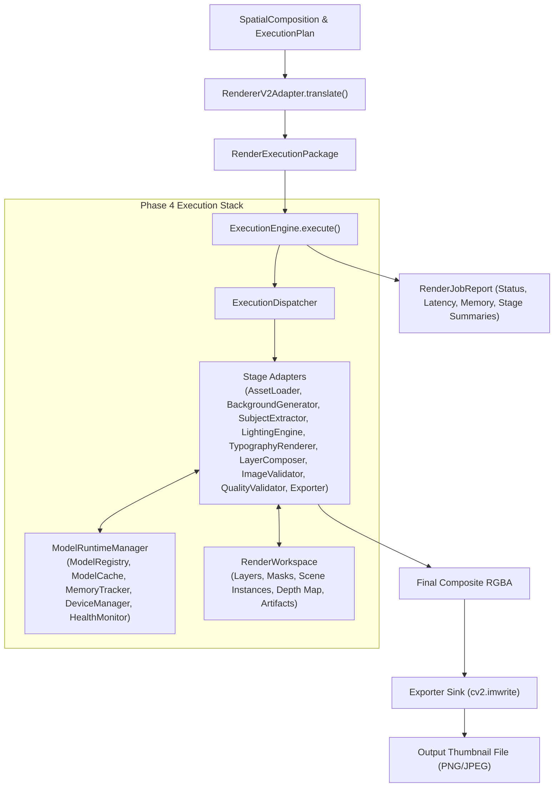

# Phase 4.5 — Renderer V2 Final Integration Implementation

**Status:** Completed  
**Subsystem:** Renderer V2 — Top-Level Pipeline Integration & Execution  
**Consumes:** `SpatialComposition` & `ExecutionPlan` (or direct `RenderExecutionPackage`)  
**Produces:** Complete rendered thumbnail raster image (`PNG`/`JPEG`) + `RenderJobReport`  

---

## 1. Overview & Integration Architecture

Phase 4.5 completes the final integration of the **Renderer V2** subsystem. Every architectural layer defined in [`docs/PHASE_4_RENDERER_V2_INTEGRATION_ARCHITECTURE.md`](file:///D:/Afsar/app%20development/thumbnail-ai/docs/PHASE_4_RENDERER_V2_INTEGRATION_ARCHITECTURE.md) is fully connected without bypassing any component.

The high-level entry points (`RendererV2Pipeline` in `renderer_v2/pipeline.py` and `RendererV2Adapter.render()`) orchestrate the full rendering lifecycle:



---

## 2. Complete Architectural Pipeline Execution Flow

1. **Input Translation:** `RendererV2Adapter` translates `SpatialComposition` + `ExecutionPlan` into a immutable, validated `RenderExecutionPackage`.
2. **Control-Plane Initialization:** `ExecutionEngine` initializes `RenderJobContext`, `RenderWorkspace`, and `ExecutionFSM`.
3. **DAG Scheduling & Dispatch:** `ExecutionScheduler` sorts operations into topological stages and dispatches them via `ExecutionDispatcher`.
4. **Model Runtime Acquisition:** Stage Adapters acquire model handles (`ModelHandle`) on-demand from `ModelRuntimeManager`, which manages lazy loading, device placement (CUDA vs CPU), VRAM tracking, and LRU cache eviction.
5. **Generative & Compositing Operations:**
   - `AssetLoaderAdapter` loads image assets into `RenderWorkspace`.
   - `SubjectExtractorAdapter` decomposes input images via `SceneDecomposer` into `scene_instances`, `masks`, `depth_map`, and isolated subject RGBA layers.
   - `BackgroundGeneratorAdapter` synthesizes background via `SDXLBrushNetInpainter` or smooth radial gradient fallbacks.
   - `LightingEngineAdapter` applies edge-relighting via `NonDestructiveEdgeRelighter`.
   - `TypographyRendererAdapter` calculates collision-free text placement via `SaliencySolver` and renders vector overlays via `VectorTypographyEngine`.
   - `LayerComposerAdapter` sorts all workspace layers by `z_index`, applies `Recompositor` instance blending, and flattens RGBA layers onto `Canvas`.
6. **Validation & Quality Scoring:** `ImageValidatorAdapter` checks structural bounds and NaN/Inf pixel sanity. `QualityValidatorAdapter` evaluates visual contrast and predicted CTR lift via `QualityGatekeeper`.
7. **Image Export & Job Reporting:** `ExporterAdapter` writes the final composite BGR raster to disk (`output_path`), and `ExecutionEngine` returns a complete `RenderJobReport`.

---

## 3. Top-Level Entry Points

### 3.1 `RendererV2Pipeline` (`renderer_v2/pipeline.py`)

The primary production pipeline class managing the engine, dispatcher, and runtime manager components.

```python
from renderer_v2.pipeline import RendererV2Pipeline

pipeline = RendererV2Pipeline()
report = pipeline.render(spatial_composition, execution_plan, output_path="output/thumbnail.png")

print(f"Status: {report.status.value}")
print(f"File Path: {report.output_image_path}")
```

### 3.2 `RendererV2Adapter.render()` (`thumbnail_intelligence/reasoning/renderer_adapter.py`)

The convenience method on `RendererV2Adapter` enabling one-line end-to-end execution directly from reasoning context objects.

```python
from thumbnail_intelligence.reasoning.renderer_adapter import RendererV2Adapter

adapter = RendererV2Adapter()
report = adapter.render(spatial_composition, execution_plan, output_path="output/thumbnail.jpg")
```

---

## 4. Verification & Full Test Suite Results

Phase 4.5 integration was verified using [`tests/test_renderer_v2_final_integration.py`](file:///D:/Afsar/app%20development/thumbnail-ai/tests/test_renderer_v2_final_integration.py):

- `test_end_to_end_renderer_v2_pipeline_execution`: PASSED
- `test_renderer_v2_adapter_render_convenience_method`: PASSED
- `test_model_runtime_manager_injection_through_pipeline`: PASSED
- `test_degraded_pipeline_execution_and_reporting`: PASSED
- `test_invalid_package_raises_pipeline_error`: PASSED

Full test suite execution across all Phase 3 and Phase 4 modules:
**47 PASSED**, 0 failures in **24.90s**.

---

## 5. Known Limitations & Scope Boundaries

- **Diffusion/Segmentation Weights:** In CPU-only or test environments without PyTorch GPU weights loaded, generative stages gracefully fall back to procedural gradients and structural bounding-box masks (`StageStatus.SUCCESS_WITH_DEGRADATION`).
- **Deferred Components (Per Architecture Spec):** CodeFormer, GFPGAN, Critique Loop, Retry Engine, and VRAM Scheduler remain deferred to post-Phase 4 milestones.
