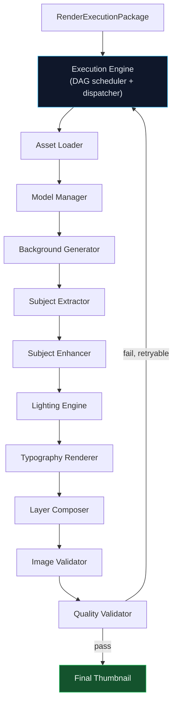
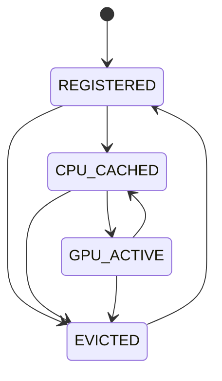
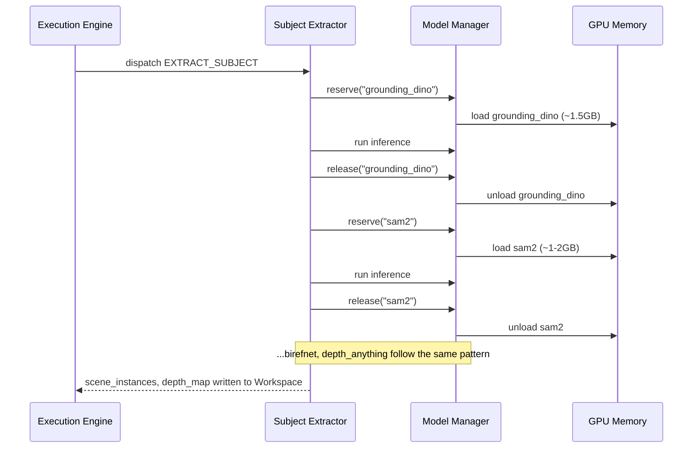
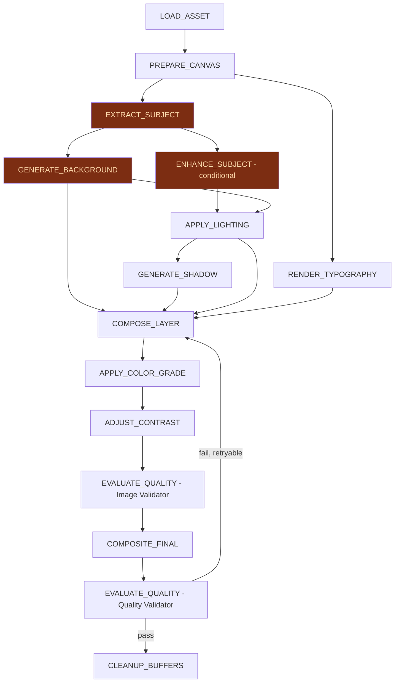
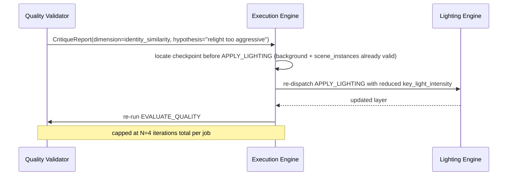
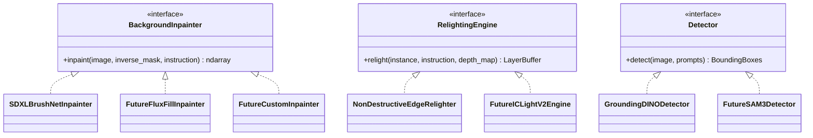

# Phase 4 — Renderer V2 Integration Architecture

**Status:** Design Specification (Pre-Implementation)
**Subsystem:** Renderer V2 — Execution Layer
**Consumes:** `RenderExecutionPackage` (Phase 3.8 `RendererAdapter` output) — **and nothing else**
**Produces:** Final Thumbnail (raster image) + `RenderJobReport`
**Upstream layers (frozen, unmodified by this document):** Knowledge Layer, Strategic Reasoning Layer, Validation Layer, Planning Layer, Spatial Composition Layer, Renderer Adapter (Phase 3.8)

---

## 0. Purpose and Non-Goals

This document is the single source of truth for how a `RenderExecutionPackage` becomes pixels. It is an **execution** specification, not a reasoning specification.

**In scope:** everything that happens after `RendererAdapter.translate()` returns a `RenderExecutionPackage`, up to and including the final validated thumbnail and its execution report.

**Explicitly out of scope (frozen, do not touch):**
- How a `DesignBrief` is produced (Strategic Reasoning Layer, Phase 3.1–3.5)
- How a `DesignBrief` becomes an `ExecutionPlan` (Planning Layer, Phase 3.6)
- How an `ExecutionPlan` becomes a `SpatialComposition` (Phase 3.7)
- How `SpatialComposition` + `ExecutionPlan` become a `RenderExecutionPackage` (Phase 3.8 `RendererAdapter`)

**Architectural invariant carried forward from Phase 3.8, and re-asserted here as a hard boundary of this layer:**

> Renderer V2 and every component described in this document MUST NEVER receive a `DesignBrief`, `ReasoningContext`, `ExecutionPlan`, or `SpatialComposition`. The only permitted input to the Execution Engine's public entry point is a validated `RenderExecutionPackage`.

Any future engineer proposing to pass a Phase 3 object past the Execution Engine's boundary is proposing a breaking change to this architecture and must revise this document first.

---

## 1. Where This Document's Subject Sits in the Whole System

Everything left of the `RenderExecutionPackage` arrow is out of bounds. Everything right of it is this document.

---

## 2. Reconciling the Existing Codebase Into One Execution Engine

Before defining new components, it is necessary to be honest about what already exists in the repository, because two independent renderer prototypes are currently present and this architecture must decide how they relate to each other. Neither is being redesigned; both are being **subordinated** to a single new orchestrator.

| Existing asset | What it actually is | Disposition under this architecture |
|---|---|---|
| `renderer_v2/phase1/` (`Phase1Pipeline`, `SceneDecomposer`, `ModelRegistry`, `SDXLBrushNetInpainter`, `Recompositor`) | A working, sequential decompose → mask → inpaint → recomposite pipeline with real model IDs (GroundingDINO-tiny, SAM2.1-b, BiRefNet-lite, Depth-Anything-V2-Small, SDXL-1.0-Inpainting) and a functioning VRAM-budgeted `ModelRegistry` | **Becomes the reference implementation for the Asset Loader, Subject Extractor, and Background Generator stages.** Its `ModelRegistry` load/unload/VRAM-tracking pattern is promoted (§7) into the Execution Engine's shared **Model Manager**, generalized beyond Phase 1's own instance. |
| `modules/renderer/` (`RenderingEngineV2`, `CoarseSegmentor`, `AlphaMattingEngine`, `NonDestructiveEdgeRelighter`, `SaliencySolver`, `VectorTypographyEngine`, `QualityGatekeeper`) | A second, independently-evolved "V2.1" LINDE (Layer-Isolated Non-Destructive Editing) engine that takes an `EditPlan` directly | **Its five stage engines are retained and reused as the concrete implementations of the Lighting Engine, Typography Renderer, and Image Validator (§5.6, §5.8, §5.10).** Its top-level entry point, `RenderingEngineV2.render(original_image_rgb, edit_plan)`, is **not** the Phase 4 entry point and is not called directly. `EditPlan` is not a Phase 4 input. |
| `modules/vision_stack/` (`ModelRegistry` FSM, `RuntimeManager`, `GPUResourceManager`) | A more general, already-built model lifecycle framework: a 4-state FSM (`REGISTERED → CPU_CACHED → GPU_ACTIVE → EVICTED`), single-GPU-slot reservation locking, worker-restart thresholds | **Promoted as the lifecycle backbone for the Phase 4 Model Manager (§7.1).** Rather than re-implement lifecycle state tracking a third time, the Execution Engine's Model Manager wraps this FSM directly. |
| `modules/image_generator.py` (legacy ComfyUI-driven Module 7 pipeline, `restoration="codeformer"/"gfpgan"`, ControlNet capability probing) | A separate, still-in-production, **ComfyUI-backed** generation pipeline used elsewhere in the product | **Not touched.** Its restoration/ControlNet capability patterns are referenced as prior art for the Subject Enhancer (§5.5) and background ControlNet conditioning (§6.9), but Phase 4 does not call into ComfyUI — Phase 4 is an in-process `diffusers`-based engine, matching the `renderer_v2/phase1` precedent, not the legacy Module 7 precedent. |

**The one new thing this document introduces is the Execution Engine itself** — an orchestrator that did not exist before, whose entire job is to sit above these three code families, own the `RenderExecutionPackage → RenderOperation[]` execution loop, and dispatch each operation to the right existing (or newly-built, same-shape) stage component. No stage component described below requires its existing public API to change; the Execution Engine adapts to them, not the reverse. Section §12 spells this out as a concrete migration plan.

---

## 3. Design Principles Governing This Layer

These are restatements of principles already established upstream (§0 of `thumbnail-renderer-v2-architecture-v2.md`), scoped specifically to execution:

1. **Reconstruction, not regeneration.** Locked pixels (subject, face, hands, logo) are never passed through a diffusion model unless the `RenderOperation` explicitly says so (e.g., `APPLY_LIGHTING` on a locked instance uses a relighting-only model, not img2img).
2. **Procedural before generative.** `RENDER_TYPOGRAPHY` is *always* handled by the vector typography engine (Pillow/HarfBuzz), never by a diffusion text-rendering model. This is enforced at the operation-dispatch level (§5), not left to configuration.
3. **Sequential, VRAM-budgeted model residency.** At most one heavy model occupies GPU memory at a time, target ceiling **8GB** (RTX 4060-class hardware), matching the existing `Phase1Config.max_vram_gb` and `vision_stack` FSM discipline. This is a hard constraint on the Execution DAG's scheduling (§8), not a soft target.
4. **The package is immutable; the workspace is not.** The `RenderExecutionPackage` itself is never mutated during execution. All mutable render state lives in a separate, ephemeral `RenderWorkspace` (§4.2) scoped to one job.
5. **Every stage validates its own output before the next stage runs.** This is stricter than "validate at the end" — see §9.
6. **Fail toward a worse-but-shippable thumbnail, not toward no thumbnail.** Recoverable failures degrade gracefully (§10); only a small, enumerated set of failure classes is fatal.

---

## 4. Core Data Contracts Owned by This Layer

The `RenderExecutionPackage` is the only contract that crosses *into* this layer from outside. Internally, this layer defines two additional contracts that never leave it.

### 4.1 `RenderJobContext` (read-only wrapper, created once per job)

Wraps one validated `RenderExecutionPackage` plus job-scoped identifiers (job ID, correlation ID for observability, target output paths, a monotonically increasing attempt counter used by the retry/critique-loop machinery). Constructed once at Execution Engine entry via `RenderExecutionPackage.validate_package()` (already implemented in Phase 3.8's model) — a package that fails validation is rejected before any model is loaded, before any GPU memory is touched.

### 4.2 `RenderWorkspace` (mutable, job-scoped, discarded or archived at job end)

The shared, in-memory working state for one render job — the direct generalization of the `RenderWorkspace` concept already named in `thumbnail-renderer-v2-architecture-v2.md` §9.4, now given concrete shape for Phase 4:

| Field | Contents | Written by |
|---|---|---|
| `layers` | `Dict[layer_id, LayerBuffer]` — each an RGBA raster buffer plus its source `RenderLayerEntry` metadata | Every generative/procedural stage, on `COMPOSE_LAYER`-eligible operations |
| `masks` | `Dict[mask_id, ndarray]` — resolved raster masks from `RenderMaskInstruction` | Subject Extractor, Asset Loader |
| `scene_instances` | Decomposition output (per-instance mask, alpha matte, bbox, depth layer, locked flag) — shape-compatible with `renderer_v2.phase1.schemas.SceneGraph`/`Instance` | Subject Extractor |
| `depth_map` | `HxW float32 [0,1]` | Subject Extractor (Depth Anything) |
| `intermediate_artifacts` | Named ndarray/JSON blobs kept for debugging and `CritiqueReport` targeting (mirrors the `01_..13_` debug-artifact convention already established in `Phase1Pipeline._generate_debug_artifacts`) | All stages |
| `stage_reports` | Ordered list of `StageExecutionReport` (§9.1) | Execution Engine, after each stage |
| `op_history` | Ordered list of executed `RenderOperation.op_id` with timing and status | Execution Engine |

A `RenderWorkspace` is created fresh for attempt 1 of a job and **re-used, not recreated**, across critique-loop retries (§10.4) within the same job — this is what lets a retry selectively re-run only the layer a `CritiqueReport` implicates, rather than the whole DAG, exactly as anticipated in the v2 vision document's §9.4.

### 4.3 `RenderJobReport` (the only thing returned to the caller besides the image)

Final summary object: overall status (`SUCCESS`, `SUCCESS_WITH_DEGRADATION`, `FAILED_HUMAN_REVIEW`), the full `stage_reports` trail, cumulative VRAM peak, total latency, and — on failure — the terminal `CritiqueReport`/error classification. This is the audit artifact; nothing about the internal `RenderWorkspace` is exposed beyond it.

---

## 5. The Twelve-Stage Execution Pipeline

Note that this is a **dependency graph**, not a strict linear script — §8 defines which of these actually run in sequence versus which are independent branches the Execution Engine may reorder or parallelize on CPU. The diagram above shows the conceptual (and VRAM-safe, worst-case) ordering; §8's DAG is the precise one.

### 5.1 Execution Engine

**Role:** The sole entry point (`execute(package: RenderExecutionPackage) -> RenderJobReport`) and orchestrator. It does not itself touch pixels or load models.

- **Input:** one validated `RenderExecutionPackage`.
- **Output:** `RenderJobReport` + final image handed to caller-specified output sink.
- **Responsibilities:**
  1. Validate the package (`package.validate_package()`); reject with a `PackageValidationError` (fatal, §10.2) before anything else runs.
  2. Construct `RenderJobContext` + `RenderWorkspace`.
  3. Compile `render_operations` (already ordered by the Renderer Adapter) into the Execution DAG (§8).
  4. Walk the DAG, dispatching each `RenderOperation` by its `RenderOperationType` to the owning stage component (table in §5.12).
  5. After each stage, invoke that stage's local validator (§9) before advancing.
  6. On a retryable failure, consult the Retry/Critique policy (§10) and either re-dispatch a corrected operation or escalate.
  7. On completion, hand the composited, validated raster to the Exporter sink and assemble the `RenderJobReport`.
- **Dependencies:** Model Manager (for lifecycle-safe stage construction), every stage component below.
- **Never does:** model inference, pixel manipulation, or creative decision-making. It is pure control flow, matching the "translation boundary" discipline already established one layer up in Phase 3.8.

### 5.2 Asset Loader

**Role:** Resolves every `RenderAssetReference` in the package into an in-memory, decoded asset before any stage that needs it runs.

- **Input:** `List[RenderAssetReference]` (asset_id, asset_type, source_key, file_path, is_required).
- **Output:** populates `RenderWorkspace` with decoded assets keyed by `asset_id` (images → ndarray; fonts → resolved font file handles; logos → RGBA ndarray).
- **Dependencies:** local filesystem / asset store only — no GPU.
- **Error handling:** a missing asset with `is_required=True` is a **fatal** failure (§10.2) — the package is malformed relative to what it claims to need, and this is caught before any GPU memory is allocated, deliberately, to avoid wasting a model load on a job that cannot finish. A missing asset with `is_required=False` is logged and the corresponding operation is skipped/degraded, not retried.

### 5.3 Model Manager

**Role:** The shared VRAM gatekeeper for every model-backed stage. This is not a pipeline stage that transforms pixels — it is a cross-cutting service every other stage calls through. It is described here, in pipeline order, only because the diagram groups it near the Asset Loader as "the thing that runs right before generative work starts."

Full design in §7; referenced by every stage in §5.4–§5.9.

### 5.4 Background Generator

**Role:** Executes `GENERATE_BACKGROUND` operations. Synthesizes or inpaints the background region defined by the inverse of the locked-instance mask.

- **Input:** source image, inverse background mask (from Subject Extractor's locked-region output, requested up-front via the DAG — see §8's back-edge note), `RenderBackgroundInstruction` (style_prompt_direction, dominant_colors, depth_treatment).
- **Output:** full-frame RGB background layer written to `RenderWorkspace.layers["background"]`.
- **Model:** SDXL 1.0 Inpainting (`diffusers/stable-diffusion-xl-1.0-inpainting-0.1`), matching the already-proven `SDXLBrushNetInpainter` in `renderer_v2/phase1/inpaint/sdxl_brushnet.py`. BrushNet-specific conditioning and the higher-VRAM FLUX.1-Fill-dev path (per the v2 vision doc §5.2, §10) are supported as **alternate registered backends** behind the same interface (§11), not the default.
- **Dependencies:** Model Manager (for pipeline load/unload), the inverse mask from Subject Extractor.
- **VRAM:** ~6–7GB fp16, single peak load, matches existing measured budget.

### 5.5 Subject Extractor

**Role:** Executes `EXTRACT_SUBJECT` operations — the decomposition stage. Turns the flat source image into per-instance masks, alpha mattes, bboxes, depth layers, and locked-region unions.

- **Input:** source image, target class prompts (derived from `RenderMaskInstruction.mask_type` and `RenderAssetReference.asset_type` entries such as `image_hero`).
- **Output:** `RenderWorkspace.scene_instances`, `RenderWorkspace.depth_map`, `RenderWorkspace.masks`.
- **Models, run sequentially (never concurrently resident):**
  1. **GroundingDINO** (`IDEA-Research/grounding-dino-tiny`) — open-vocabulary detection from text prompts → bounding boxes.
  2. **SAM2** (`sam2.1_b.pt`) — boxes → binary instance masks.
  3. **BiRefNet** (`ZhengPeng7/BiRefNet_lite`) — binary masks → soft alpha mattes (hair/finger edge quality).
  4. **Depth Anything V2** (`depth-anything/Depth-Anything-V2-Small-hf`) — full-frame depth map.
- **Dependencies:** Model Manager for each of the four sub-models; this is the stage with the most sequential model swaps (§7 handles the swap ordering).
- **Reuse note:** this is a direct promotion of the already-implemented `SceneDecomposer` (`renderer_v2/phase1/scene_decomposer/decomposer.py` + its four `base.py`-conforming detector/matter/depth wrappers). No reimplementation required — the Execution Engine calls this class through the `Subject Extractor` interface.

### 5.6 Subject Enhancer

**Role:** Executes `ENHANCE_SUBJECT` operations — targeted, non-identity-altering repair (face restoration, detail sharpening) on locked instances that need it (e.g., a low-resolution source face).

- **Input:** a locked instance's cropped raster + alpha matte.
- **Output:** enhanced raster written back into that instance's slot in `RenderWorkspace.scene_instances`.
- **Models:** **CodeFormer** and **GFPGAN**, run as an *optional, conditionally-invoked* pair — mirroring the `restoration: Literal["codeformer","gfpgan","both","none"]` pattern already established in `modules/config.py`'s `GenerationProfile`. Unlike the legacy Module 7 pipeline, these run **in-process via their native inference wrappers**, not via a ComfyUI custom node, to stay consistent with Phase 4's in-process `diffusers` execution model.
- **Invocation condition:** only dispatched when the corresponding `RenderOperation.parameters` (sourced from the Renderer Adapter's translation of an `ENHANCE_SUBJECT`-typed `ExecutionStep`) requests it — this is not run unconditionally on every subject, to avoid identity drift risk on faces that don't need restoration.
- **Dependencies:** Model Manager; runs *after* Subject Extractor (needs the matte) and *before* Lighting Engine (relighting should see the enhanced, not raw, subject).

### 5.7 Lighting Engine

**Role:** Executes `APPLY_LIGHTING` and `GENERATE_SHADOW` operations.

- **Input:** locked instance raster + matte, `RenderLightingInstruction` (mood, key_light_direction, key_light_intensity, rim_light_enabled, rim_light_color_temp, shadow_cast_enabled), depth map (for shadow placement).
- **Output:** relit instance raster (identity-preserving — illumination-only edit) + optional synthesized ground-contact shadow layer.
- **Model / implementation:** the existing `NonDestructiveEdgeRelighter` (`modules/renderer/generative/relighter.py`) is reused directly as the concrete implementation — its "Non-Destructive Additive Edge Relighting" (NDAER) approach is exactly the illumination-only, identity-preserving constraint this stage requires, matching the IC-Light-class approach recommended in the v2 vision document §5.3. `RenderLightingInstruction.key_light_direction`/`key_light_intensity`/`rim_light_*` map directly onto `RelightingSpec.direction_angle_deg`/`intensity`/`color_hex` (unit/representation conversion happens inside this stage's adapter code, not upstream).
- **Dependencies:** Model Manager only if NDAER's implementation requires GPU tensors (current implementation is lightweight compositing math, low VRAM cost).

### 5.8 Typography Renderer

**Role:** Executes `RENDER_TYPOGRAPHY` operations. **Never** diffusion-backed — see Principle 2 in §3.

- **Input:** `List[RenderTypographyInstruction]` (content, placement, font_family, font_size_px, font_weight, font_color_hex, stroke, drop_shadow, alignment, max_word_count), plus protected-region masks from every locked layer already in `RenderWorkspace.layers` (for collision-aware placement).
- **Output:** one RGBA typography layer per instruction, written to `RenderWorkspace.layers`.
- **Implementation:** direct reuse of the existing `SaliencySolver` (contrast/collision-aware bbox placement) + `VectorTypographyEngine` (Pillow/HarfBuzz rendering) from `modules/renderer/typography/`. `RenderTypographyInstruction`'s pixel-space `placement` (already resolved by the Renderer Adapter's coordinate mapping, §4 of the Phase 3.8 doc) is passed through; the Saliency Solver is used to *refine within* that target region for collision-avoidance, not to override the upstream-decided element position.
- **Dependencies:** CPU-only, zero VRAM. Can and should run concurrently with GPU-bound stages (§8).

### 5.9 Layer Composer

**Role:** Executes `COMPOSE_LAYER` operations — depth-ordered alpha compositing of everything accumulated in `RenderWorkspace.layers`, following `RenderExecutionPackage.layer_stack` (`z_index` ascending, respecting `blend_mode`, `opacity`, `visible`).

- **Input:** `RenderWorkspace.layers`, `RenderExecutionPackage.layer_stack`.
- **Output:** single flattened RGB (or RGBA prior to `COMPOSITE_FINAL`) raster.
- **Implementation:** generalization of the existing `Canvas.composite_rgba()` (`modules/renderer/core/canvas.py`) and `Recompositor.recomposite()` (`renderer_v2/phase1/compositor/recompositor.py`) into one component that both prior prototypes' logic collapses into, ordered strictly by `z_index` rather than by insertion order, with edge feathering per `RenderMaskInstruction.feather_px`.
- **Dependencies:** CPU/OpenCV only, zero VRAM. Deterministic and non-generative by design (Principle in §0 of the v2 vision doc, carried forward unchanged) — this stage never introduces new stochastic artifacts, only assembles ones already validated by earlier stages.

### 5.10 Image Validator

**Role:** Executes the pixel-level half of `EVALUATE_QUALITY` — structural/compositional checks that don't require the full Quality Validator's scoring models: mask bounds sanity, canvas-bounds sanity for every `RenderPlacementCoordinate` (already checked once at the package level by `validate_package()`, re-checked here against the *actual rendered* layer extents, which can differ from planned extents after generative stages), alpha-matte edge-quality heuristics, and detection of obviously-corrupt output (NaN/degenerate pixel blocks from a failed diffusion step).

- **Implementation:** reuses `QualityGatekeeper` (`modules/renderer/quality/gatekeeper.py`) for its structural checks, run as a fast pre-filter before the heavier Quality Validator.
- **On failure:** returns a `StageExecutionReport` with `status=FAILED_RECOVERABLE` and a specific defect classification, feeding directly into §10.4's critique loop — this is a mechanical, execution-level failure, not a creative one.

### 5.11 Quality Validator

**Role:** The final gate before export. Scores the fully composited image against `RenderExecutionPackage`'s carried-through `quality_targets` (originating from the frozen `DesignBrief.success_metrics`, per §7 of the v2 vision doc — Phase 4 reads these values, it does not set them).

| Score | Method | Source |
|---|---|---|
| Identity similarity | InsightFace embedding cosine similarity, original vs. final locked-instance crop | existing `vision_stack.insightface_multi` wrapper |
| Composition preservation | IoU / centroid drift of locked-instance bboxes, original vs. final | `RenderWorkspace.scene_instances` bbox history |
| Brand/logo preservation | Template match + embedding similarity on locked logo instance | reused pattern from `QualityGatekeeper` |
| Lighting consistency | Estimated light-direction agreement between subject and background regions | new, small CV heuristic — shading-gradient comparison |
| Readability | OCR confidence + WCAG-style contrast ratio of rendered text vs. local background | reuse existing OCR wrapper (`paddleocr`, already in `vision_stack` model order) |
| Aesthetic/CTR proxy | Small local aesthetic scorer | existing pattern, calibration owned outside this document |

- **On pass:** proceeds to export; `RenderJobReport.status = SUCCESS`.
- **On fail:** emits a `CritiqueReport` (§10.4) and returns control to the Execution Engine, **not** upstream to Phase 3 — this mirrors §3.9/§7 of the v2 vision document precisely: a quality failure is an execution-level correction, never a trigger to re-run reasoning or re-translate a new `RenderExecutionPackage`.

### 5.12 Operation → Stage Dispatch Table

This is the concrete continuation of the `ExecutionStepType → RenderOperationType` table already defined in Phase 3.8 (§4 of that document) — it maps the *output* of that table to the component that actually executes it:

| `RenderOperationType` | Dispatched to | GPU? |
|---|---|---|
| `LOAD_ASSET` | Asset Loader | No |
| `PREPARE_CANVAS` | Execution Engine (workspace init) | No |
| `GENERATE_BACKGROUND` | Background Generator | Yes |
| `EXTRACT_SUBJECT` | Subject Extractor | Yes |
| `ENHANCE_SUBJECT` | Subject Enhancer | Yes (conditional) |
| `APPLY_LIGHTING` | Lighting Engine | Low/No |
| `GENERATE_SHADOW` | Lighting Engine | No |
| `COMPOSE_LAYER` | Layer Composer | No |
| `RENDER_TYPOGRAPHY` | Typography Renderer | No |
| `APPLY_COLOR_GRADE` | Layer Composer (color-grade sub-stage) | No |
| `ADJUST_CONTRAST` | Layer Composer (color-grade sub-stage) | No |
| `EVALUATE_QUALITY` | Image Validator, then Quality Validator | Low |
| `COMPOSITE_FINAL` | Layer Composer (final flatten) | No |
| `CLEANUP_BUFFERS` | Model Manager + Execution Engine | No |

---

## 6. Model Execution Reference

For every model, this section is the authoritative statement of inputs, outputs, dependencies, and lifecycle. Model IDs shown are the real, already-configured production identifiers from `renderer_v2/phase1/config.py` where an equivalent exists; models with no existing Phase 1 equivalent (Subject Enhancer's pair, ControlNet) are specified at the same fidelity for consistency.

### 6.1 GroundingDINO

- **Model ID:** `IDEA-Research/grounding-dino-tiny`
- **Stage:** Subject Extractor (step 1 of 4)
- **Input:** RGB image + text class prompts (e.g. `["person", "logo", "product"]`, sourced from asset/mask type hints in the package)
- **Output:** bounding boxes with class labels and confidence
- **Dependencies:** none upstream within this layer (first model in the Subject Extractor sub-chain)
- **VRAM:** ~1.5GB fp16
- **Loading:** lazy, on first `EXTRACT_SUBJECT` dispatch, via Model Manager
- **Unloading:** immediately after SAM2 has consumed its boxes — never held resident concurrently with SAM2
- **Error handling:** zero detections for a required prompt (e.g., no `person` found when the package's locked instances require one) is a **recoverable** failure — falls back to a full-frame bounding box for that class and flags the resulting instance as `low_confidence` in `RenderWorkspace`, letting the Quality Validator's composition-preservation score catch downstream consequences rather than failing the job outright.

### 6.2 SAM2

- **Model ID:** `sam2.1_b.pt`
- **Stage:** Subject Extractor (step 2 of 4)
- **Input:** RGB image + GroundingDINO boxes
- **Output:** binary instance masks (HxW uint8/bool per instance)
- **Dependencies:** GroundingDINO output (hard dependency — cannot run standalone in this pipeline)
- **VRAM:** ~1–2GB fp16
- **Loading/Unloading:** sequential swap-in after GroundingDINO unloads, swap-out before BiRefNet loads
- **Error handling:** a degenerate (near-zero-area or full-frame) mask is recoverable — treated the same as a GroundingDINO miss (§6.1)

### 6.3 BiRefNet

- **Model ID:** `ZhengPeng7/BiRefNet_lite`
- **Stage:** Subject Extractor (step 3 of 4)
- **Input:** RGB image + SAM2 binary mask
- **Output:** soft alpha matte (HxW float32 [0,1])
- **Dependencies:** SAM2 mask
- **VRAM:** <1GB
- **Loading/Unloading:** sequential; this is the last of the segmentation-family swaps before Depth Anything
- **Error handling:** matting failure (e.g. NaN output) degrades to using the SAM2 binary mask directly with a fixed feather radius (`RenderMaskInstruction.feather_px` default) — never fatal.

### 6.4 Depth Anything V2

- **Model ID:** `depth-anything/Depth-Anything-V2-Small-hf`
- **Stage:** Subject Extractor (step 4 of 4)
- **Input:** RGB image (full frame, no dependency on prior three models' output)
- **Output:** HxW float32 depth map, normalized [0,1]
- **Dependencies:** none (can, in principle, run independently/earlier — see §8's parallelization note)
- **VRAM:** <1GB
- **Loading/Unloading:** sequential; last model in the Subject Extractor chain, then full unload before Background Generator loads
- **Error handling:** depth failure degrades to a flat mid-gray depth map (uniform 0.5) — shadow synthesis and DoF-adjacent features degrade gracefully rather than blocking the job.

### 6.5 SDXL 1.0 Inpainting (Background Generator)

- **Model ID:** `diffusers/stable-diffusion-xl-1.0-inpainting-0.1`
- **Stage:** Background Generator
- **Input:** RGB source image, inverse locked-region mask, `RenderBackgroundInstruction`-derived prompt/negative-prompt
- **Output:** full-frame RGB with background region replaced
- **Dependencies:** the inverse background mask, which itself depends on the full Subject Extractor chain (§6.1–6.4) having completed and the locked-region union being computed
- **VRAM:** ~6–7GB fp16, the single largest peak in the pipeline
- **Loading:** loaded fresh for this stage after the entire Subject Extractor chain has fully unloaded (never concurrent — VRAM budget does not allow both resident)
- **Unloading:** immediately after inpainting completes, before Subject Enhancer/Lighting Engine load their own models
- **Reuse:** not resident; each job re-loads. Weight-caching across jobs (keeping the pipeline object warm across requests within the same worker process, as opposed to across model *types* within one job) is a valid Model Manager-level optimization (§7.3) but is orthogonal to per-job VRAM budgeting.
- **Error handling:** a failed/NaN diffusion step is **recoverable** — retried once with a reduced `num_inference_steps` and the same seed; a second failure degrades to a solid-color or blurred-original-background fallback (never blocks export) and is flagged in the `RenderJobReport` as `SUCCESS_WITH_DEGRADATION`.
- **Alternate backends (registered, not default):** BrushNet-conditioned SDXL, FLUX.1-Fill-dev (high-VRAM path). See §11.

### 6.6 CodeFormer / GFPGAN (Subject Enhancer)

- **Stage:** Subject Enhancer (conditional)
- **Input:** cropped locked-instance raster + alpha matte
- **Output:** enhanced raster, same crop dimensions
- **Dependencies:** Subject Extractor's matte for that instance
- **VRAM:** ~1–2GB each; only one of the two loaded at a time per the package's `restoration` selection (`codeformer` | `gfpgan` | `both` sequential | `none`)
- **Loading/Unloading:** loaded only when dispatched; unloaded immediately after use
- **Error handling:** restoration failure is recoverable — falls back to the pre-enhancement crop unchanged; this stage is additive quality, never load-bearing for job completion.

### 6.7 IC-Light-class Relighting Model (Lighting Engine)

- **Stage:** Lighting Engine
- **Current implementation:** `NonDestructiveEdgeRelighter` — a compositing-based (non-diffusion) illumination adjustment, not a learned relighting model, reused as-is per §5.7.
- **Future path:** if a learned relighting model (IC-Light V2-class) is introduced, it slots into this same stage interface without changing anything upstream (§11). Until then, this stage has **no GPU model dependency** and its "VRAM" line in §8's budget table is effectively zero.

### 6.8 ControlNet (background conditioning, optional)

- **Stage:** Background Generator, as an optional conditioning input alongside the base SDXL inpainting call
- **Input:** depth map (from Depth Anything, §6.4) or edge map, used to constrain background structure (e.g. preserve horizon lines, floor perspective) during synthesis
- **Output:** conditions the same output as §6.5, not a separate output
- **Dependencies:** Depth Anything output; the base inpainting pipeline
- **VRAM:** additive ~1–2GB on top of the base SDXL pipeline when enabled
- **Invocation condition:** only when `RenderBackgroundInstruction.depth_treatment` requests structural preservation (e.g. `"shallow, subject-forward"` composition goals carried through from the DesignBrief) — this mirrors the existing `controlnet_capability_resolver.py` pattern used by the legacy Module 7 pipeline, adapted to run in-process via `diffusers`' native ControlNet pipeline classes rather than via a ComfyUI graph node.
- **Error handling:** ControlNet load/apply failure degrades to unconditioned inpainting (§6.5's base path) — never fatal.

### 6.9 Face Landmark / Embedding Model (InsightFace)

- **Stage:** used by both Subject Extractor (optional, for face-region targeting during relighting) and Quality Validator (identity-similarity scoring)
- **Model:** `buffalo_l`, already present as `vision_stack.insightface_multi`
- **VRAM:** negligible, CPU-capable
- **Dependencies:** none
- **Error handling:** face detection failure degrades identity-similarity scoring to `N/A` (excluded from the aggregate quality score, flagged in the report) rather than failing validation outright — a thumbnail without a clearly detectable face (e.g., product-only archetype) is a legitimate case, not an error.

---

## 7. Model Manager — VRAM Lifecycle Design

### 7.1 Lifecycle State Machine

The Model Manager wraps, rather than re-implements, the FSM already defined in `modules/vision_stack/lifecycle.py`:

Every model used anywhere in §6 is `REGISTERED` at Model Manager construction (declarative, from a config manifest analogous to `vision_stack.yaml`), then moved through `CPU_CACHED → GPU_ACTIVE` on first use within a job and back down on stage completion. `GPU_ACTIVE` is the only state with real VRAM cost; the transition rules above (identical to the existing FSM) make it structurally impossible to skip straight from `REGISTERED` to `GPU_ACTIVE`, which is what forces the "materialize on CPU/disk metadata first, then promote" discipline that keeps a bad checkpoint path from being discovered mid-job rather than at bootstrap.

### 7.2 Single-GPU-Slot Reservation

The Model Manager exposes a `reserve(model_name)` context-manager reservation, generalizing `GPUResourceManager.reserve()` from `modules/vision_stack/resources.py`. **At most one model holds the reservation at a time, globally, per worker process** — this is the mechanism that enforces Principle 3 (§3) at runtime, not just at design time. Every stage in §5.4–§5.9 that needs a model acquires this reservation before constructing/loading its pipeline and releases it (triggering unload) before returning control to the Execution Engine.

### 7.3 VRAM Budget Table (RTX 4060-class, 8GB ceiling)

| Stage | Model(s) resident | Peak VRAM | Concurrent with anything? |
|---|---|---|---|
| Subject Extractor | GroundingDINO → SAM2 → BiRefNet → Depth Anything (strictly sequential) | ~1.5–2GB (never more than one at a time) | No |
| Background Generator | SDXL 1.0 Inpainting (+ optional ControlNet) | ~6–7GB (~7–9GB with ControlNet) | No |
| Subject Enhancer | CodeFormer or GFPGAN (conditional) | ~1–2GB | No |
| Lighting Engine | none (current NDAER implementation) | ~0GB | Can run alongside CPU-bound stages |
| Typography Renderer | none (CPU/Pillow) | ~0GB | Yes — can overlap with any GPU stage |
| Layer Composer | none (CPU/OpenCV) | ~0GB | Yes |
| Image Validator | none (CPU heuristics) / InsightFace (negligible, CPU-capable) | ~0GB | Yes |
| Quality Validator | InsightFace, OCR (both negligible/CPU-capable) | <0.5GB | Yes |

**Governing rule enforced by the Model Manager, not left to stage discipline:** the reservation mechanism in §7.2 makes it structurally impossible for two `GPU_ACTIVE`-heavy models (Background Generator's SDXL, Subject Enhancer's restoration model) to be resident simultaneously, regardless of how the Execution DAG orders CPU-only stages around them.

### 7.4 Model Reuse Across Jobs (Worker-Level, Not Job-Level)

Per-job, every model is loaded and unloaded exactly as described above — there is no cross-model concurrent residency. Across jobs within the same long-lived worker process, the Model Manager *may* keep a model's weights warm on CPU (not GPU) between jobs to avoid repeated disk I/O, consistent with `vision_stack.runtime.VisionStackRuntime.worker_restart_threshold` — the existing precedent for bounding how long a worker runs before a clean restart to prevent slow VRAM/host-memory fragmentation. This document adopts the same `worker_restart_threshold` pattern for Phase 4's worker processes without modification.

### 7.5 Temporary Tensor / Cache Lifecycle

Every stage is responsible for releasing intermediate GPU tensors (diffusion latents, attention caches, matting intermediates) before returning control — the Model Manager's `unload()` path always runs `gc.collect()` + `torch.cuda.empty_cache()` + `torch.cuda.ipc_collect()`, matching the already-implemented pattern in `renderer_v2/phase1/model_registry.py`. This is enforced at the Model Manager boundary, not trusted to individual stage implementations — a stage that forgets to release a large intermediate still gets cleaned up when its reservation is released.

---

## 8. Execution DAG

### 8.1 Dependency Structure

(Orange = GPU-resident stages; everything else is CPU-only and eligible for scheduling alongside a GPU stage.)

### 8.2 Sequential vs. Parallel Stages

- **Strictly sequential (VRAM-forced):** `EXTRACT_SUBJECT`'s four sub-models, then `GENERATE_BACKGROUND`, then (conditionally) `ENHANCE_SUBJECT` — these can never overlap in GPU residency, per §7.3's budget table. This is a hard constraint, not a scheduling preference.
- **Parallelizable (CPU-bound, no VRAM contention):** `RENDER_TYPOGRAPHY` has no data dependency on `GENERATE_BACKGROUND`/`ENHANCE_SUBJECT`/`APPLY_LIGHTING` beyond `PREPARE_CANVAS` and the locked-layer masks needed for collision-aware placement — it can execute on CPU **while** the Background Generator's GPU stage is running. The Execution Engine's DAG scheduler is expected to exploit this: it is real wall-clock latency saved at zero VRAM cost.
- **Barrier point:** `COMPOSE_LAYER` is a hard join — it cannot start until every layer it depends on (`background`, `lighting`/`shadow`, `typography`) has been written to `RenderWorkspace.layers`.
- **Depth Anything's independence (§6.4):** because Depth Anything has no dependency on the other three Subject Extractor sub-models, an optimization available to (but not required of) the Model Manager is to run it *before* GroundingDINO/SAM2/BiRefNet in the same VRAM-budgeted sequential slot, e.g. to overlap its inference with CPU-side prompt/asset preparation. This is noted as a valid future scheduling optimization (§13), not part of the baseline DAG.

### 8.3 Checkpointing

After each stage completes and passes its local validator (§9), the Execution Engine snapshots the relevant `RenderWorkspace` fields as `intermediate_artifacts` (extending the existing `01_..13_` numbered-artifact convention from `Phase1Pipeline._generate_debug_artifacts`, generalized to cover every stage in this pipeline, not just Phase 1's four). This is what makes selective retry (§10.4) possible — a critique-loop iteration triggered by, say, a lighting-consistency failure can re-run from `APPLY_LIGHTING` onward using the checkpointed `background` and `scene_instances` layers, without re-running `EXTRACT_SUBJECT` or `GENERATE_BACKGROUND`.

---

## 9. Quality Control — Validation After Every Stage

### 9.1 `StageExecutionReport`

Every stage dispatch produces one of these, appended to `RenderWorkspace.stage_reports`:

| Field | Meaning |
|---|---|
| `stage` | which of §5.2–§5.11 ran |
| `op_id` | the `RenderOperation.op_id` that triggered it |
| `status` | `SUCCESS` \| `SUCCESS_WITH_DEGRADATION` \| `FAILED_RECOVERABLE` \| `FAILED_FATAL` |
| `latency_s` | wall-clock time |
| `vram_peak_gb` | peak VRAM observed during this stage (from Model Manager tracking, §7.5) |
| `validation_notes` | structured findings from that stage's local validator |

### 9.2 Per-Stage Validation Responsibilities

| Stage | What it checks before letting the DAG advance |
|---|---|
| Asset Loader | every required asset resolved; no `is_required=True` asset missing |
| Subject Extractor | at least one instance detected per package-referenced locked class; no degenerate (near-zero-area) masks; depth map has non-uniform variance (not a flat failure output) |
| Background Generator | output has no NaN/degenerate pixel blocks; output dimensions match target canvas |
| Subject Enhancer | enhanced crop dimensions match input crop; no gross color-shift outlier vs. input (cheap histogram check) |
| Lighting Engine | relit instance's silhouette/matte unchanged vs. pre-relight (illumination-only constraint, checked structurally, not just assumed) |
| Typography Renderer | rendered text layer's bbox stays within the placement's target region; no text/background contrast collapse below a floor threshold |
| Layer Composer | every `layer_stack` entry marked `visible=True` was actually composited; no canvas-bounds violations in the *rendered* (not just planned) extents |
| Image Validator | full structural pass — see §5.10 |
| Quality Validator | full scoring pass against `quality_targets` — see §5.11 |

This is deliberately more granular than "validate the final image" — a defect caught at, say, the Subject Extractor is far cheaper to recover from (retry just that sub-model) than one only discovered after the ~7GB Background Generator stage has already run against a bad mask.

---

## 10. Error Recovery

### 10.1 Failure Classification

| Class | Definition | Example | Handling |
|---|---|---|---|
| **Recoverable** | Stage produced a degraded-but-usable result, or a retry with adjusted parameters is likely to succeed | GroundingDINO zero-detection fallback (§6.1); SDXL NaN output (§6.5) | Retry once with adjusted parameters, or degrade in place; job continues |
| **Fatal** | Stage cannot produce any usable output and no fallback exists | Missing required asset (§5.2); package fails `validate_package()`; GPU OOM that persists after Model Manager's forced unload-and-retry | Job terminates; `RenderJobReport.status = FAILED_HUMAN_REVIEW` (or a package-validation-specific rejection prior to any model load) |

### 10.2 Fatal Failure List (exhaustive, by design — anything not here is treated as recoverable)

1. `RenderExecutionPackage.validate_package()` returns non-empty errors.
2. A `RenderAssetReference` with `is_required=True` cannot be resolved.
3. GPU OOM persists after the Model Manager's standard unload-all-and-retry-once recovery (§10.3).
4. `COMPOSITE_FINAL` produces an image with a canvas-bounds/dimension mismatch that survives the Layer Composer's own correction pass.

Everything else enumerated across §6's per-model error-handling notes and §9.2's per-stage checks is recoverable by construction.

### 10.3 Retry Policy

- **Model-level retry (within a stage):** one retry with adjusted inference parameters (e.g., reduced diffusion steps, different sampler) before escalating that operation to recoverable-degraded status. This is a stage-local decision, not visible to the Execution Engine as a separate DAG node.
- **GPU OOM specifically:** Model Manager response is: unload everything (`unload_all()`, matching the existing `ModelRegistry.unload_all()` behavior), clear CUDA cache, retry the load once. A second OOM on the same model is escalated to fatal (§10.2, item 3) — this is not retried indefinitely.
- **Quality-loop retry (across stages):** governed by §10.4, capped at **N=4** iterations, matching the cap already specified in the v2 vision document §7 for consistency across the whole system.

### 10.4 The Critique Loop, and Why It Never Escalates Past This Layer

When the Quality Validator (§5.11) fails one or more `quality_targets` thresholds, it emits a `CritiqueReport`: the specific failing dimension(s) plus a targeted correction hypothesis (e.g. `"identity_similarity 0.82 < 0.90 — relight strength likely too aggressive"`). This is handed back to the **Execution Engine**, which re-dispatches from the earliest checkpointed stage the critique implicates (§8.3) — never back to Phase 3.

This is a direct, unmodified continuation of the invariant already established in §3.9 and §7 of the v2 vision document: a `CritiqueReport` is scoped to *execution-level* corrections against the *same* `RenderExecutionPackage`. If a job exhausts N=4 iterations without passing, the result is `FAILED_HUMAN_REVIEW` — this document's execution layer has no mechanism to request a new `DesignBrief`, a new `ExecutionPlan`, or a new `RenderExecutionPackage`. That decision, if warranted, belongs entirely to whatever system component initiates a fresh top-level render attempt — outside this document's scope, by design (§0).

---

## 11. Extensibility

Renderer V2 must support future diffusion models, inpainting models, segmentation models, and rendering engines without changing Phases 1–3. This is achieved by keeping every model-backed stage in §5 behind a narrow, stable interface, with the specific model/backend selected by **registration**, not by hardcoding:

This is the same discipline already proven in the codebase: `renderer_v2/phase1/scene_decomposer/base.py`'s `Detector`/`Matter`/`DepthEstimator` ABCs already have two interchangeable detector implementations (`groundingdino_sam2_detector.py` and `sam3_detector.py`), and `renderer_v2/phase1/inpaint/base.py`'s `BackgroundInpainter` ABC is designed for exactly this kind of swap. Phase 4 generalizes this pattern to **every** model-backed stage, not just Subject Extractor and Background Generator:

| Extension point | Interface owner | Existing precedent | New backends slot in by |
|---|---|---|---|
| Detection | `Detector` ABC | `groundingdino_sam2_detector.py`, `sam3_detector.py` (already both present) | implementing `Detector`, registering in Model Manager's manifest |
| Segmentation | `Matter` ABC | `birefnet_matter.py` | same pattern |
| Depth | `DepthEstimator` ABC | `depth_anything.py` | same pattern |
| Background synthesis | `BackgroundInpainter` ABC | `sdxl_brushnet.py` | same pattern; FLUX.1-Fill-dev, plain BrushNet, or a future custom model implement this ABC |
| Relighting | new `RelightingEngine` interface (formalizes the existing `NonDestructiveEdgeRelighter`'s implicit contract) | `relighter.py` | implement interface, register |
| Typography | new `TypographyEngine` interface (formalizes `VectorTypographyEngine`'s contract) | `vector_engine.py` | implement interface, register — this stays procedural-only by policy (§3), so "future models" here means future *rendering engines* (e.g. Skia instead of Pillow), not diffusion models |
| Whole-package target renderer | `BaseRendererAdapter` (already exists, one layer up) | `RendererV2Adapter`, `FutureComfyUIAdapter`, `FutureFluxAdapter`, `FutureImagenAdapter`, `FutureCustomAdapter` | Phase 3.8 already anticipates a renderer *other than* Renderer V2 entirely receiving a `RenderExecutionPackage` — this document's Execution Engine is simply the concrete implementation `RendererV2Adapter.target_renderer == "RendererV2"` resolves to |

Adding a new model to an existing stage never requires touching the Execution DAG (§8), the dispatch table (§5.12), or any upstream layer — it requires implementing the stage's interface and adding one entry to the Model Manager's registration manifest.

---

## 12. Migration Strategy

This section makes §2's reconciliation concrete and sequenced, so implementation can proceed incrementally without a big-bang rewrite.

| Step | Action | Risk |
|---|---|---|
| 1 | Build the Execution Engine and `RenderWorkspace`/`RenderJobContext` as new code; no existing file is modified in this step | Low — purely additive |
| 2 | Wire `Subject Extractor` and `Background Generator` to call the existing `SceneDecomposer` and `SDXLBrushNetInpainter` classes from `renderer_v2/phase1/` directly (thin adapter, no logic change to those classes) | Low — reuses proven code |
| 3 | Wire `Lighting Engine`, `Typography Renderer`, `Image Validator` to call the existing `NonDestructiveEdgeRelighter`, `SaliencySolver`+`VectorTypographyEngine`, and `QualityGatekeeper` from `modules/renderer/` directly (thin adapter) | Low — reuses proven code |
| 4 | Promote `renderer_v2/phase1/model_registry.py`'s load/unload/VRAM-tracking pattern into a Model Manager that wraps `modules/vision_stack`'s FSM+`GPUResourceManager`, so both prototype registries collapse into one | Medium — first place two previously-separate lifecycles merge; needs its own test coverage before Step 5 |
| 5 | Implement `Subject Enhancer` (CodeFormer/GFPGAN, in-process) — genuinely new code, no direct prior-art class to reuse (only the legacy ComfyUI pattern in `modules/image_generator.py`, referenced for *what* to do, not *how*, since Phase 4 is in-process/`diffusers`-based) | Medium — new integration |
| 6 | Deprecate `RenderingEngineV2.render(original_image_rgb, edit_plan)` as a *directly callable* entry point once the Execution Engine's coverage is validated against it stage-by-stage; its stage components remain in permanent use (Step 3), only its top-level `EditPlan`-based orchestration becomes unreachable in the new flow | Low by this point — nothing upstream ever called this entry point after Phase 3.8 was introduced, since `EditPlan` was already superseded by `RenderExecutionPackage`'s translation boundary |
| 7 | Point the Renderer Adapter's `RendererV2Adapter` (already implemented, Phase 3.8) at the new Execution Engine's `execute()` as its downstream call target | Low — Phase 3.8's interface contract does not change |

No step in this plan requires modifying Phases 1–3, and no step requires a rewrite of `renderer_v2/phase1/` or `modules/renderer/`'s stage components — only new orchestration code above them and, in Step 4, a deliberate, isolated merge of two lifecycle-tracking implementations that were always meant to converge.

---

## 13. Performance Considerations

- **Dominant cost:** Background Generator's SDXL inpainting call (~6–7GB, tens of seconds at 20 steps per the existing `SDXLBrushNetInpainter` default) is the single largest latency and VRAM contributor, matching the "Peak VRAM" column in §7.3. Any future latency-reduction work should target this stage first (lower step counts with a quality-aware early-exit, or a v2-vision-doc-anticipated FLUX.1-Fill-dev swap only if VRAM headroom genuinely allows it — see §11's extension point, not a change to this document's default).
- **CPU/GPU overlap (§8.2):** `RENDER_TYPOGRAPHY` running concurrently with `GENERATE_BACKGROUND` is the most impactful free latency win available in the baseline DAG, since it costs zero additional VRAM.
- **Sequential model-swap overhead in Subject Extractor:** four load/unload cycles in immediate succession (§6.1–6.4) each carry fixed weight-loading latency in addition to inference time. The existing `Phase1Pipeline` already measures this as `stage_latencies["scene_decomposition"]`; Phase 4's `StageExecutionReport` (§9.1) generalizes that same measurement across every stage, which is what makes future optimization (e.g. keeping small models like BiRefNet/Depth-Anything warm on CPU RAM across the swap sequence, per §7.4) measurable rather than speculative.
- **Checkpointing cost (§8.3):** snapshotting `RenderWorkspace` state after every stage has a real but small CPU/host-memory cost; it is accepted deliberately because it is what makes the N≤4 critique loop (§10.4) cheap — the alternative (re-running the full DAG on every quality-loop iteration) would multiply the dominant SDXL cost by up to 4×.

---

## 14. Testing Strategy

| Layer | What is tested | How |
|---|---|---|
| Contract boundary | Execution Engine rejects any input that is not a valid `RenderExecutionPackage`; never accepts a `DesignBrief`/`ExecutionPlan`/`SpatialComposition` even if one is passed by a caller bug | Type-contract unit tests at the `execute()` entry point |
| Per-stage unit tests | Each of §5.2–§5.11's stages, tested against the reused underlying classes' existing test suites (`tests/phase1/test_inpaint.py`, `tests/phase1/test_pipeline_integration.py`, and the `modules/renderer/` stage tests referenced by `RenderingEngineV2`'s own coverage) plus new tests for genuinely new code (Subject Enhancer, Model Manager merge) | pytest, existing conventions |
| DAG scheduling | Dependency ordering (§8.1) is respected; CPU/GPU overlap (§8.2) does not violate the single-GPU-slot invariant (§7.2) even under concurrent dispatch | Scheduler-level integration tests asserting Model Manager reservation exclusivity |
| VRAM budget | Peak VRAM per stage stays within §7.3's table under realistic inputs; OOM-retry path (§10.3) is exercised with an artificially constrained VRAM ceiling | Integration tests on target hardware class, plus a CI-safe mocked-VRAM-ceiling test for the retry logic itself |
| Error classification | Every fatal case in §10.2 actually terminates the job with `FAILED_HUMAN_REVIEW` and never silently continues; every recoverable case in §6/§9.2 actually degrades gracefully and the job still completes | Fault-injection tests per model/stage |
| Critique loop | N=4 cap is enforced; loop re-dispatches from the correct checkpoint (not from the beginning) per §10.4; loop never calls back into Phase 3 | Integration test with a Quality Validator stub forced to fail deterministically |
| End-to-end | A real `RenderExecutionPackage` (constructed via the existing `RendererV2Adapter.translate()`) produces a validated final thumbnail matching `renderer_v2/phase1`'s existing debug-artifact conventions | Golden-image / structural regression tests, extending `tests/phase1/test_pipeline_integration.py`'s pattern |

---

## 15. Future Roadmap

| Phase | Deliverable | Depends on this document's... |
|---|---|---|
| 4.1 | Execution Engine + Model Manager merge (Migration Steps 1, 4) | §4, §7, §12 |
| 4.2 | Stage adapters wired to existing `renderer_v2/phase1` and `modules/renderer` components (Migration Steps 2–3) | §5, §12 |
| 4.3 | Subject Enhancer (CodeFormer/GFPGAN, in-process) | §5.6, §6.6, §12 |
| 4.4 | Critique loop + `CritiqueReport` wiring end-to-end | §10.4 |
| 4.5 | `RendererV2Adapter` pointed at the new `execute()` entry point; legacy `RenderingEngineV2.render(edit_plan)` orchestration retired | §12 Step 6–7 |
| 4.6 | Alternate backend registration: FLUX.1-Fill-dev / BrushNet-conditioned SDXL, IC-Light V2-class relighting, SAM3-based detection | §11 |
| 4.7 | Cross-job model warm-caching + worker-restart threshold tuning | §7.4 |

Each phase above ends with something runnable against a real `RenderExecutionPackage`, matching the incremental-shippability discipline already established for Phases 1–3 in the v2 vision document's own roadmap (§11 of `thumbnail-renderer-v2-architecture-v2.md`).

---

## 16. Summary of Architectural Invariants (Quick Reference)

1. The Execution Engine's only input type is `RenderExecutionPackage`. No exceptions, no debug backdoors.
2. At most one heavy model is `GPU_ACTIVE` at a time, enforced by the Model Manager's reservation lock, not by convention.
3. Typography is never diffusion-rendered.
4. Locked instances are never regenerated — only matted, relit (illumination-only), and optionally restored (identity-preserving).
5. Every stage validates its own output before the DAG advances past it.
6. Recoverable failures degrade the job; only the four enumerated conditions in §10.2 are fatal.
7. The critique loop corrects execution parameters against the same `RenderExecutionPackage`; it never triggers new reasoning, planning, or translation upstream.
8. New models and backends are added by implementing an existing stage interface and registering — never by branching the Execution DAG or modifying Phases 1–3.
