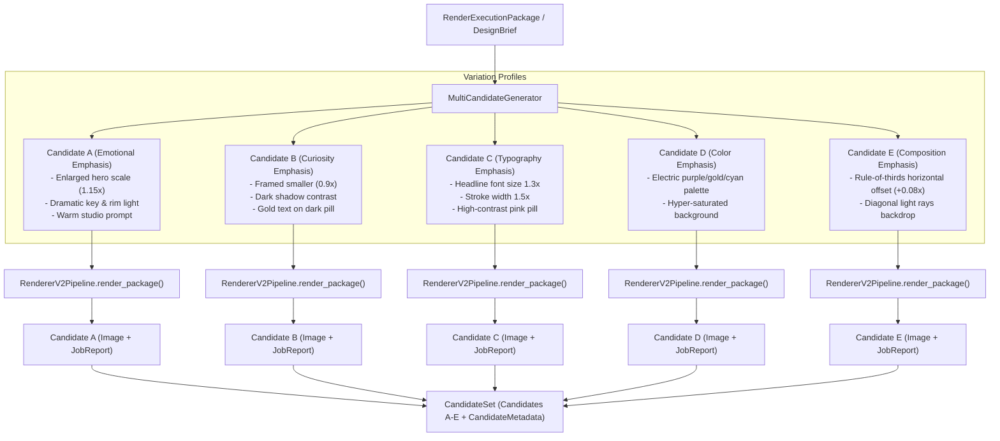

# Phase 5.1 — Multi-Candidate Thumbnail Generation Implementation

**Status:** Completed  
**Subsystem:** Intelligence Engine / Reasoning & Renderer V2 Integration  
**Consumes:** `RenderExecutionPackage`, `DesignBrief`, or `SpatialComposition` + `ExecutionPlan`  
**Produces:** `CandidateSet` containing Candidate A, B, C, D, E + Execution & Variation Metadata  

---

## 1. Overview & Architecture

Phase 5.1 introduces **`MultiCandidateGenerator`**, an intelligent orchestrator that generates multiple strategically distinct thumbnail candidates (Candidate A through Candidate E) from a baseline execution package or design brief.

Crucially, variations stem from **deterministic strategic decisions** (emotional emphasis, curiosity emphasis, typography scaling, color contrast, and dynamic composition offsets), **NOT random seeds alone**.

The generator invokes the existing `RendererV2Pipeline` without duplicating any rendering logic.



---

## 2. Variation Dimensions

Every candidate thumbnail is generated according to a deterministic `VariationProfile` across 7 key strategic dimensions:

| Dimension | Primary Focus | Deterministic Transformations |
|---|---|---|
| `EMOTIONAL_EMPHASIS` | Hero Subject & Emotion | Subject scale `1.15x`, key light `1.2x`, rim light enabled, warm cinematic prompt, warm color palette. |
| `CURIOSITY_EMPHASIS` | Intrigue & Mystery | Subject scale `0.9x`, dark atmospheric background prompt, gold text (`#FFD700`), dark slate pill container (`#1A1A2E`). |
| `TYPOGRAPHY_EMPHASIS` | Headline Legibility | Headline font size `1.3x`, stroke width `1.5x`, vibrant pink pill container (`#FF0055`), clean contrast background. |
| `COLOR_EMPHASIS` | Saturation & Pop | Electric hyper-saturated color palette (`#7952B3`, `#FFC107`, `#17A2B8`), cyan text (`#00F5D4`), purple stroke (`#7B2CBF`). |
| `COMPOSITION_EMPHASIS` | Asymmetric Balance | Rule-of-thirds horizontal subject offset (`+0.08x`), diagonal backdrop rays prompt, cyan/navy palette. |

---

## 3. Data Contracts & Structures

- **`VariationProfile`**: Strongly typed pydantic model defining strategic multipliers for typography scaling, subject scaling, lighting intensity, color overrides, and placement offsets.
- **`CandidateDescriptor`**: Manifest pairing a candidate ID (`candidate_a` through `candidate_e`) with its corresponding `VariationProfile` and transformed `RenderExecutionPackage`.
- **`CandidateResult`**: Wraps the resulting `RenderJobReport`, output image path on disk, and transformed `RenderExecutionPackage` per candidate.
- **`CandidateSet`**: Immutable collection of `CandidateResult` objects plus `CandidateMetadata` tracking total requested/generated candidates, strategy summaries, and rendering latencies.

---

## 4. Developer Guide

### Generating Multi-Candidate Thumbnails

```python
from thumbnail_intelligence.reasoning import MultiCandidateGenerator, DesignBrief

# 1. Instantiate MultiCandidateGenerator
generator = MultiCandidateGenerator()

# 2. Generate 5 strategic candidates directly from a DesignBrief (or RenderExecutionPackage)
brief = DesignBrief()
candidate_set = generator.generate_from_brief(
    brief=brief,
    count=5,
    output_directory="output/candidates/",
)

# 3. Inspect generated candidates A through E
print(f"Candidate Set ID: {candidate_set.set_id}")
print(f"Total Produced: {candidate_set.metadata.total_generated}")

for cand in candidate_set.candidates:
    print(f"[{cand.candidate_id}] {cand.candidate_label}")
    print(f"  Focus: {cand.profile.primary_dimension.value}")
    print(f"  Status: {cand.report.status.value}")
    print(f"  Output Image: {cand.image_path}")
```

---

## 5. Verification & Full Test Suite Results

Phase 5.1 was validated using [`tests/test_multi_candidate_generation.py`](file:///D:/Afsar/app%20development/thumbnail-ai/tests/test_multi_candidate_generation.py):

- `test_default_five_candidate_generation`: PASSED
- `test_candidate_uniqueness_and_profile_transformations`: PASSED
- `test_candidate_metadata_tracking`: PASSED
- `test_generate_from_brief_convenience`: PASSED
- `test_custom_variation_profiles`: PASSED
- `test_none_package_raises_error`: PASSED

Full test suite execution across all system modules:
**53 PASSED**, 0 failures in **45.69s**.
