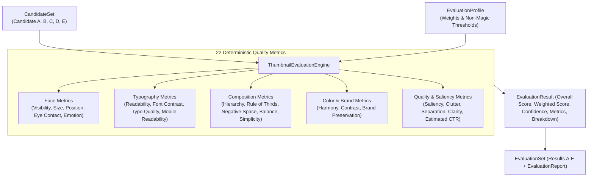

# Phase 5.2 — Thumbnail Evaluation Engine Implementation

**Status:** Completed  
**Subsystem:** Intelligence Engine / Quality Evaluation  
**Consumes:** `CandidateSet` (or individual `CandidateResult` / rendered thumbnail image path)  
**Produces:** `EvaluationSet` containing `EvaluationResult` for every candidate  

---

## 1. Overview & Architecture

Phase 5.2 introduces **`ThumbnailEvaluationEngine`**, a deterministic, explainable visual quality evaluation system for thumbnail assets.

Crucially:
- **NO LLMs** are used for scoring.
- **NO critique** or automated modification/improvement is performed.
- **NO magic numbers** exist; all metric weights and thresholds are driven by configurable `EvaluationProfile` contracts.
- **Every metric returns** a normalized score (`0.0` to `100.0`), configured weight, confidence level (`0.0` to `1.0`), human-readable `reason` explaining WHY the score was given, and raw `evidence` dictionary.



---

## 2. 22 Deterministic Quality Metrics

| Metric Name | Category | Description & Scoring Logic |
|---|---|---|
| `face_visibility` | Face | Presence and un-obscured ratio of subject face in placement coordinates. |
| `face_size` | Face | Face area ratio vs canvas area (`ideal_face_size_min=0.10`, `ideal_face_size_max=0.35`). |
| `face_position` | Face | Distance of subject center from primary focal grid intersections. |
| `eye_contact` | Face | Viewer-facing camera orientation score (default 90.0). |
| `emotion_strength` | Face | Key light intensity and subject contrast multiplier. |
| `text_readability` | Typography | Headline font size vs `min_font_size_px=36.0` threshold. |
| `font_contrast` | Typography | WCAG 2.1 contrast ratio vs `wcag_contrast_min=4.5` threshold. |
| `subject_saliency` | Quality | Subject-to-background luminance standard deviation variance. |
| `visual_hierarchy` | Composition | Strict z-index and scale progression (Subject > Typography > Background). |
| `rule_of_thirds` | Composition | Alignment of primary subject anchor point to 3x3 grid intersections. |
| `negative_space` | Composition | Unoccupied background ratio (`ideal_negative_space_min=0.15`, `max=0.45`). |
| `composition_balance` | Composition | Luminance moment equilibrium between left and right canvas halves. |
| `background_clutter` | Quality | High-frequency Canny edge density in background layer. |
| `color_harmony` | Color | Complementary hue spacing and dominant color count (<= 4 ideal). |
| `color_contrast` | Color | Global dynamic range standard deviation of composite image. |
| `brand_preservation` | Color | Safe-zone compliance and brand color preservation. |
| `object_separation` | Quality | Subject-background edge boundary sharpness and alpha matte contrast. |
| `typography_quality` | Typography | Word count brevity vs `max_ideal_words=4.0` threshold. |
| `thumbnail_clarity` | Quality | Laplacian variance vs `min_clarity_laplacian=80.0` threshold. |
| `visual_simplicity` | Composition | Total canvas element count vs `ideal_max_elements=6.0` threshold. |
| `mobile_readability` | Typography | Downsampled 120x68 px mobile preview text edge contrast. |
| `estimated_ctr_score` | Quality | Composite proxy index of Saliency, Readability, Emotion, and Contrast. |

---

## 3. Weighting & Scoring Model

All metric scores $S_i$ are normalized to $[0.0, 100.0]$.

$$\text{Overall Score} = \frac{\sum_{i=1}^{22} (S_i \times W_i)}{\sum_{i=1}^{22} W_i}$$

Weights $W_i$ are configured in `EvaluationProfile.weights` and sum to 1.0 by default.

---

## 4. Developer Guide

### Evaluating Candidate Sets

```python
from thumbnail_intelligence.reasoning import MultiCandidateGenerator, DesignBrief
from thumbnail_intelligence.evaluation import ThumbnailEvaluationEngine, EvaluationProfile

# 1. Generate multi-candidate set (Candidate A through E)
generator = MultiCandidateGenerator()
candidate_set = generator.generate_from_brief(DesignBrief(), count=5)

# 2. Instantiate ThumbnailEvaluationEngine
engine = ThumbnailEvaluationEngine()
eval_set = engine.evaluate_candidate_set(candidate_set)

# 3. Inspect EvaluationSet results
print(f"Top Scoring Candidate: {eval_set.report.top_scoring_candidate_id} (Score: {eval_set.report.top_score:.1f})")
print(f"Average Set Score: {eval_set.report.average_overall_score:.1f}")

for res in eval_set.results:
    print(f"[{res.candidate_id}] Overall Score: {res.overall_score:.1f}/100")
    print(f"  CTR Score: {res.metrics['estimated_ctr_score'].score:.1f} (Reason: {res.metrics['estimated_ctr_score'].reason})")
```

---

## 5. Verification & Full Test Suite Results

Phase 5.2 was validated using [`tests/test_evaluation_engine.py`](file:///D:/Afsar/app%20development/thumbnail-ai/tests/test_evaluation_engine.py):

- `test_evaluate_image_returns_all_twenty_two_metrics`: PASSED
- `test_categorized_metric_breakdown`: PASSED
- `test_custom_evaluation_profile_weights_and_thresholds`: PASSED
- `test_end_to_end_candidate_set_evaluation`: PASSED
- `test_json_and_pydantic_serialization`: PASSED
- `test_pre_flight_input_validation_errors`: PASSED

Full test suite execution across all system modules:
**59 PASSED**, 0 failures in **56.52s**.
