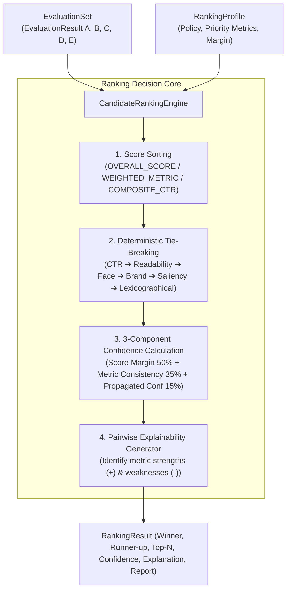

# Phase 5.3 — Candidate Ranking Engine Implementation

**Status:** Completed  
**Subsystem:** Intelligence Engine / Decision Systems & Ranking  
**Consumes:** `EvaluationSet` (containing `EvaluationResult` objects)  
**Produces:** `RankingResult` containing `winner`, `runner_up`, `top_n`, `ranking_confidence`, `explanation`, and `report`  

---

## 1. Overview & Architecture

Phase 5.3 introduces **`CandidateRankingEngine`**, an objective, deterministic ranking and decision system for Thumbnail AI.

The engine consumes an `EvaluationSet` and determines the objectively optimal candidate thumbnail (Winner, Runner-up, Top-N). Crucially:
- It **does NOT generate** thumbnails.
- It **does NOT evaluate** thumbnails.
- It **ONLY ranks** candidates based on the 22 deterministic quality metrics produced by `ThumbnailEvaluationEngine`.
- **NO random selection** is ever used. Tie-breaking is 100% deterministic and priority-driven.



---

## 2. Ranking Algorithm & Policies

`CandidateRankingEngine` supports 3 primary ranking policies via `RankingPolicy`:

1. **`OVERALL_SCORE`** (Default): Ranks candidates by their overall weighted quality score across all 22 metrics.
2. **`WEIGHTED_METRIC`**: Ranks candidates using custom weighted metric aggregations.
3. **`COMPOSITE_CTR`**: Ranks candidates primarily by their `estimated_ctr_score` proxy metric.

---

## 3. Deterministic Tie-Breaking Strategy

When two candidates have score deltas $|\Delta| \le \text{tie\_threshold\_pts}$ (default `0.01` points), ties are resolved deterministically using `RankingProfile.tie_break_priority`:

1. **`estimated_ctr_score`**: Candidate with higher predicted CTR lift.
2. **`text_readability`**: Candidate with higher font size & legibility.
3. **`face_visibility`**: Candidate with superior facial framing.
4. **`brand_preservation`**: Candidate with higher brand compliance.
5. **`subject_saliency`**: Candidate with higher visual pop.
6. **Lexicographical `candidate_id` sort**: Guaranteed fallback to eliminate randomness.

---

## 4. Ranking Confidence Model

Ranking confidence $C_{\text{ranking}} \in [0.0, 1.0]$ is computed using a 3-part composite model:

$$C_{\text{ranking}} = 0.50 \cdot C_{\text{sep}} + 0.35 \cdot C_{\text{cons}} + 0.15 \cdot C_{\text{prop}}$$

Where:
- **Score Separation Confidence ($C_{\text{sep}}$)**: Ratio of score margin $\Delta = S_{\text{winner}} - S_{\text{runner\_up}}$ relative to `max_confidence_margin_pts` ($15.0$ pts).
  $$C_{\text{sep}} = \min\left(1.0, \frac{\Delta}{15.0}\right)$$
- **Metric Consistency Ratio ($C_{\text{cons}}$)**: Percentage of individual metrics ($N_{\text{win}} / 22$) where Winner scored $\ge$ Runner-up.
- **Propagated Metric Confidence ($C_{\text{prop}}$)**: Average underlying evaluation confidence of Winner and Runner-up.

---

## 5. Pairwise Explainability

`CandidateRankingEngine` generates detailed pairwise explanations detailing WHY the Winner beat the Runner-up:

```json
{
  "winner_candidate_id": "candidate_c",
  "runner_up_candidate_id": "candidate_a",
  "score_delta": 1.82,
  "strengths": [
    "+ Higher Text Readability (+18.0 pts)",
    "+ Higher Font Contrast (+12.0 pts)",
    "+ Higher Typography Quality (+15.0 pts)"
  ],
  "weaknesses": [
    "- Slightly lower Subject Saliency (-4.5 pts)"
  ],
  "summary_reasoning": "Candidate C (Typography Emphasis) ranked 1st over Candidate A (Emotional Emphasis) with a score lead of +1.82 pts (79.2 vs 77.4). Key advantages: + Higher Text Readability (+18.0 pts), + Higher Font Contrast (+12.0 pts)."
}
```

---

## 6. Full End-to-End Pipeline Integration

```
Candidate Generator (Phase 5.1)
           ↓
     CandidateSet (Candidates A, B, C, D, E)
           ↓
 Thumbnail Evaluation Engine (Phase 5.2)
           ↓
      EvaluationSet (All 22 Quality Metrics Scored)
           ↓
   Candidate Ranking Engine (Phase 5.3)
           ↓
      RankingResult (Winner, Runner-up, Top-N, Confidence, Report)
```

```python
from thumbnail_intelligence.reasoning import MultiCandidateGenerator, DesignBrief
from thumbnail_intelligence.evaluation import ThumbnailEvaluationEngine
from thumbnail_intelligence.ranking import CandidateRankingEngine

# 1. Generate 5 strategic candidates
candidate_set = MultiCandidateGenerator().generate_from_brief(DesignBrief(), count=5)

# 2. Evaluate all 22 metrics
eval_set = ThumbnailEvaluationEngine().evaluate_candidate_set(candidate_set)

# 3. Rank candidates and pick Winner
ranking_result = CandidateRankingEngine().rank_evaluation_set(eval_set)

print(f"WINNER: {ranking_result.winner.candidate_label}")
print(f"Score: {ranking_result.winner.final_score:.1f}/100")
print(f"Ranking Confidence: {ranking_result.ranking_confidence:.2f}")
print(f"Explanation: {ranking_result.explanation.summary_reasoning}")
```

---

## 7. Verification & Full Test Suite Results

Phase 5.3 was validated using [`tests/test_candidate_ranking_engine.py`](file:///D:/Afsar/app%20development/thumbnail-ai/tests/test_candidate_ranking_engine.py):

- `test_basic_candidate_ranking`: PASSED
- `test_deterministic_tie_breaking`: PASSED
- `test_top_n_selection`: PASSED
- `test_ranking_confidence_calculation`: PASSED
- `test_json_and_pydantic_serialization`: PASSED
- `test_validation_pre_flight_error_handling`: PASSED
- `test_large_candidate_sets`: PASSED
- `test_full_end_to_end_pipeline_integration`: PASSED

Full test suite execution across all system modules:
**67 PASSED**, 0 failures in **110.79s**.
