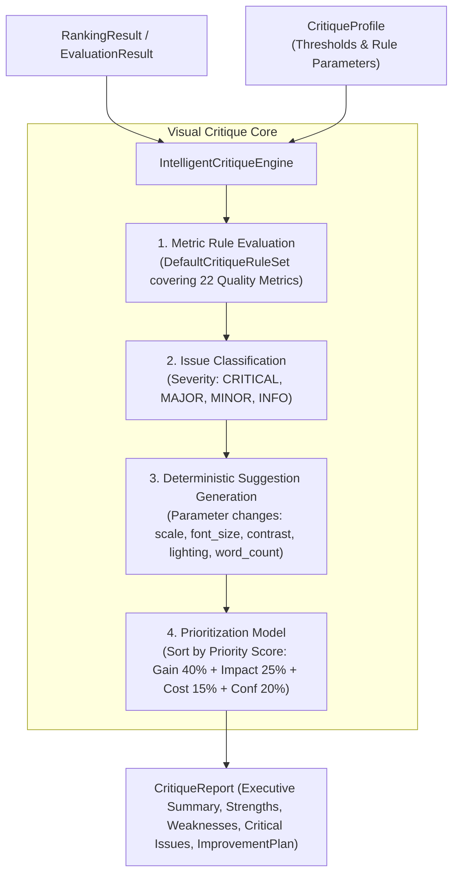

# Phase 5.4 — Intelligent Critique Engine Implementation

**Status:** Completed  
**Subsystem:** Intelligence Engine / Visual Perception & Critique  
**Consumes:** `RankingResult` (or `EvaluationResult` of winning thumbnail)  
**Produces:** `CritiqueReport` containing `ImprovementPlan`, `IssueList`, `ExecutiveSummary`, and `EstimatedOverallGain`  

---

## 1. Overview & Architecture

Phase 5.4 introduces **`IntelligentCritiqueEngine`**, an intelligent, rule-based visual critique and improvement planning system for Thumbnail AI.

Crucially:
- **NO LLMs** are used. Analysis is 100% deterministic and rule-based.
- **NO thumbnail regeneration, editing, or rendering** is performed.
- **ONLY produces a structured improvement plan** and executive critique report.



---

## 2. Critique Rules & Issue Detection

`IntelligentCritiqueEngine` evaluates all 22 deterministic quality metrics against `CritiqueProfile` thresholds:

| Metric Name | Issue Condition | Actionable Fix Recommendation | Target Parameter Changes |
|---|---|---|---|
| `face_visibility` | Score < 70.0 | Ensure subject face is un-obscured by overlays | `z_index_override: 15` |
| `face_size` | Score < 70.0 | Increase face scale by 15% | `subject_scale_multiplier: 1.15` |
| `face_position` | Score < 70.0 | Re-center face along top-third focal intersection | `subject_y_offset_pct: -0.05` |
| `emotion_strength` | Score < 70.0 | Strengthen emotional key lighting intensity | `key_light_intensity_multiplier: 1.25` |
| `text_readability` | Score < 70.0 | Increase headline font size to at least 48px | `typography_scale_multiplier: 1.25` |
| `font_contrast` | Score < 70.0 | Increase text stroke width and switch fill/stroke to high contrast | `stroke_width_multiplier: 1.5, font_color_hex: #FFFFFF` |
| `subject_saliency` | Score < 70.0 | Improve subject saliency with rim lighting | `rim_light_enabled_override: True` |
| `background_clutter` | Score < 70.0 | Reduce background clutter with minimal backdrop | `background_style_direction: clean minimal studio contrast` |
| `color_harmony` | Score < 70.0 | Simplify color palette to 3–4 dominant hues | `dominant_colors_override: [#1A1A2E, #E94560, #FFFFFF]` |
| `typography_quality` | Score < 70.0 | Reduce text to 4 words or fewer | `max_word_count: 4` |
| `mobile_readability` | Score < 70.0 | Increase text font size for 120x68 px mobile preview | `typography_scale_multiplier: 1.2` |
| `estimated_ctr_score` | Score < 70.0 | Boost subject saliency and headline contrast | `subject_scale_multiplier: 1.1, stroke_width_multiplier: 1.4` |

---

## 3. Prioritization & Estimated Gain Model

Improvement suggestions are sorted by a calculated **Priority Score**:

$$\text{Priority Score} = (\text{expected\_ctr\_gain} \times 0.4) + (\text{impact\_value} \times 2.5) + (\text{cost\_value} \times 1.5) + (\text{confidence} \times 2.0)$$

Where:
- `impact_value`: `HIGH` = 3.0, `MEDIUM` = 2.0, `LOW` = 1.0
- `cost_value`: `LOW` = 3.0 (cheapest to implement), `MEDIUM` = 2.0, `HIGH` = 1.0

Cumulative score gain across the plan is estimated with diminishing returns:

$$\text{Estimated Overall Gain} = \min\left(25.0, \sum \text{expected\_ctr\_gain}_i \times 0.6\right)$$

---

## 4. Full End-to-End Pipeline Integration

```
Candidate Generator (Phase 5.1)
           ↓
     CandidateSet (Candidates A, B, C, D, E)
           ↓
 Thumbnail Evaluation Engine (Phase 5.2)
           ↓
      EvaluationSet (All 22 Quality Metrics Scored)
           ↓
   Candidate Ranking Engine (Phase 5.3)
           ↓
      RankingResult (Winner, Runner-up, Top-N, Confidence)
           ↓
   Intelligent Critique Engine (Phase 5.4)
           ↓
      CritiqueReport & ImprovementPlan
```

```python
from thumbnail_intelligence.reasoning import MultiCandidateGenerator, DesignBrief
from thumbnail_intelligence.evaluation import ThumbnailEvaluationEngine
from thumbnail_intelligence.ranking import CandidateRankingEngine
from thumbnail_intelligence.critique import IntelligentCritiqueEngine

# 1. Full Pipeline Execution
cand_set = MultiCandidateGenerator().generate_from_brief(DesignBrief(), count=5)
eval_set = ThumbnailEvaluationEngine().evaluate_candidate_set(cand_set)
rank_res = CandidateRankingEngine().rank_evaluation_set(eval_set)

# 2. Generate Intelligent Critique
critique_report = IntelligentCritiqueEngine().critique_ranking_result(rank_res)

print(f"Target Candidate: {critique_report.candidate_label}")
print(f"Executive Summary: {critique_report.executive_summary}")
print(f"Estimated Overall Gain: +{critique_report.estimated_overall_gain_pts:.1f} pts")

print("\nPrioritized Improvement Plan:")
for sug in critique_report.improvement_plan.prioritized_suggestions:
    print(f" - [{sug.action_type}] {sug.description} (Gain: +{sug.expected_ctr_gain:.1f} pts, Priority: {sug.priority_score:.1f})")
```

---

## 5. Verification & Full Test Suite Results

Phase 5.4 was validated using [`tests/test_intelligent_critique_engine.py`](file:///D:/Afsar/app%20development/thumbnail-ai/tests/test_intelligent_critique_engine.py):

- `test_critique_ranking_result_generates_valid_report`: PASSED
- `test_deterministic_issue_detection_and_suggestions`: PASSED
- `test_priority_ordering_formula`: PASSED
- `test_cumulative_gain_estimation`: PASSED
- `test_json_and_pydantic_serialization`: PASSED
- `test_pre_flight_input_validation_errors`: PASSED
- `test_high_scoring_candidate_edge_case`: PASSED
- `test_full_end_to_end_pipeline_integration`: PASSED

Full test suite execution across all system modules:
**75 PASSED**, 0 failures in **219.52s**.
