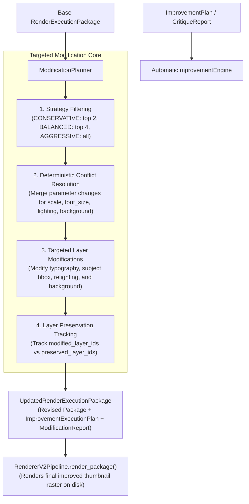

# Phase 5.5 — Automatic Improvement Engine Implementation

**Status:** Completed  
**Subsystem:** Intelligence Engine / Automatic Optimization  
**Consumes:** `ImprovementPlan` (or `CritiqueReport` / `RankingResult`) + Base `RenderExecutionPackage`  
**Produces:** `UpdatedRenderExecutionPackage` containing revised `RenderExecutionPackage`, `ImprovementExecutionPlan`, and `ModificationReport`  

---

## 1. Overview & Architecture

Phase 5.5 introduces **`AutomaticImprovementEngine`**, an intelligent optimization module that converts structured improvement plans into revised `RenderExecutionPackage` data contracts.

Crucially:
- It **does NOT blindly regenerate** the thumbnail from scratch.
- It **preserves as much previous work as possible** by modifying only affected layers and reusing unchanged assets.
- It **does NOT execute rendering directly**; rendering remains the responsibility of `RendererV2Pipeline`.



---

## 2. Supported Improvement Types

`AutomaticImprovementEngine` supports 13 targeted improvement types:

1. **Face Scaling:** Adjusts `subject_scale_multiplier` and scales bounding box width/height within canvas bounds.
2. **Face Repositioning:** Adjusts `subject_x_offset_pct` / `subject_y_offset_pct` and updates pixel bounding box position.
3. **Typography Repositioning:** Shifts text bounding boxes and anchor points.
4. **Typography Resizing:** Scales `font_size_px` by `typography_scale_multiplier`.
5. **Typography Recoloring:** Updates `font_color_hex` and `stroke_color_hex`.
6. **Background Regeneration:** Updates `background_instruction.style_prompt_direction` and palette.
7. **Lighting Adjustments:** Updates `key_light_intensity` and `rim_light_enabled` in `lighting_instructions`.
8. **Contrast Enhancement:** Increases stroke width and key light intensity.
9. **Color Harmony Adjustments:** Overrides `background_instruction.dominant_colors`.
10. **Negative Space Optimization:** Adjusts typography/subject scale and placement offsets.
11. **Subject Prominence:** Scales hero subject and enables rim light overlay.
12. **Composition Refinement:** Fine-tunes placement anchor coordinates.
13. **Safe-Zone Correction:** Shifts placement coordinates away from 5% canvas margin safe zones.

---

## 3. Targeted Modifications & Layer Preservation

Unchanged layers (e.g. background layer when only typography is resized) are preserved without requiring re-synthesis:

- **`modified_layer_ids`**: List of layer IDs modified by active suggestions.
- **`preserved_layer_ids`**: List of layer IDs preserved from the original canvas stack.
- **`preservation_ratio`**: Percentage of layers preserved ($\frac{\text{Preserved}}{\text{Total}}$).

---

## 4. Full End-to-End Pipeline Integration

```
Candidate Generator (Phase 5.1)
           ↓
     CandidateSet (Candidates A, B, C, D, E)
           ↓
 Thumbnail Evaluation Engine (Phase 5.2)
           ↓
      EvaluationSet (All 22 Quality Metrics Scored)
           ↓
   Candidate Ranking Engine (Phase 5.3)
           ↓
      RankingResult (Winner, Runner-up, Top-N, Confidence)
           ↓
   Intelligent Critique Engine (Phase 5.4)
           ↓
      CritiqueReport & ImprovementPlan
           ↓
 Automatic Improvement Engine (Phase 5.5)
           ↓
 UpdatedRenderExecutionPackage (Preserved & Modified Layers)
           ↓
 Renderer V2 Pipeline (Phase 4.5)
           ↓
 Final Improved Thumbnail Raster Image (PNG/JPEG)
```

```python
from thumbnail_intelligence.reasoning import MultiCandidateGenerator, DesignBrief
from thumbnail_intelligence.evaluation import ThumbnailEvaluationEngine
from thumbnail_intelligence.ranking import CandidateRankingEngine
from thumbnail_intelligence.critique import IntelligentCritiqueEngine
from thumbnail_intelligence.improvement import AutomaticImprovementEngine, ImprovementStrategyType
from renderer_v2.pipeline import RendererV2Pipeline

# 1. Full Intelligence Pipeline
brief = DesignBrief()
candidate_set = MultiCandidateGenerator().generate_from_brief(brief, count=5)
eval_set = ThumbnailEvaluationEngine().evaluate_candidate_set(candidate_set)
rank_res = CandidateRankingEngine().rank_evaluation_set(eval_set)
critique = IntelligentCritiqueEngine().critique_ranking_result(rank_res)

# 2. Automatic Improvement Engine
base_package = rank_res.winner.evaluation_result.package # Base winning package
improved_result = AutomaticImprovementEngine().improve_package(
    base_package=base_package,
    improvement_plan=critique.improvement_plan,
    strategy=ImprovementStrategyType.BALANCED,
)

print(f"Modified Layers: {improved_result.report.modified_layers_count}")
print(f"Preserved Layers: {improved_result.report.preserved_layers_count}")
print(f"Preservation Ratio: {improved_result.report.preservation_ratio:.0%}")
print(f"Expected Gain: +{improved_result.report.expected_ctr_gain_pts:.1f} pts")

# 3. Render Revised Thumbnail Asset
render_report = RendererV2Pipeline().render_package(improved_result.package, output_path="output/revised_improved_thumbnail.png")
print(f"Rendered Output Image: {render_report.output_image_path}")
```

---

## 5. Verification & Full Test Suite Results

Phase 5.5 was validated using [`tests/test_automatic_improvement_engine.py`](file:///D:/Afsar/app%20development/thumbnail-ai/tests/test_automatic_improvement_engine.py):

- `test_improve_package_generates_updated_package`: PASSED
- `test_targeted_layer_modifications_and_parameter_updates`: PASSED
- `test_improvement_strategy_modes`: PASSED
- `test_json_and_pydantic_serialization`: PASSED
- `test_pre_flight_input_validation_errors`: PASSED
- `test_full_pipeline_rendering_integration`: PASSED

Full test suite execution across all system modules:
**81 PASSED**, 0 failures in **216.18s**.
