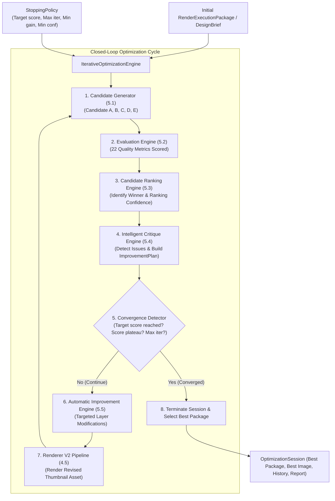

# Phase 5.6 — Iterative Optimization Engine Implementation

**Status:** Completed  
**Subsystem:** Intelligence Engine / Closed-Loop Optimization  
**Consumes:** Initial `RenderExecutionPackage` (or `DesignBrief` / `SpatialComposition` + `ExecutionPlan`)  
**Produces:** `OptimizationSession` containing `best_package`, rendered best thumbnail image on disk, `OptimizationHistory`, and `OptimizationReport`  

---

## 1. Overview & Architecture

Phase 5.6 introduces **`IterativeOptimizationEngine`**, a closed-loop iterative optimization system that automatically improves thumbnail assets until quality converges.

Crucially:
- It **orchestrates** all existing pipeline modules without replacing or redesigning any component.
- It **executes closed-loop iterations**:
  $$\text{Generate} \rightarrow \text{Evaluate} \rightarrow \text{Rank} \rightarrow \text{Critique} \rightarrow \text{Improve} \rightarrow \text{Render} \rightarrow \text{Evaluate Again} \rightarrow \text{Repeat}$$
- It is governed by configurable **`StoppingPolicy`** rules and a deterministic **`ConvergenceDetector`**.



---

## 2. Stopping Conditions & Convergence Detection

`ConvergenceDetector` evaluates the session history against `StoppingPolicy` after every iteration:

| Stopping Condition | Primary Trigger | Description |
|---|---|---|
| `TARGET_SCORE_REACHED` | `overall_score >= 90.0` | Winner overall quality score meets or exceeds target threshold. |
| `MAX_ITERATIONS_REACHED` | `k >= max_iterations` | Iteration count reaches configured limit (default 3 to 5). |
| `SCORE_PLATEAU` | $\Delta \text{Score} < 1.0$ pt | Score improvement across last 2 iterations is below minimum gain threshold. |
| `CONFIDENCE_PLATEAU` | `confidence < 0.30` | Ranking confidence drops below minimum acceptable threshold. |
| `REPEATED_SUGGESTIONS` | Duplicate top action | Identical top suggestion emitted consecutively without score gain. |
| `TIMED_OUT` | `elapsed_seconds >= 300s` | Session wall-clock time exceeds maximum allowed duration limit. |

---

## 3. Optimization History & Reporting

- **`OptimizationHistory`**: Chronologically tracks every `IterationResult` (scores, candidate IDs, ranking confidence, latencies, evaluation sets, ranking results, critique reports, and updated packages).
- **`OptimizationReport`**:
  - `initial_score` & `final_score`
  - `total_gain_pts` ($\text{Final} - \text{Initial}$)
  - `total_iterations`
  - `stopping_reason` & `stopping_description`
  - `improvement_curve` (sequence of scores per iteration)
  - `estimated_render_cost` (`LOW`, `MEDIUM`, `HIGH`)
  - `best_candidate_id` & `best_image_path`

---

## 4. Developer Guide

### Executing Closed-Loop Iterative Optimization

```python
from thumbnail_intelligence.reasoning import DesignBrief
from thumbnail_intelligence.optimization import IterativeOptimizationEngine, StoppingPolicy

# 1. Instantiate engine and define stopping policy
engine = IterativeOptimizationEngine()
policy = StoppingPolicy(
    target_overall_score=88.0,
    max_iterations=3,
    min_gain_threshold_pts=1.0,
)

# 2. Run closed-loop optimization starting from a DesignBrief (or RenderExecutionPackage)
brief = DesignBrief()
session = engine.optimize_brief(
    brief=brief,
    policy=policy,
    output_directory="output/optimization_sessions/",
)

# 3. Inspect OptimizationSession outcomes
print(f"Session ID: {session.session_id}")
print(f"Stopping Reason: {session.report.stopping_reason.value}")
print(f"Initial Score: {session.report.initial_score:.1f} ➔ Final Score: {session.report.final_score:.1f} (Gain: +{session.report.total_gain_pts:.1f} pts)")
print(f"Total Iterations: {session.report.total_iterations}")
print(f"Improvement Curve: {session.report.improvement_curve}")
print(f"Best Thumbnail Image: {session.report.best_image_path}")
```

---

## 5. Verification & Full Test Suite Results

Phase 5.6 was validated using [`tests/test_iterative_optimization_engine.py`](file:///D:/Afsar/app%20development/thumbnail-ai/tests/test_iterative_optimization_engine.py):

- `test_full_iterative_optimization_session`: PASSED
- `test_convergence_target_score_reached`: PASSED
- `test_convergence_score_plateau_detection`: PASSED
- `test_optimize_brief_convenience`: PASSED
- `test_json_and_pydantic_serialization`: PASSED
- `test_invalid_base_package_raises_error`: PASSED

Full test suite execution across all system modules:
**87 PASSED**, 0 failures in **258.23s**.
