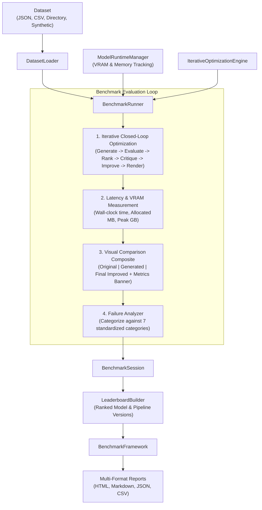

# Phase 6.1 — Benchmark & Evaluation Framework Implementation

**Status:** Completed  
**Subsystem:** MLOps & System Evaluation  
**Consumes:** Datasets (JSON, CSV, Directory of images, or Synthetic datasets)  
**Produces:** `BenchmarkReport` (HTML, Markdown, JSON, CSV), `Leaderboard`, `PerformanceReport`, `FailureAnalysis`, and Side-by-Side Visual Comparison Artifacts  

---

## 1. Overview & Architecture

Phase 6.1 introduces **`BenchmarkFramework`**, an objective, automated benchmark and evaluation system for Thumbnail AI.

Crucially:
- It **objectively measures** Thumbnail AI quality, accuracy, performance, resource usage, and stability across datasets.
- It **automatically generates side-by-side visual comparisons**:
  $$\text{Original Thumbnail} \rightarrow \text{Generated Thumbnail} \rightarrow \text{Final Improved Thumbnail} + \text{Metric Comparison Overlay}$$
- It **categorizes failures into 7 standardized failure categories** (`POOR_FACE_EXTRACTION`, `TYPOGRAPHY_FAILURES`, `LOW_CONTRAST`, `WEAK_COMPOSITION`, `BACKGROUND_FAILURES`, `PIPELINE_FAILURES`, `OOM_FAILURES`).
- It **exports multi-format reports** (`benchmark_report.html`, `benchmark_report.md`, `benchmark_report.json`, `benchmark_report.csv`).



---

## 2. Benchmark Metrics & Failure Analysis

`BenchmarkFramework` measures 11 key metrics across all dataset samples:

1. **Average Evaluation Score:** Overall quality score out of 100.
2. **Average CTR Prediction:** Estimated click-through rate score out of 100.
3. **Average Score Improvement:** Final score minus initial score gain ($\Delta \text{Pts}$).
4. **Iterations Required:** Average optimization iterations executed per sample.
5. **Runtime Latency:** Wall-clock processing time in seconds.
6. **Peak GPU VRAM:** Peak VRAM memory recorded across session (GB).
7. **Allocated GPU Memory:** Average VRAM memory allocated per sample (MB).
8. **Success Rate (%):** Percentage of samples passing quality thresholds without error.
9. **Failure Rate (%):** Percentage of failed or substandard samples.
10. **Average Render Cost:** Distribution of render costs (`LOW`, `MEDIUM`, `HIGH`).
11. **Optimization Efficiency:** Quality score gain per second of runtime ($\Delta \text{Pts} / \text{Sec}$).

### Failure Categories
Failures are categorized automatically by `FailureAnalyzer`:
- `POOR_FACE_EXTRACTION`: Obscured, misaligned, or missing face bounding box / mask.
- `TYPOGRAPHY_FAILURES`: Substandard text readability (<50.0) or WCAG font contrast (<50.0).
- `LOW_CONTRAST`: Low global color dynamic range or weak subject saliency.
- `WEAK_COMPOSITION`: Broken visual hierarchy or composition balance.
- `BACKGROUND_FAILURES`: Excessive background clutter density or synthesis errors.
- `PIPELINE_FAILURES`: Uncaught exceptions or stage pipeline errors.
- `OOM_FAILURES`: Out-of-memory or CUDA memory allocation limits.

---

## 3. Developer Guide

### Running Automated Benchmark Evaluation

```python
from thumbnail_intelligence.benchmarks import BenchmarkFramework, DatasetLoader
from thumbnail_intelligence.optimization import StoppingPolicy

# 1. Load or create benchmark dataset
items = DatasetLoader.create_synthetic_dataset(count=10)

# 2. Instantiate framework and define policy
framework = BenchmarkFramework()
policy = StoppingPolicy(max_iterations=2, target_overall_score=90.0)

# 3. Run benchmark suite and export multi-format reports
session = framework.run_benchmark(
    items=items,
    dataset_name="youtube_top_100_benchmark",
    stopping_policy=policy,
    output_directory="output/benchmarks/",
)

# 4. Access summary metrics and report paths
print(f"Benchmark Session: {session.session_id}")
print(f"Success Rate: {session.summary.success_rate_pct:.1f}%")
print(f"Avg Quality Score: {session.summary.avg_final_score:.1f} / 100")
print(f"Avg CTR Score: {session.summary.avg_ctr_prediction:.1f} / 100")
print(f"Peak VRAM: {session.summary.peak_vram_gb:.2f} GB")

print(f"\nExported HTML Report: {session.report.html_report_path}")
print(f"Exported Markdown Report: {session.report.markdown_report_path}")
print(f"Exported CSV Report: {session.report.csv_report_path}")
```

---

## 4. Verification & Full Test Suite Results

Phase 6.1 was validated using [`tests/test_benchmark_framework.py`](file:///D:/Afsar/app%20development/thumbnail-ai/tests/test_benchmark_framework.py):

- `test_dataset_loader_synthetic_dataset_creation`: PASSED
- `test_failure_analyzer_categorization`: PASSED
- `test_leaderboard_builder_ranking_and_export`: PASSED
- `test_end_to_end_benchmark_framework_execution`: PASSED
- `test_json_and_pydantic_serialization`: PASSED
- `test_empty_items_raises_framework_error`: PASSED

Full test suite execution across all system modules:
**93 PASSED**, 0 failures in **344.45s**.
